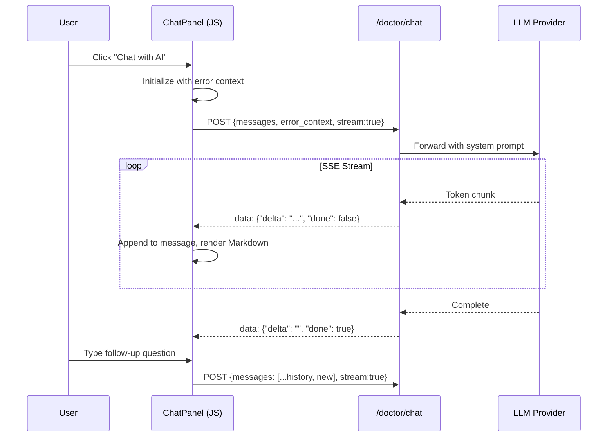

# ComfyUI-Doctor Architecture & Extension Roadmap

[繁體中文](#comfyui-doctor-專案架構與擴展規劃) | English

## 1. Architecture

### 1.1 Core Module Structure

```mermaid
graph TD
    A[prestartup_script.py] -->|Early Hook| B[__init__.py]
    B --> C[logger.py]
    B --> D[analyzer.py]
    B --> E[i18n.py]
    B --> F[config.py]
    B --> G[nodes.py]
    
    C --> H[AsyncFileWriter]
    C --> I[SmartLogger]
    
    D --> J[ErrorAnalyzer]
    D --> K[NodeContext]
    
    B --> L[API Endpoints]
    L --> M[/debugger/last_analysis]
    L --> N[/debugger/history]
    L --> O[/debugger/set_language]
    L --> P[/doctor/analyze]
    L --> Q[/doctor/verify_key]
    L --> R[/doctor/list_models]
    
    S[web/doctor.js] --> T[Settings Registration]
    U[web/doctor_ui.js] --> V[Sidebar Panel]
    U --> W[Error Cards]
    U --> X[AI Analysis]
    Y[web/doctor_api.js] --> Z[Fetch Wrapper]
```

### 1.2 Module Overview

| Module | Lines | Function |
|--------|-------|----------|
| `prestartup_script.py` | 102 | Earliest log interception hook (before custom_nodes load) |
| `__init__.py` | 477 | Main entry: full Logger install, 6 API endpoints, LLM integration |
| `logger.py` | 339 | Smart logger: async writes, real-time error analysis, history |
| `analyzer.py` | 271 | Error analyzer: 20+ error patterns, node context extraction |
| `i18n.py` | 190 | Internationalization: 4 languages (en, zh_TW, zh_CN, ja) |
| `config.py` | 65 | Config management: dataclass + JSON persistence |
| `nodes.py` | 179 | Smart Debug Node: deep data inspection |
| `doctor.js` | 528 | ComfyUI settings panel integration |
| `doctor_ui.js` | 778 | Sidebar UI, error cards, AI analysis trigger |
| `doctor_api.js` | 114 | API wrapper layer |

---

## 2. Robustness Assessment

### 2.1 Strengths ✅

1. **Two-phase logging system** - `prestartup_script.py` ensures capture before all custom_nodes load
2. **Async I/O** - `AsyncFileWriter` uses background thread + batch writes, non-blocking
3. **Thread safety** - `threading.Lock` protects traceback buffer, `weakref.finalize` ensures cleanup
4. **Complete error analysis pipeline** - 20+ predefined patterns, regex LRU cache, node context extraction
5. **LLM integration** - Supports OpenAI/DeepSeek/Ollama/LMStudio, auto-detects local LLMs
6. **Frontend integration** - Native ComfyUI Settings API, WebSocket `execution_error` subscription
7. **Internationalization** - 4 languages, extensible `SUGGESTIONS` structure

### 2.2 Potential Issues ⚠️ → ✅ ALL FIXED

- [x] **P1**: Overly broad `except Exception: pass` statements → *Fixed in Phase 1 (R1)*
- [x] **P2**: Race conditions on `_analysis_history` deque and `SmartLogger._instances` → *Fixed in Phase 1 (R2)*
- [x] **P3**: Resource leak risks with `aiohttp.ClientSession` per-request creation → *Fixed in Phase 2 (R3)*
- [x] **P4**: No XSS protection on AI analysis results in frontend → *Fixed in Phase 1 (R4)*
- [x] **P5**: Missing API endpoint tests and frontend tests → *Fixed in Phase 1 (T1) + Phase 2*

---

## 3. Extension Todo-List

### 3.1 Features

- [x] **F1**: Error history persistence (SQLite/JSON) - 🟡 Medium ✅ *Completed (Phase 2)*
- [ ] **F2**: Hot-reload error patterns from external JSON/YAML - 🟢 Low
- [x] **F3**: Workflow context capture on error - 🔴 High ✅ *Completed (Phase 2)*
- [ ] **F4**: Error statistics dashboard - 🟡 Medium ⚠️ *Use dev branch*
- [ ] **F5**: Node health scoring - 🟢 Low
- [ ] **F6**: Multi-LLM provider quick switch - 🟡 Medium ⚠️ *Use dev branch*
- [ ] **F7**: One-click auto-fix for specific errors - 🟢 Low

### 3.2 Robustness

- [x] **R1**: Comprehensive error handling refactor - 🔴 High ✅ *Completed*
- [x] **R2**: Thread safety hardening - 🔴 High ✅ *Completed*
- [x] **R3**: aiohttp session reuse - 🟡 Medium ✅ *Completed (Phase 2)*
- [x] **R4**: XSS protection - 🔴 High ✅ *Completed*
- [ ] **R5**: Frontend error boundaries - 🟡 Medium ⚠️ *Use dev branch*

### 3.3 Testing

- [x] **T1**: API endpoint unit tests - 🔴 High ✅ *Completed*
- [ ] **T2**: Frontend interaction tests (Playwright) - 🟡 Medium ⚠️ *Use dev branch*
- [ ] **T3**: End-to-end integration tests - 🟢 Low
- [ ] **T4**: Stress tests - 🟢 Low

### 3.4 Documentation

- [ ] **D1**: OpenAPI/Swagger spec - 🟡 Medium ⚠️ *Use dev branch*
- [ ] **D2**: Architecture documentation - 🟢 Low
- [ ] **D3**: Contribution guide - 🟢 Low

### 3.5 Architecture Improvements (from Cordon analysis)

*Sorted by complexity (simple → complex):*

- [ ] **A1**: Add `py.typed` marker + mypy config in pyproject.toml - 🟢 Low
- [ ] **A2**: Integrate ruff linter (replace flake8/isort) - 🟢 Low  
- [ ] **A3**: Add pytest-cov with `--cov-report=term-missing` - 🟢 Low
- [ ] **A4**: Convert `NodeContext` to `@dataclass(frozen=True)` + validation - 🟡 Medium ⚠️ *Use dev branch*
- [ ] **A5**: Create `LLMProvider` Protocol for unified LLM interface - 🟡 Medium ⚠️ *Use dev branch*
- [ ] **A6**: Refactor analyzer.py to Pipeline pattern (capture→parse→classify→suggest) - 🔴 High ⚠️ *Use dev branch*

> [!IMPORTANT]
> Items marked with ⚠️ should be developed on a separate `dev` branch to prevent breaking existing functionality. Merge to `main` only after thorough testing.

---

## 4. Priority Phases

### Phase 1: Immediate Improvements (1-2 weeks) ✅ COMPLETED

1. **R1** Error handling refactor
2. **R2** Thread safety
3. **R4** XSS protection
4. **T1** API tests

### Phase 2: Feature Enhancement (2-4 weeks) ✅ COMPLETED

1. **F3** Workflow context ✅
2. **F1** History persistence ✅
3. **R3** Session reuse ✅
4. **F6** Provider quick switch ⏳ *Deferred to next cycle*

### Phase 3: Advanced Features (1-2 months)

1. **A1-A3** Quick architecture wins (py.typed, ruff, pytest-cov)
2. **F4** Statistics dashboard
3. **T2** Frontend tests
4. **A4-A5** Dataclass + Protocol refactoring

### Phase 4: Major Refactoring (2+ months)

1. **A6** Pipeline architecture refactor
2. **F2** Pattern hot-reload
3. **D1-D3** Full documentation

---

## 5. v2.0 Major Feature: LLM Debug Chat Interface 🆕

> **Target Version**: v2.0.0  
> **Status**: 📋 Planning  
> **Priority**: 🔴 High  
> **Branch**: `feature/chat-ui`

### 5.1 Feature Overview

Transform the current single-shot AI analysis into a full conversational debugging experience, allowing users to have multi-turn dialogues with LLM about their errors.

```
┌─────────────────────────────────────────────────────────────┐
│  🏥 ComfyUI Doctor                               [─] [×]   │
├─────────────────────────────────────────────────────────────┤
│  ┌─ Error Card ──────────────────────────────────────────┐ │
│  │ ⚠️ RuntimeError: CUDA out of memory                   │ │
│  │ 🕐 14:32:05 | Node #42: KSampler                      │ │
│  │ [🔍 Locate] [✨ Chat with AI] [📋 Copy Error]         │ │
│  └───────────────────────────────────────────────────────┘ │
│                                                             │
│  ┌─ AI Chat (Expanded) ──────────────────────────────────┐ │
│  │ 🤖 Based on the error, here are solutions:            │ │
│  │    1. **Reduce batch size** to 1                      │ │
│  │    2. Use `--lowvram` flag                            │ │
│  │    ```bash                                            │ │
│  │    python main.py --lowvram                           │ │
│  │    ```                                                │ │
│  │ ──────────────────────────────────────────────────────│ │
│  │ 👤 What if I'm already using --lowvram?               │ │
│  │ ──────────────────────────────────────────────────────│ │
│  │ 🤖 If --lowvram isn't enough, try:                    │ │
│  │    - Split workflow into smaller segments...        ▼ │ │
│  │                                                        │ │
│  │ ┌──────────────────────────────────┐ [Send] [🔄]      │ │
│  │ │ Ask a follow-up question...      │                  │ │
│  │ └──────────────────────────────────┘                  │ │
│  └────────────────────────────────────────────────────────┘ │
└─────────────────────────────────────────────────────────────┘
```

### 5.2 Design Inspiration

| Source | Key Takeaways |
|--------|---------------|
| **ChatGPT/Claude Web** | Message list layout, streaming output, Markdown rendering |
| **VS Code Copilot Chat** | Sidebar integration, code block actions, context awareness |
| **Intercom/Drift Widgets** | Expandable panel, minimize/maximize, session persistence |

### 5.3 Feature Breakdown

#### Core Features (v2.0.0)

| ID | Feature | Description | Complexity |
|----|---------|-------------|------------|
| **C1** | Message List | User/AI message alternating display with scroll | 🟢 Low |
| **C2** | Streaming Output | SSE real-time display with typewriter effect | 🟡 Medium |
| **C3** | Markdown Rendering | Headers, lists, code blocks, inline code | 🟢 Low |
| **C4** | Code Highlighting | Syntax highlighting + one-click copy | 🟢 Low |
| **C5** | Context Injection | Auto-attach error info + Node Context to first message | 🟢 Low |
| **C6** | Session History | Retain conversation in frontend session, clearable | 🟢 Low |
| **C7** | Regenerate | Re-request last AI response | 🟢 Low |
| **C8** | Quick Follow-ups | Preset question buttons (e.g., "Explain more", "Show code") | 🟢 Low |

#### Backend Features

| ID | Feature | Description | Complexity |
|----|---------|-------------|------------|
| **C9** | Chat API Endpoint | `POST /doctor/chat` supporting multi-turn dialogue | 🟡 Medium |
| **C10** | SSE StreamResponse | `aiohttp` Server-Sent Events for streaming | 🟡 Medium |
| **C11** | Context Management | Build system prompt with error + workflow context | 🟢 Low |

#### Future Enhancements (v2.1+)

| ID | Feature | Description | Complexity |
|----|---------|-------------|------------|
| **C12** | Chat History Persistence | Save/load conversation history | 🟡 Medium |
| **C13** | Export Conversation | Export chat as Markdown/JSON | 🟢 Low |
| **C14** | Multi-Error Context | Reference multiple errors in one chat | 🟡 Medium |
| **C15** | Code Actions | "Apply fix" button for specific suggestions | 🔴 High |

### 5.4 Technical Architecture



### 5.5 Technology Stack

| Component | Choice | Rationale |
|-----------|--------|-----------|
| **Markdown Renderer** | marked.js (CDN) | Lightweight (~40KB gzip), zero dependencies |
| **Code Highlighting** | highlight.js (CDN) | Wide language support, on-demand loading |
| **Streaming Parser** | Native EventSource | Browser built-in, no extra dependencies |
| **State Management** | Plain JS Map/Array | Maintain zero-dependency principle |

### 5.6 API Design

#### New Endpoint: `POST /doctor/chat`

**Request:**

```json
{
  "messages": [
    {"role": "user", "content": "Why am I getting this OOM error?"},
    {"role": "assistant", "content": "Based on the error..."},
    {"role": "user", "content": "What if I'm already using --lowvram?"}
  ],
  "error_context": {
    "error": "RuntimeError: CUDA out of memory...",
    "node_context": {"node_id": "42", "node_name": "KSampler", ...}
  },
  "api_key": "sk-...",
  "base_url": "https://api.openai.com/v1",
  "model": "gpt-4o",
  "stream": true
}
```

**Response (SSE):**

```
data: {"delta": "If ", "done": false}
data: {"delta": "--lowvram ", "done": false}
data: {"delta": "isn't enough, try:", "done": false}
data: {"delta": "", "done": true, "usage": {"prompt_tokens": 150, "completion_tokens": 89}}
```

### 5.7 File Structure Changes

```
web/
├── doctor.js           # Add Chat settings registration
├── doctor_ui.js        # Add ChatPanel integration
├── doctor_api.js       # Add streamChat() method
├── doctor_chat.js      # 【NEW】Chat UI module
└── doctor_chat.css     # 【NEW】Chat styles (or embedded)

__init__.py             # Add /doctor/chat streaming endpoint
```

### 5.8 Implementation Phases

#### Phase 2.0-A: Basic Chat (1-2 weeks)

| Task | Est. Hours | Dependencies |
|------|------------|--------------|
| Design chat UI styles (CSS) | 2h | - |
| Implement ChatPanel class | 4h | - |
| Implement message list rendering | 3h | ChatPanel |
| Integrate marked.js + highlight.js | 2h | - |
| Backend `/doctor/chat` endpoint (non-streaming) | 3h | - |
| Frontend-backend integration test | 2h | All above |

#### Phase 2.0-B: Streaming & Advanced (1-2 weeks)

| Task | Est. Hours | Dependencies |
|------|------------|--------------|
| Backend SSE StreamResponse | 4h | - |
| Frontend EventSource parsing | 3h | - |
| Typewriter animation effect | 2h | EventSource |
| Regenerate functionality | 2h | - |
| Quick follow-up buttons | 2h | - |
| Code copy button | 1h | highlight.js |

#### Phase 2.0-C: Polish & Testing (1 week)

| Task | Est. Hours | Dependencies |
|------|------------|--------------|
| Error handling & retry mechanism | 2h | - |
| Session history management | 2h | - |
| Responsive design (mobile-friendly) | 2h | - |
| Unit tests | 3h | - |
| Documentation update | 2h | - |

### 5.9 Success Metrics

| Metric | Target |
|--------|--------|
| First message response time | < 3s (streaming start) |
| Chat panel load time | < 500ms |
| Markdown render time | < 100ms per message |
| User satisfaction (if trackable) | > 80% positive feedback |

### 5.10 Risks & Mitigations

| Risk | Impact | Mitigation |
|------|--------|------------|
| SSE not supported by proxy | Medium | Fallback to polling mode |
| Large context overflow | High | Token counting + truncation |
| CDN dependency failure | Low | Bundle fallback or local copy |
| LLM rate limiting | Medium | Exponential backoff + user notification |

---
---

# ComfyUI-Doctor 專案架構與擴展規劃

## 一、專案架構

### 1.1 核心模組結構

```mermaid
graph TD
    A[prestartup_script.py] -->|早期 Hook| B[__init__.py]
    B --> C[logger.py]
    B --> D[analyzer.py]
    B --> E[i18n.py]
    B --> F[config.py]
    B --> G[nodes.py]
    
    C --> H[AsyncFileWriter]
    C --> I[SmartLogger]
    
    D --> J[ErrorAnalyzer]
    D --> K[NodeContext]
    
    B --> L[API Endpoints]
    L --> M[/debugger/last_analysis]
    L --> N[/debugger/history]
    L --> O[/debugger/set_language]
    L --> P[/doctor/analyze]
    L --> Q[/doctor/verify_key]
    L --> R[/doctor/list_models]
    
    S[web/doctor.js] --> T[Settings Registration]
    U[web/doctor_ui.js] --> V[Sidebar Panel]
    U --> W[Error Cards]
    U --> X[AI Analysis]
    Y[web/doctor_api.js] --> Z[Fetch Wrapper]
```

### 1.2 模組功能概覽

| 模組 | 行數 | 功能 |
|------|------|------|
| `prestartup_script.py` | 102 | 最早的日誌攔截 Hook（在 custom_nodes 載入前） |
| `__init__.py` | 477 | 主入口：完整 Logger 安裝、6 個 API 端點、LLM 整合 |
| `logger.py` | 339 | 智能日誌器：非同步寫入、錯誤即時分析、歷史記錄 |
| `analyzer.py` | 271 | 錯誤分析器：20+ 錯誤模式、節點上下文擷取 |
| `i18n.py` | 190 | 國際化：4 語言（en, zh_TW, zh_CN, ja） |
| `config.py` | 65 | 配置管理：dataclass + JSON 持久化 |
| `nodes.py` | 179 | Smart Debug Node：深度數據檢查 |
| `doctor.js` | 528 | ComfyUI 設定面板整合 |
| `doctor_ui.js` | 778 | Sidebar UI、錯誤卡片、AI 分析觸發 |
| `doctor_api.js` | 114 | API 封裝層 |

---

## 二、架構強健性評估

### 2.1 優點 ✅

1. **雙階段日誌系統**
   - `prestartup_script.py` 確保在所有 custom_nodes 載入前就開始捕獲
   - `SmartLogger` 無縫升級，不遺失早期日誌

2. **非同步 I/O**
   - `AsyncFileWriter` 使用背景執行緒 + 批次寫入
   - 不會阻塞主執行緒（關鍵於高頻 stdout/stderr）

3. **執行緒安全**
   - `threading.Lock` 保護 traceback buffer
   - `weakref.finalize` 確保資源清理

4. **完整的錯誤分析管線**
   - 20+ 預定義錯誤模式（`PATTERNS` list）
   - 正則表達式 LRU 快取（`@functools.lru_cache`）
   - 節點上下文擷取（Node ID, Name, Class, Custom Path）

5. **LLM 整合架構**
   - 支援 OpenAI/DeepSeek/Ollama/LMStudio
   - 本地 LLM 自動偵測（不需要 API Key）
   - 60 秒 timeout 防止請求掛起

6. **前端整合**
   - 原生 ComfyUI Settings API 整合
   - WebSocket `execution_error` 事件訂閱（即時通知）
   - 輪詢 + 事件雙通道

7. **國際化**
   - 4 語言支援，結構化翻譯字典
   - 可擴展的 `SUGGESTIONS` 結構

### 2.2 潛在問題與改進點 ⚠️

#### P1: 錯誤處理

| 問題 | 位置 | 建議 |
|------|------|------|
| `except Exception: pass` 過於寬泛 | `logger.py:184`, `__init__.py:56` | 至少記錄到 log 或使用特定 Exception |
| `api_verify_key` 中 `data` 可能未定義 | `__init__.py:364` | 使用 `.get()` 前先確認或用 try block 外的預設值 |

#### P2: 競態條件（Race Conditions）

| 問題 | 位置 | 建議 |
|------|------|------|
| `_analysis_history` 是 `deque`，多執行緒寫入可能不安全 | `logger.py:269` | 使用 `threading.Lock` 保護或改用 `collections.deque` with `maxlen` + 單一寫入者模式 |
| `SmartLogger._instances` 無鎖保護 | `logger.py:146` | 加入鎖保護或確保單一執行緒操作 |

#### P3: 資源洩漏風險

| 問題 | 位置 | 建議 |
|------|------|------|
| `prestartup_script.py` 的 `_log_file` 僅在 finalizer 處理 | `prestartup_script.py:45` | 加入顯式 `close()` 方法 |
| `aiohttp.ClientSession` 在每次請求建立 | `__init__.py:258,341,403` | 考慮複用 session 或確保例外時正確關閉 |

#### P4: 前端穩健性

| 問題 | 位置 | 建議 |
|------|------|------|
| `locateNodeOnCanvas` 依賴 `app.graph._nodes_by_id` 內部 API | `doctor_ui.js:243` | 加入 fallback 或檢查 API 存在 |
| 無 XSS 防護於 AI analysis 結果 | `doctor_ui.js:398` | 確保 `innerHTML` 輸入已淨化 |

#### P5: 測試覆蓋

| 問題 | 說明 |
|------|------|
| 無 API 端點測試 | 缺少 `/doctor/analyze`, `/doctor/verify_key` 等 API 的 mock 測試 |
| 無前端測試 | JavaScript 無單元測試 |
| 整合測試依賴 mock | `test_integrations.py` mock 了 torch/server，無法測真實整合 |

---

## 三、延伸擴展項目 Todo-List

### 3.1 功能擴展（Feature）

- [ ] **F1: 錯誤歷史持久化**
  - 將 `_analysis_history` 寫入 SQLite 或 JSON 檔
  - 支援跨重啟查看歷史
  - 優先級：🟡 Medium ⚠️ *使用 dev branch 開發*

- [ ] **F2: 錯誤模式熱更新**
  - 從外部 JSON/YAML 載入 `PATTERNS`
  - 允許使用者自訂錯誤模式
  - 優先級：🟢 Low

- [ ] **F3: Workflow 上下文擷取**
  - 在錯誤發生時捕獲當前 workflow JSON
  - 提供給 LLM 更完整的上下文
  - 優先級：🔴 High ⚠️ *使用 dev branch 開發*

- [ ] **F4: 錯誤統計儀表板**
  - 按節點/錯誤類型分組統計
  - 視覺化常見錯誤熱點
  - 優先級：🟡 Medium ⚠️ *使用 dev branch 開發*

- [ ] **F5: 節點健康評分**
  - 追蹤各 custom_node 的錯誤頻率
  - 標記高風險節點
  - 優先級：🟢 Low

- [ ] **F6: 多 LLM Provider 快速切換**
  - 在 UI 中提供下拉選單快速切換 preset
  - 預設配置：OpenAI/DeepSeek/Ollama
  - 優先級：🟡 Medium ⚠️ *使用 dev branch 開發*

- [ ] **F7: 錯誤自動修復建議執行**
  - 對於特定錯誤（如 pip install 缺失模組），提供一鍵執行
  - 需評估安全性風險
  - 優先級：🟢 Low

### 3.2 穩健性改進（Robustness）

- [ ] **R1: 全面的錯誤處理重構**
  - 替換所有 `except: pass` 為特定錯誤處理
  - 加入日誌記錄
  - 優先級：🔴 High

- [ ] **R2: 執行緒安全加固**
  - 為 `_analysis_history` 加入鎖
  - 審計所有共享狀態
  - 優先級：🔴 High

- [ ] **R3: Session 複用**
  - 為 LLM API 呼叫建立可複用的 `aiohttp.ClientSession`
  - 加入連線池管理
  - 優先級：🟡 Medium ⚠️ *使用 dev branch 開發*

- [ ] **R4: XSS 防護**
  - 確保所有 `innerHTML` 使用都經過淨化
  - 對 LLM 回應使用 markdown 渲染器
  - 優先級：🔴 High

- [ ] **R5: 前端錯誤邊界**
  - 加入 try-catch 於關鍵前端函數
  - 顯示友善錯誤訊息而非靜默失敗
  - 優先級：🟡 Medium ⚠️ *使用 dev branch 開發*

### 3.3 測試擴充（Testing）

- [ ] **T1: API 端點單元測試**
  - 使用 `aiohttp.test_utils` 測試所有端點
  - 包含正常/錯誤回應
  - 優先級：🔴 High

- [ ] **T2: 前端互動測試**
  - 使用 Playwright 或 Puppeteer
  - 測試 Settings 面板、Sidebar、AI 分析
  - 優先級：🟡 Medium ⚠️ *使用 dev branch 開發*

- [ ] **T3: 端對端整合測試**
  - 在真實 ComfyUI 環境中執行
  - 模擬錯誤並驗證捕獲
  - 優先級：🟢 Low

- [ ] **T4: 壓力測試**
  - 高頻 stdout 輸出不阻塞
  - 大量錯誤歷史記錄效能
  - 優先級：🟢 Low

### 3.4 文件與 DX（Documentation）

- [ ] **D1: API 文件**
  - 為所有 API 端點撰寫 OpenAPI/Swagger 規格
  - 優先級：🟡 Medium ⚠️ *使用 dev branch 開發*

- [ ] **D2: 架構文件**
  - 繪製完整資料流圖
  - 說明各模組責任
  - 優先級：🟢 Low

- [ ] **D3: 貢獻指南**
  - 如何新增錯誤模式
  - 如何新增語言
  - 如何新增 LLM Provider
  - 優先級：🟢 Low

### 3.5 架構改進（參考 Cordon 專案）

*按複雜度排序（簡單 → 複雜）：*

- [ ] **A1: 加入 py.typed + mypy 配置**
  - 在 pyproject.toml 加入嚴格型別檢查
  - 優先級：🟢 Low

- [ ] **A2: 整合 ruff linter**
  - 取代 flake8/isort，統一程式碼風格
  - 優先級：🟢 Low

- [ ] **A3: 加入 pytest-cov 覆蓋率報告**
  - 使用 `--cov-report=term-missing` 顯示未覆蓋行
  - 優先級：🟢 Low

- [ ] **A4: NodeContext 改為 frozen dataclass**
  - 使用 `@dataclass(frozen=True)` + `__post_init__` 驗證
  - 優先級：🟡 Medium ⚠️ *使用 dev branch 開發*

- [ ] **A5: 建立 LLMProvider Protocol**
  - 統一 OpenAI/Ollama/DeepSeek 介面
  - 優先級：🟡 Medium ⚠️ *使用 dev branch 開發*

- [ ] **A6: 重構 analyzer.py 為 Pipeline 架構**
  - 採用 capture→parse→classify→suggest 管線模式
  - 優先級：🔴 High ⚠️ *使用 dev branch 開發*

> [!IMPORTANT]
> 標註 ⚠️ 的項目應在獨立的 `dev` 分支上開發，以避免破壞現有功能。完成充分測試後再合併至 `main`。

---

## 四、優先級排序建議

### Phase 1: 立即改進（1-2 週）✅ 已完成

1. **R1** 錯誤處理重構
2. **R2** 執行緒安全
3. **R4** XSS 防護
4. **T1** API 測試

### Phase 2: 功能增強（2-4 週）

1. **F3** Workflow 上下文
2. **F1** 歷史持久化
3. **R3** Session 複用
4. **F6** Provider 快速切換

### Phase 3: 進階功能（1-2 月）

1. **A1-A3** 快速架構優化（py.typed、ruff、pytest-cov）
2. **F4** 統計儀表板
3. **T2** 前端測試
4. **A4-A5** Dataclass + Protocol 重構

### Phase 4: 重大重構（2+ 月）

1. **A6** Pipeline 架構重構
2. **F2** 模式熱更新
3. **D1-D3** 完整文件

---

## 五、v2.0 重大功能：LLM 除錯對話介面 🆕

> **目標版本**：v2.0.0  
> **狀態**：📋 規劃中  
> **優先級**：🔴 High  
> **分支**：`feature/chat-ui`

### 5.1 功能概述

將目前的單次 AI 分析升級為完整的對話式除錯體驗，讓使用者能與 LLM 進行多輪對話來解決錯誤問題。

**設計亮點**：

- 📝 多輪對話：保持上下文的連續追問
- ⚡ 串流輸出：即時顯示 AI 回應，提升體驗
- 🎨 Markdown 渲染：支援程式碼區塊、列表、標題
- 📋 一鍵複製：程式碼區塊支援快速複製
- 🔗 上下文關聯：自動將錯誤資訊傳遞給 LLM

### 5.2 UI 設計草圖

```
┌─────────────────────────────────────────────────────────────┐
│  🏥 ComfyUI Doctor                               [─] [×]   │
├─────────────────────────────────────────────────────────────┤
│  ┌─ 錯誤卡片 ────────────────────────────────────────────┐ │
│  │ ⚠️ RuntimeError: CUDA out of memory                   │ │
│  │ 🕐 14:32:05 | 節點 #42: KSampler                      │ │
│  │ [🔍 定位節點] [✨ 與 AI 對話] [📋 複製錯誤]           │ │
│  └───────────────────────────────────────────────────────┘ │
│                                                             │
│  ┌─ AI 對話（展開）─────────────────────────────────────┐ │
│  │ 🤖 根據錯誤分析，建議以下解決方案：                   │ │
│  │    1. **降低 batch size** 至 1                        │ │
│  │    2. 使用 `--lowvram` 啟動參數                       │ │
│  │    ```bash                                            │ │
│  │    python main.py --lowvram                           │ │
│  │    ```                                                │ │
│  │ ──────────────────────────────────────────────────────│ │
│  │ 👤 如果我已經在用 --lowvram 了呢？                    │ │
│  │ ──────────────────────────────────────────────────────│ │
│  │ 🤖 如果 --lowvram 仍然不夠，可以嘗試：                │ │
│  │    - 將工作流拆分成較小的片段...                    ▼ │ │
│  │                                                        │ │
│  │ ┌──────────────────────────────────┐ [發送] [🔄]      │ │
│  │ │ 輸入追問問題...                  │                  │ │
│  │ └──────────────────────────────────┘                  │ │
│  └────────────────────────────────────────────────────────┘ │
└─────────────────────────────────────────────────────────────┘
```

### 5.3 功能細項

#### 核心功能（v2.0.0）

| 編號 | 功能 | 描述 | 複雜度 |
|------|------|------|--------|
| **C1** | 訊息列表 | 用戶/AI 訊息交替顯示，支援滾動 | 🟢 Low |
| **C2** | 串流輸出 | SSE 即時顯示 + 打字機效果 | 🟡 Medium |
| **C3** | Markdown 渲染 | 標題、列表、程式碼區塊、行內程式碼 | 🟢 Low |
| **C4** | 程式碼高亮 | 語法高亮 + 一鍵複製按鈕 | 🟢 Low |
| **C5** | 上下文注入 | 首則訊息自動附帶錯誤資訊 + Node Context | 🟢 Low |
| **C6** | 對話歷史 | 前端 Session 內保留，可手動清除 | 🟢 Low |
| **C7** | 重新生成 | 重新請求最後一則 AI 回應 | 🟢 Low |
| **C8** | 快速追問 | 預設問題按鈕（「詳細解釋」「顯示程式碼」） | 🟢 Low |

#### 後端功能

| 編號 | 功能 | 描述 | 複雜度 |
|------|------|------|--------|
| **C9** | Chat API 端點 | `POST /doctor/chat` 支援多輪對話 | 🟡 Medium |
| **C10** | SSE 串流回應 | `aiohttp` Server-Sent Events | 🟡 Medium |
| **C11** | 上下文管理 | 建構包含錯誤 + 工作流上下文的系統提示 | 🟢 Low |

#### 未來增強（v2.1+）

| 編號 | 功能 | 描述 | 複雜度 |
|------|------|------|--------|
| **C12** | 對話歷史持久化 | 儲存/載入對話記錄 | 🟡 Medium |
| **C13** | 匯出對話 | 匯出為 Markdown/JSON | 🟢 Low |
| **C14** | 多錯誤上下文 | 在同一對話中參考多個錯誤 | 🟡 Medium |
| **C15** | 程式碼操作 | 針對特定建議的「套用修復」按鈕 | 🔴 High |

### 5.4 技術選型

| 元件 | 選擇 | 理由 |
|------|------|------|
| **Markdown 渲染** | marked.js (CDN) | 輕量（~40KB gzip）、零依賴 |
| **程式碼高亮** | highlight.js (CDN) | 廣泛語言支援、可按需載入 |
| **串流解析** | 原生 EventSource | 瀏覽器內建、無額外依賴 |
| **狀態管理** | 純 JavaScript Map/Array | 維持零依賴原則 |

### 5.5 API 設計

#### 新端點：`POST /doctor/chat`

**請求格式：**

```json
{
  "messages": [
    {"role": "user", "content": "為什麼會出現這個 OOM 錯誤？"},
    {"role": "assistant", "content": "根據錯誤分析..."},
    {"role": "user", "content": "如果我已經在用 --lowvram 了呢？"}
  ],
  "error_context": {
    "error": "RuntimeError: CUDA out of memory...",
    "node_context": {"node_id": "42", "node_name": "KSampler", ...}
  },
  "api_key": "sk-...",
  "base_url": "https://api.openai.com/v1",
  "model": "gpt-4o",
  "stream": true
}
```

**回應格式（SSE）：**

```
data: {"delta": "如果 ", "done": false}
data: {"delta": "--lowvram ", "done": false}
data: {"delta": "仍然不夠，可以嘗試：", "done": false}
data: {"delta": "", "done": true, "usage": {"prompt_tokens": 150, "completion_tokens": 89}}
```

### 5.6 檔案結構變更

```
web/
├── doctor.js           # 新增 Chat 設定註冊
├── doctor_ui.js        # 新增 ChatPanel 整合
├── doctor_api.js       # 新增 streamChat() 方法
├── doctor_chat.js      # 【新增】對話 UI 專用模組
└── doctor_chat.css     # 【新增】對話樣式（或內嵌）

__init__.py             # 新增 /doctor/chat 串流端點
```

### 5.7 實作階段

#### Phase 2.0-A：基礎對話（1-2 週）

| 任務 | 估時 | 依賴 |
|------|------|------|
| 設計對話 UI 樣式 (CSS) | 2h | - |
| 實作 ChatPanel class | 4h | - |
| 實作訊息列表渲染 | 3h | ChatPanel |
| 整合 marked.js + highlight.js | 2h | - |
| 後端 `/doctor/chat` 端點（非串流）| 3h | - |
| 前後端整合測試 | 2h | 以上全部 |

#### Phase 2.0-B：串流與進階（1-2 週）

| 任務 | 估時 | 依賴 |
|------|------|------|
| 後端 SSE StreamResponse | 4h | - |
| 前端 EventSource 解析 | 3h | - |
| 打字機效果動畫 | 2h | EventSource |
| 重新生成功能 | 2h | - |
| 快速追問按鈕 | 2h | - |
| 程式碼複製按鈕 | 1h | highlight.js |

#### Phase 2.0-C：優化與測試（1 週）

| 任務 | 估時 | 依賴 |
|------|------|------|
| 錯誤處理與重試機制 | 2h | - |
| 對話歷史 Session 管理 | 2h | - |
| 響應式設計（小螢幕適配）| 2h | - |
| 單元測試 | 3h | - |
| 文件更新 | 2h | - |

### 5.8 成功指標

| 指標 | 目標 |
|------|------|
| 首則訊息回應時間 | < 3 秒（串流開始）|
| 對話面板載入時間 | < 500ms |
| Markdown 渲染時間 | < 100ms / 訊息 |
| 使用者滿意度 | > 80% 正面回饋 |

### 5.9 風險與應對

| 風險 | 影響 | 應對措施 |
|------|------|----------|
| Proxy 不支援 SSE | 中 | 降級為輪詢模式 |
| 大量上下文超過 Token 限制 | 高 | Token 計數 + 截斷策略 |
| CDN 依賴失效 | 低 | 本地打包備用 |
| LLM 限流 | 中 | 指數退避 + 使用者通知 |

---

## 六、結論

目前已具備完整的錯誤捕獲→分析→展示→LLM 輔助鏈路。主要改進方向為：

1. **穩健性**：加強錯誤處理、執行緒安全、XSS 防護 ✅ 已完成
2. **可測試性**：補齊 API 與前端測試
3. **功能深度**：Workflow 上下文整合、歷史持久化
4. **v2.0 核心功能**：LLM 除錯對話介面，提供多輪對話式除錯體驗 🆕
