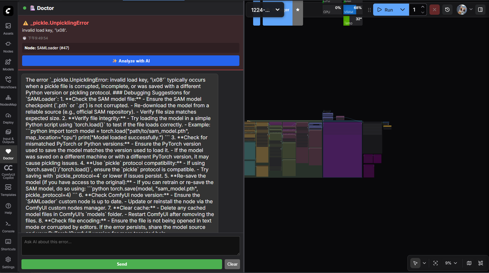
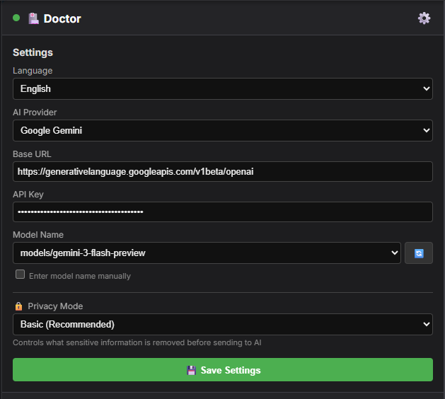

# ComfyUI-Doctor

[繁體中文](README.zh-TW.md) | English | [📋 Roadmap & Development Status](ROADMAP.md)

A continuous, real-time runtime diagnostics suite for ComfyUI. Automatically intercepts all terminal output from startup, captures complete Python tracebacks, and delivers prioritized fix suggestions with node-level context extraction. Features 19+ error pattern recognition, i18n support for Multilingual, persistent log history, and RESTful API for frontend integration.

---

## Latest Updates (30 Dec 2025)

### F9: Multi-language Support Expansion

We've expanded language support from 4 to 9 languages! ComfyUI-Doctor now provides error suggestions in:

- **English** (en)
- **繁體中文** Traditional Chinese (zh_TW)
- **简体中文** Simplified Chinese (zh_CN)
- **日本語** Japanese (ja)
- **🆕 Deutsch** German (de)
- **🆕 Français** French (fr)
- **🆕 Italiano** Italian (it)
- **🆕 Español** Spanish (es)
- **🆕 한국어** Korean (ko)

All 23 error patterns are fully translated across all languages, ensuring consistent diagnostic quality worldwide.

### F8: Sidebar Settings Integration

Settings have been streamlined! Configure Doctor directly from the sidebar:

- Click the ⚙️ icon in the sidebar header to access all settings
- Language selection (9 languages)
- AI Provider quick-switch (OpenAI, DeepSeek, Groq, Gemini, Ollama, etc.)
- Base URL auto-fill when changing providers
- API Key management (password-protected input)
- Model name configuration
- Settings persist across sessions with localStorage
- Visual feedback on save (✅ Saved! / ❌ Error)

ComfyUI Settings panel now only shows the Enable/Disable toggle - all other settings moved to the sidebar for a cleaner, more integrated experience.

---

## Features

- **Automatic Error Monitoring**: Captures all terminal output and detects Python tracebacks in real-time
- **Intelligent Error Analysis**: 19+ built-in error patterns with actionable suggestions
- **Node Context Extraction**: Identifies which node caused the error (Node ID, Name, Class)
- **Multi-language Support**: Current Language Support: English, Traditional Chinese, Simplified Chinese, Japanese (more coming soon).
- **Debug Inspector Node**: Deep inspection of data flowing through your workflow
- **Error History**: Maintains a buffer of recent errors via API
- **RESTful API**: Six endpoints for frontend integration
- **AI-Powered Analysis**: One-click LLM error analysis with support for 8+ providers (OpenAI, DeepSeek, Groq, Gemini, Ollama, LMStudio, and more)
- **Interactive Chat Interface**: Multi-turn AI debugging assistant integrated into ComfyUI sidebar
- **Interactive Sidebar UI**: Visual error panel with node location and instant diagnostics
- **Flexible Configuration**: Comprehensive settings panel for behavior customization

### 🆕 AI Chat Interface

The new interactive chat interface provides a conversational debugging experience directly within ComfyUI's left sidebar. When an error occurs, simply click "Analyze with AI" to start a multi-turn conversation with your preferred LLM.



**Key Features:**

- **Context-Aware**: Automatically includes error details, node information, and workflow context
- **Streaming Responses**: Real-time LLM responses with proper formatting
- **Multi-Turn Conversations**: Ask follow-up questions to dig deeper into issues
- **Always Accessible**: Input area stays visible at the bottom with sticky positioning
- **Supports 8+ LLM Providers**: OpenAI, DeepSeek, Groq, Gemini, Ollama, LMStudio, and more

**How to Use:**

1. When an error occurs, open the Doctor sidebar (left panel)
2. Click the "✨ Analyze with AI" button in the error context area
3. The AI will automatically analyze the error and provide suggestions
4. Continue the conversation by typing follow-up questions in the input box
5. Press Enter or click "Send" to submit your message

---

## Installation

1. Navigate to your ComfyUI custom nodes directory:

   ```bash
   cd ComfyUI/custom_nodes/
   ```

2. Clone or download this repository:

   ```bash
   git clone https://github.com/rookiestar28/ComfyUI-Doctor.git
   ```

3. Restart ComfyUI

4. Look for the initialization message in the console:

   ```text
   [ComfyUI-Doctor] Initializing Smart Debugger...
   [ComfyUI-Doctor] Log file: .../logs/comfyui_debug_2025-12-28.log
   
   ==================== SYSTEM SNAPSHOT ====================
   OS: Windows 11
   Python: 3.12.3
   PyTorch: 2.0.1+cu118
   CUDA Available: True
   ...
   ```

---

## Usage

### Passive Mode (Automatic)

Once installed, ComfyUI-Doctor automatically:

- Records all console output to `logs/` directory
- Detects errors and provides suggestions
- Logs system environment information

**Example Error Output**:

```
Traceback (most recent call last):
  ...
RuntimeError: CUDA out of memory. Tried to allocate 2.00 GiB

----------------------------------------
ERROR LOCATION: Node ID: #42 | Name: KSampler
SUGGESTION: OOM (Out Of Memory): Your GPU VRAM is full. Try:
   1. Reducing Batch Size
   2. Using '--lowvram' flag
   3. Closing other GPU apps
----------------------------------------
```

### Active Mode (Debug Node)

1. Right-click on the canvas → `Add Node` → `Smart Debug Node`
2. Connect the node inline with any connection (supports wildcard input `*`)
3. Execute your workflow

**Example Output**:

```text
[DEBUG] Data Inspection:
  Type: Tensor
  Shape: torch.Size([1, 4, 64, 64])
  Dtype: torch.float16
  Device: cuda:0
  Stats (All): Min=-3.2156, Max=4.8912, Mean=0.0023
```

The node passes data through without affecting workflow execution.

---

## Frontend UI

ComfyUI-Doctor provides an interactive sidebar interface for real-time error monitoring and diagnostics.

### Accessing the Doctor Panel

Click the **🏥 Doctor** button in the ComfyUI menu (left sidebar) to open the Doctor panel. The panel slides in from the right side of the screen.

### Interface Features


- **Status Indicator**: A colored dot in the panel header
  - 🟢 **Green**: System running normally, no errors detected
  - 🔴 **Red (pulsing)**: Active error detected

- **Latest Diagnosis Card**: Displays the most recent error with:
  - Error message and timestamp
  - Node context (Node ID, Name, Class)
  - **🔍 Locate Node on Canvas**: Automatically centers and highlights the problematic node
  - **✨ Analyze with AI**: Send error to configured LLM for intelligent debugging suggestions

- **Real-time Updates**: The panel automatically updates when new errors occur via WebSocket events

- **Auto-open on Error**: Enable in settings to automatically expand the panel when errors are detected

---

## AI-Powered Error Analysis

ComfyUI-Doctor integrates with popular LLM services to provide intelligent, context-aware debugging suggestions.

### Supported AI Providers

#### Cloud Services

- **OpenAI** (GPT-4, GPT-4o, etc.)
- **DeepSeek** (DeepSeek-V2, DeepSeek-Coder)
- **Groq Cloud** (Llama 3, Mixtral - ultra-fast LPU inference)
- **Google Gemini** (Gemini Pro, Gemini Flash)
- **xAI Grok** (Grok-2, Grok-beta)
- **OpenRouter** (Access to Claude, GPT-4, and 100+ models)

#### Local Services (No API Key Required)

- **Ollama** (`http://localhost:11434/v1`) - Run Llama, Mistral, CodeLlama locally
- **LMStudio** (`http://localhost:1234/v1`) - Local model inference with GUI

### Configuration



Configure AI analysis in **ComfyUI Settings** → **Doctor** → **LLM Settings**:

1. **AI Provider**: Select from the dropdown menu. The Base URL will auto-fill.
2. **AI Base URL**: The API endpoint (auto-populated, but customizable)
3. **AI API Key**: Your API key (leave empty for local LLMs like Ollama/LMStudio)
4. **AI Model Name**: Enter the model name (e.g., `gpt-4o`, `deepseek-chat`, `llama3.1:8b`)

#### Finding Available Models for Local LLMs

When you select **Ollama** or **LMStudio** as the provider and refresh the UI, a dialog box will automatically display available models:


Simply copy the desired model name and paste it into the **AI Model Name** field.

### Using AI Analysis

1. Automatically opens the Doctor panel when an error occurs.
2. Review the built-in suggestions, or click the ✨ Analyze with AI button on the error card.
3. Wait for the LLM to analyze the error (typically 3-10 seconds).
4. Review the AI-generated debugging suggestions.

**Security Note**: Your API key is transmitted securely from frontend to backend for the analysis request only. It is never logged or stored persistently.

### Example Providers Setup

| Provider         | Base URL                                                   | Model Example                |
|------------------|------------------------------------------------------------|------------------------------|
| OpenAI           | `https://api.openai.com/v1`                                | `gpt-4o`                     |
| DeepSeek         | `https://api.deepseek.com/v1`                              | `deepseek-chat`              |
| Groq             | `https://api.groq.com/openai/v1`                           | `llama-3.1-70b-versatile`    |
| Gemini           | `https://generativelanguage.googleapis.com/v1beta/openai`  | `gemini-1.5-flash`           |
| Ollama (Local)   | `http://localhost:11434/v1`                                | `llama3.1:8b`                |
| LMStudio (Local) | `http://localhost:1234/v1`                                 | Model loaded in LMStudio     |

---

## Settings

You can customize ComfyUI-Doctor behavior via the ComfyUI Settings panel (Gear icon).

### 1. Show error notifications

**Function**: Toggle floating error notification cards (toasts) in the top-right corner.
**Usage**: Disable if you prefer to check errors manually in the sidebar without visual interruptions.

### 2. Auto-open panel on error

**Function**: Automatically expands the Doctor sidebar when a new error is detected.
**Usage**: **Recommended**. Provides immediate access to diagnostic results without manual clicking.

### 3. Error Check Interval (ms)

**Function**: Frequency of frontend-backend error checks (in milliseconds). Default: `2000`.
**Usage**: Lower values (e.g., 500) give faster feedback but increase load; higher values (e.g., 5000) save resources.

### 4. Suggestion Language

**Function**: Language for diagnostic reports and Doctor suggestions.
**Usage**: Currently supports English, Traditional Chinese, Simplified Chinese, and Japanese (more coming soon). Changes apply to new errors.

### 5. Enable Doctor (requires restart)

**Function**: Master switch for the log interception system.
**Usage**: Turn off to completely disable Doctor's core functionality (requires ComfyUI restart).

### 6. AI Provider

**Function**: Select your preferred LLM service provider from a dropdown menu.
**Options**: OpenAI, DeepSeek, Groq Cloud, Google Gemini, xAI Grok, OpenRouter, Ollama (Local), LMStudio (Local), Custom.
**Usage**: Selecting a provider automatically fills in the appropriate Base URL. For local providers (Ollama/LMStudio), an alert displays available models.

### 7. AI Base URL

**Function**: The API endpoint for your LLM service.
**Usage**: Auto-populated when you select a provider, but can be customized for self-hosted or custom endpoints.

### 8. AI API Key

**Function**: Your API key for authentication with cloud LLM services.
**Usage**: Required for cloud providers (OpenAI, DeepSeek, etc.). Leave empty for local LLMs (Ollama, LMStudio).
**Security**: The key is only transmitted during analysis requests and is never logged or persisted.

### 9. AI Model Name

**Function**: Specify which model to use for error analysis.
**Usage**: Enter the model identifier (e.g., `gpt-4o`, `deepseek-chat`, `llama3.1:8b`). For local LLMs, switch provider to see available models in an alert dialog.

---

## API Endpoints

### GET `/debugger/last_analysis`

Retrieve the most recent error analysis:

```bash
curl http://localhost:8188/debugger/last_analysis
```

**Response Example**:

```json
{
  "status": "running",
  "log_path": ".../logs/comfyui_debug_2025-12-28.log",
  "language": "zh_TW",
  "supported_languages": ["en", "zh_TW", "zh_CN", "ja"],
  "last_error": "Traceback...",
  "suggestion": "SUGGESTION: ...",
  "timestamp": "2025-12-28T06:49:11",
  "node_context": {
    "node_id": "42",
    "node_name": "KSampler",
    "node_class": "KSamplerNode",
    "custom_node_path": "ComfyUI-Impact-Pack"
  }
}
```

### GET `/debugger/history`

Retrieve error history (last 20 entries):

```bash
curl http://localhost:8188/debugger/history
```

### POST `/debugger/set_language`

Change the suggestion language (see Language Switching section).

### POST `/doctor/analyze`

Analyze an error using configured LLM service.

**Payload**:

```json
{
  "error": "Traceback...",
  "node_context": {...},
  "api_key": "your-api-key",
  "base_url": "https://api.openai.com/v1",
  "model": "gpt-4o",
  "language": "en"
}
```

**Response**:

```json
{
  "analysis": "AI-generated debugging suggestions..."
}
```

### POST `/doctor/verify_key`

Verify API key validity by testing connection to the LLM provider.

**Payload**:

```json
{
  "base_url": "https://api.openai.com/v1",
  "api_key": "your-api-key"
}
```

**Response**:

```json
{
  "success": true,
  "message": "API key is valid",
  "is_local": false
}
```

### POST `/doctor/list_models`

List available models from the configured LLM provider.

**Payload**:

```json
{
  "base_url": "http://localhost:11434/v1",
  "api_key": ""
}
```

**Response**:

```json
{
  "success": true,
  "models": [
    {"id": "llama3.1:8b", "name": "llama3.1:8b"},
    {"id": "mistral:7b", "name": "mistral:7b"}
  ],
  "message": "Found 2 models"
}
```

---

## Log Files

All logs are stored in:

```text
ComfyUI/custom_nodes/ComfyUI-Doctor/logs/
```

Filename format: `comfyui_debug_YYYY-MM-DD_HH-MM-SS.log`

The system automatically retains the 10 most recent log files (configurable via `config.json`).

---

## Configuration

Create `config.json` to customize behavior:

```json
{
  "max_log_files": 10,
  "buffer_limit": 100,
  "traceback_timeout_seconds": 5.0,
  "history_size": 20,
  "default_language": "zh_TW",
  "enable_api": true
}
```

**Parameters**:

- `max_log_files`: Maximum number of log files to retain
- `buffer_limit`: Traceback buffer size (line count)
- `traceback_timeout_seconds`: Timeout for incomplete tracebacks
- `history_size`: Number of errors to keep in history
- `default_language`: Default suggestion language
- `enable_api`: Enable API endpoints

---

## Supported Error Patterns

ComfyUI-Doctor can detect and provide suggestions for:

- Type mismatches (e.g., fp16 vs float32)
- Dimension mismatches
- CUDA/MPS out of memory
- Matrix multiplication errors
- Device/type conflicts
- Missing Python modules
- Assertion failures
- Key/attribute errors
- Shape mismatches
- File not found errors
- SafeTensors loading errors
- CUDNN execution failures
- Missing InsightFace library
- Model/VAE mismatches
- Invalid prompt JSON

And more...

---

## Tips

1. **Pair with ComfyUI Manager**: Install missing custom nodes automatically
2. **Check log files**: Full tracebacks are recorded for issue reporting
3. **Use the built-in sidebar**: Click the 🏥 Doctor icon in the left menu for real-time diagnostics
4. **Node Debugging**: Connect Debug nodes to inspect suspicious data flow

---

## License

MIT License

---

## Contributing

Contributions are welcome! Please feel free to submit a Pull Request.

---

## Support

If you encounter any issues or have suggestions, please open an issue on GitHub.
