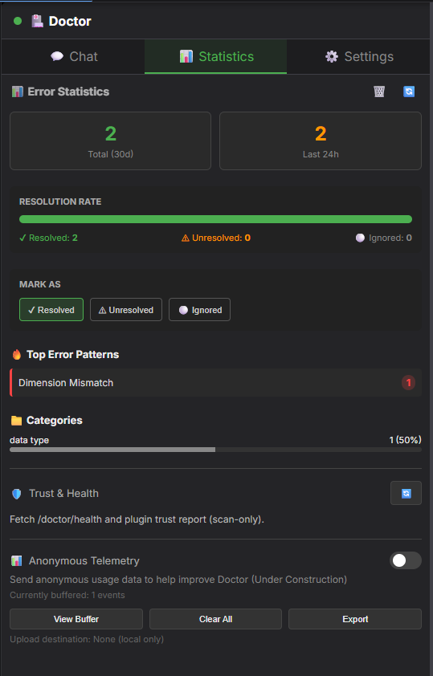
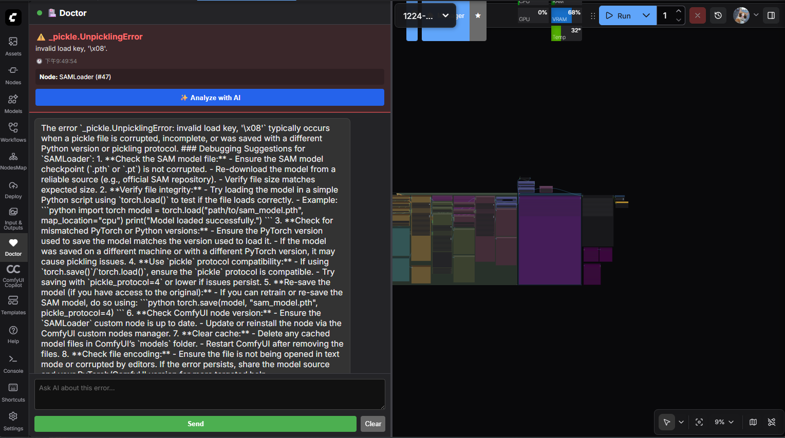
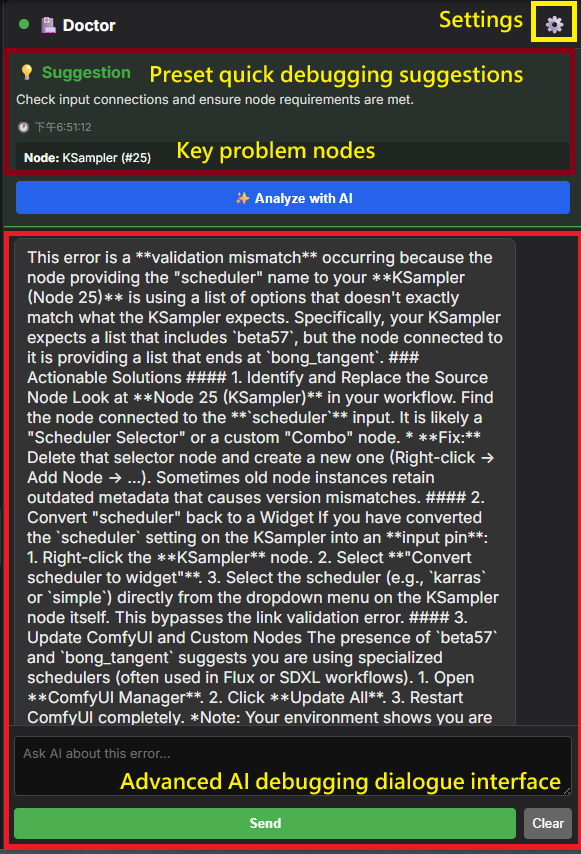

# ComfyUI-Doctor

[繁中](docs/readme/README.zh-TW.md) | [简中](docs/readme/README.zh-CN.md) | [日本語](docs/readme/README.ja.md) | [한국어](docs/readme/README.ko.md) | [Deutsch](docs/readme/README.de.md) | [Français](docs/readme/README.fr.md) | [Italiano](docs/readme/README.it.md) | [Español](docs/readme/README.es.md) | English |

<div align="center">

</div>

ComfyUI-Doctor is a real-time diagnostics and debugging assistant for ComfyUI. It captures runtime errors, identifies likely node context, shows actionable local suggestions, and can optionally use an LLM chat workflow for deeper troubleshooting.

Contributor guide: [CONTRIBUTING.md](CONTRIBUTING.md) | Architecture: [docs/ARCHITECTURE.md](docs/ARCHITECTURE.md) | API contract: [docs/API_REFERENCE.md](docs/API_REFERENCE.md) / [docs/openapi.json](docs/openapi.json)

<details>
<summary><h2>Latest Updates - Click to expand</h2></summary>

<details>
<summary><strong>Doctor sidebar minimum width and host-switch lifecycle corrected</strong></summary>

- Enforced a `560px` Doctor sidebar minimum across the host splitter, content wrapper, and Doctor mount while preserving wider user layouts.
- Isolated Doctor presentation state in an owned content root and added takeover-safe cleanup so switching to another custom sidebar releases Doctor resources without clipping, marker leakage, or overwriting the incoming extension.

</details>

<details>
<summary><strong>Current host runtime lanes, DynamicVRAM guidance, and SAM3D diagnostics refreshed</strong></summary>

- Refreshed version-aware compatibility coverage for the Desktop frontend `1.43.18`, ComfyUI-pinned frontend `1.51.9`, and standalone frontend `1.54.3+`, including current named-widget restoration and standalone asynchronous settings-handler behavior.
- Updated the bounded, nonfatal Trust & Health advisory for both supported PyTorch fallback messages and the `comfy-aimdo` fallback; DynamicVRAM requires PyTorch 2.8 or later, ComfyUI recommends 2.12 or later for this feature, and base support remains PyTorch 2.7.
- Added exact `SAM3DBody_Loader` model diagnostics against ComfyUI's registered `detection` root without falling back to checkpoints.
- Unified Doctor-owned terminal messages under one severity-aware identity while keeping persisted logs and plain sinks free of ANSI styling.
- Restored the full startup banner on compatible Unicode streams with an encoding-safe ASCII fallback and tightly packed one-block output.

</details>

<details>
<summary><strong>Current host baseline, diagnostics, frontend safety, and lifecycle reliability aligned</strong></summary>

- Refreshed source-linked compatibility coverage for the current ComfyUI and frontend baselines, including opt-in detail logging, named-widget restore policy, promoted media contracts, and the current PyTorch minimum.
- Made backend test collection preserve the canonical package entry point while retaining host-like ComfyUI package-load validation.
- Updated environment diagnostics and public guidance so parseable PyTorch versions below 2.7 receive conservative upgrade guidance.
- Expanded promoted missing-asset diagnostics across first-party image, video, output-image, and audio loaders while preserving visible-host and concrete source-loader provenance.
- Hardened dynamic tab and credential-store status rendering so backend and exception text remains literal rather than being parsed as markup.
- Scoped Chat island activation and cleanup to the owned tab pane, preventing decoy or detached containers from receiving lifecycle actions.

</details>

<details>
<summary><strong>Latest host serialization, dataset diagnostics, policy errors, and dependency security aligned</strong></summary>

- Refreshed source-linked host contract coverage for current ComfyUI, standalone frontend, core-pinned frontend, and Desktop runtime lanes.
- Added bounded positional-first, named-fallback widget value support for root and promoted nested model asset diagnostics.
- Added contained first-party image, video, caption-pair, and training dataset folder diagnostics using authoritative input and dataset roots.
- Added accurate node-level guidance for partner nodes disabled by workspace policy while preserving account-precondition routing and escaped error details.
- Patched the PostCSS development dependency path-traversal advisory and added an offline regression that enforces the safe dependency floor.

</details>

<details>
<summary><strong>Host compatibility, diagnostic safety, nested workflows, and Desktop identity aligned</strong></summary>

- Added version-aware host contract coverage for the bundled Desktop frontend, ComfyUI's pinned frontend package, and the current standalone frontend source.
- Hardened model diagnostics with authoritative registered model roots/extensions, bounded nested-subgraph scanning, and real-path containment before any asset probe.
- Redacted `Authorization` and `X-API-Key` values unconditionally across text and structured outbound/log data, and disabled host setting-change telemetry for all Doctor-owned settings.
- Corrected real subgraph focus and public-graph validation-error surfacing while preserving group-node behavior, source provenance, and legacy frontend fallbacks.
- Aligned Python/PyTorch support guidance and separated Desktop runtime identity from private system-user storage selection.

</details>

<details>
<summary><strong>Current host contracts, diagnostics, error UX, and tooling policy refreshed</strong></summary>

- Refreshed host compatibility checks for current system statistics metadata, telemetry feature flags, ComfyUI job-cancel routes, and frontend job-cancel adoption.
- Expanded local model asset diagnostics for current Diffusers, GLIGEN, 3D asset input, and broader CLIP loader/widget naming while preserving legacy folder fallbacks.
- Improved frontend error UX for current aggregate validation groups, missing model/media/swap-node states, account-precondition filtering, and duplicate validation/runtime reports.
- Clarified Doctor's frontend validation tooling policy as Node.js `>=18 <26`, with full-test scripts and preflight checks blocking unvalidated Node 26+ runtimes.

</details>

<details>
<summary><strong>Host API alignment, model diagnostics, and validation UX refreshed</strong></summary>

- Refreshed host compatibility checks for current prompt queue metadata, execution event payloads, model asset folders, and frontend queue source attribution.
- Expanded model asset diagnostics to recognize current ComfyUI first-party model folders and loader families while keeping legacy folder fallbacks.
- Improved validation-error display so known prompt-validation failures use stable local catalog copy and grouping, with safe fallback for unknown host errors and duplicate suppression across validation/runtime reports.
- Clarified canonical `/doctor/...` routes, current host-provided `/api/doctor/...` aliases, and future-safe prompt usage-source metadata policy.

</details>

<details>
<summary><strong>Architecture, API contract, contribution, and security-audit docs added</strong></summary>

- Added a public architecture guide that maps ComfyUI startup, backend service domains, frontend modules, security/storage boundaries, telemetry, diagnostics, and validation lanes.
- Added a machine-readable OpenAPI contract and public API reference for Doctor/debugger endpoints, admin-gated writes, telemetry, diagnostics, jobs, and provider status.
- Added a root contributor guide covering setup, repository orientation, validation workflow, documentation expectations, security/privacy boundaries, and pull-request readiness.
- Added a quarterly security-audit SOP, sanitized report-template generator, and scheduled/manual GitHub Actions workflow with required local checks plus optional Semgrep, Snyk, and OWASP ZAP lanes.

</details>

<details>
<summary><strong>Host alignment, service boundaries, and UI maintainability refreshed</strong></summary>

- Decomposed route registration and route handlers so host-facing startup remains compact while service-owned endpoints stay easier to review.
- Added stable service-domain entry points for LLM, security, infrastructure, and community modules.
- Moved frontend i18n text into data files and split the right-side diagnosis panel out of the main sidebar renderer.
- Added a chat provider quick switch that stays synchronized with Settings while preserving the existing provider configuration flow.

</details>

<details>
<summary><strong>Validation lanes expanded for deterministic integration, stress, and audit coverage</strong></summary>

- Renamed the supplemental security/contract/E2E gate to the neutral focused-gate entrypoints while preserving compatibility wrappers for old local automation.
- Made telemetry integration E2E deterministic by default through the Playwright harness backend, with live-backend testing kept as explicit opt-in via `COMFYUI_URL`.
- Added an opt-in telemetry stress lane for burst/state behavior while keeping the default `npm test` run fast and stable.
- Updated public validation docs to distinguish the mandatory full gate from focused, integration, stress, compatibility, coverage, and quarterly audit lanes.

</details>

<details>
<summary><strong>Supply-Chain Hardening, Host Alignment, and Node Focus Compatibility</strong></summary>

- Added a repo-local supply-chain scanner for dependency manifests, lockfiles, workflow risk patterns, install trees, and optional workstation config indicators.
- Added a sanitized incident-response checklist and wired the supply-chain gate into local full-test scripts and CI dependency-install paths.
- Hardened GitHub Actions permissions, token exposure defaults, install sequencing, and dependency audit posture for the development test stack.
- Updated Doctor runtime state resolution to prefer ComfyUI's private system-user directory when available, with legacy fallback/migration and path diagnostics.
- Expanded host compatibility checks for current ComfyUI, ComfyUI frontend, and Desktop contracts.
- Updated sidebar registration to prefer the current ComfyUI frontend sidebar API while keeping legacy fallback behavior and duplicate-tab cleanup.
- Aligned locate-node behavior with current upstream focus semantics for root graph nodes, grouped execution ids, and nested subgraph execution ids.

</details>

<details>
<summary><strong>Unified LLM Context, Provider Handling, and API Hardening</strong></summary>

- Routed LLM prompt context through the analysis pipeline so sanitized tracebacks, node context, recent logs, workflow snippets, and system details use one structured path.
- Centralized OpenAI-compatible, Anthropic, and Ollama request/response handling for chat, analysis, model listing, and provider connectivity checks.
- Standardized API error payloads with `success`, `error`, and `message` fields while preserving existing success response shapes.
- Improved node-context stability with immutable, validated node identity data used by analysis, locate actions, and prompt context.
- Removed obsolete no-op diagnostics output now that concrete local diagnostics checks are available.
- Hardened import fallback behavior and logger traceback reset handling for more reliable ComfyUI host loading and history clearing.

</details>

<details>
<summary><strong>Host Compatibility, Security Controls, and Coverage Baseline</strong></summary>

- Added host compatibility checks for the ComfyUI, ComfyUI frontend, and Desktop surfaces Doctor depends on.
- Updated frontend settings integration to prefer the current ComfyUI settings API while keeping legacy fallback behavior isolated.
- Improved execution-error lineage enrichment from recent execution/progress events.
- Added strict admin-token mode for shared-server deployments and clearer loopback-mode warnings.
- Documented encrypted server-side credential storage metadata and the current encrypt-then-MAC design.
- Added an optional coverage baseline lane; the default full local validation flow remains unchanged.

</details>

<details>
<summary><strong>Frontend Extension API Modernization + Sidebar Lifecycle Cleanup</strong></summary>

- Migrated Doctor frontend settings registration to the current ComfyUI frontend extension settings API using declarative `settings: [...]`, with a dedicated compatibility adapter for modern and legacy host behavior.
- Centralized frontend coupling for runtime setting access, `rootGraph`-first graph lookup, and guarded legacy fallback behavior so upstream API drift is isolated to one adapter.
- Added explicit sidebar/tab cleanup on remount so repeated Doctor panel renders do not retain stale island mounts, tab managers, or listeners.
- Updated frontend mocks and regression coverage so declarative settings registration is validated before extension setup logic runs.

</details>

<details>
<summary><strong>Startup Compatibility + Validation Gate Hardening</strong></summary>

- Hardened package-internal imports and prestartup bootstrap behavior so real ComfyUI custom-node loading no longer depends on the extension root being a top-level import root.
- Made startup/backend console output ASCII-safe and removed non-UI emoji from backend/startup/test-script paths to avoid Windows charmap/code-page failures during import and early logging.
- Added a host-like package/startup validation stage (`scripts/validate_host_load.py`) to the local acceptance gate so package-load and startup encoding regressions surface before backend pytest and E2E.

</details>

<details>
<summary><strong>Compatibility + Hardening Follow-up (Desktop Paths, UTC Timestamps, Event Compatibility)</strong></summary>

- Verified Doctor data-path resolution against ComfyUI Desktop `.venv` installs and modern `user/ComfyUI-Doctor` layouts, with path diagnostics exposed in `/doctor/health`.
- Standardized runtime timestamp handling around timezone-aware UTC serialization while keeping legacy naive history, telemetry, and diagnostics records backward-compatible.
- Completed compatibility and hardening follow-ups for logger recursion filtering, `execution_error` subgraph fields, Desktop path detection, and runtime timestamp normalization.

</details>

<details>
<summary><strong>Security Hardening Refresh (Admin Gate + Network Boundary + Secret Storage)</strong></summary>

- Consolidated write-sensitive API routes under a unified admin guard path so state-changing operations consistently require authorized access.
- Strengthened outbound URL safety with DNS-resolution checks to block hostname-based private/metadata target rebinding attempts.
- Upgraded server-side secret storage with optional at-rest encryption, safer migration behavior for existing plaintext files, and stronger Windows ACL hardening behavior.
- Hardened outbound proxy trust defaults so shared HTTP sessions ignore ambient proxy environment variables unless explicitly opted in, with effective policy exposed in health diagnostics.

</details>

<details>
<summary><strong>Data-Driven Diagnostics Signature Packs</strong></summary>

- Added JSON-based signature packs for proactive diagnostics so heuristic rule updates can be maintained as data instead of code-only changes.
- Added bounded, local-only diagnostic enrichment for common ComfyUI workflow issues such as model path anomalies, missing assets/placeholders, node config anti-patterns, and environment mismatch hints.
- Diagnostics issues can now include machine-readable confidence and provenance metadata for signature-pack matches.

</details>

<details>
<summary><strong>Validation Expansion Remediation: Desktop Hardening + Isolation Test Pack</strong></summary>

- Added targeted desktop failure-injection regression tests for corrupt state recovery, flush-failure non-crash paths, and history migration continuity.
- Added non-ComfyUI isolation coverage for metadata contract validation and PromptComposer/harness payload compatibility.
- Added an opt-in online API test lane scaffold (`RUN_ONLINE_API_TESTS=true`) to separate secret-scoped provider checks from default local runs.

</details>

<details>
<summary><strong>Validation Expansion Foundation: Runtime Guardrail Config</strong></summary>

- Added centralized runtime guardrail configuration through environment variables for history limits, job retention, aggregation/rate windows, and provider timeout/retry defaults.
- Applied initial runtime wiring for stale job cleanup retention while keeping default behavior unchanged for existing users.
- Hardened config persistence by treating guardrails as runtime-only policy excluded from `config.json`, with compatibility handling for legacy payloads.
- Added regression tests for defaults, environment override precedence, runtime-only persistence, and config loader compatibility.

</details>

<details>
<summary><strong>External Enrichment Safety Foundation + Resumable Job APIs</strong></summary>

- Added a fail-closed external enrichment foundation with provider contract/capability registry, submission policy checks, confirmation tokens, and redacted audit logging.
- Added resumable, checkpointed long-job APIs for job status, resume, cancel, and provider status, with corruption-tolerant state handling.
- Hardened route wiring and integrated non-stream output cleanup for `/doctor/analyze` and non-stream `/doctor/chat` to reduce hidden marker leakage.
- Added dedicated regression coverage for policy engine, adapter behavior, resumable jobs, contract normalization, and API routes.

</details>

<details>
<summary><strong>(v1.6.3) Dual-Mode API Key Strategy (ENV-first + Advanced Server Key Store)</strong></summary>

- API keys are no longer persisted in frontend settings; the API key input is session-only by default.
- Added a default-collapsed **Advanced Key Store (Server-side)** section for explicit save/delete actions.
- Backend key resolution order is now request key, provider environment variable, generic environment variable, then optional server store.
- Existing users with legacy frontend-stored keys are auto-migrated once to runtime memory, then the persisted key is cleared.
- UI now includes inline risk guidance explaining that the server store is optional, supports configurable encryption-at-rest, and that environment variables remain the recommended path.

</details>

<details>
<summary><strong>Proactive Diagnostics (Health Check + Intent Signature)</strong></summary>

- Added a **Diagnostics** section to the **Statistics** tab for proactive workflow troubleshooting without requiring an LLM.
- Added health checks for workflow lint, environment/dependencies, and privacy/safety issues, with actionable findings.
- Added deterministic intent signature inference with top intents and evidence to help triage what a workflow is trying to do.
- Improved UX fallbacks for cases such as no dominant intent and strengthened evidence sanitization.

</details>

<details>
<summary><strong>(v1.5.8) QoL: Auto-open Right Error Report Panel Toggle</strong></summary>

- Added a dedicated toggle in **Doctor -> Settings** to control whether the right-side error report panel auto-opens when a new error is detected.
- The setting defaults to enabled for new installs and is persisted after the user changes it.

</details>

<details>
<summary><strong>(v1.5.0) Smart Token Budget Management</strong></summary>

**Smart Context Management (Cost Optimization):**

- Automatic trimming for remote LLMs, reducing token usage before requests are sent.
- Progressive trimming strategy covering workflow pruning, system info removal, and traceback truncation.
- Local opt-in trimming for Ollama and LMStudio contexts with larger local limits.
- Token tracking and A/B validation support for context-budget behavior.

**Network Resilience:**

- Exponential backoff for 429/5xx responses with jitter.
- Streaming timeout watchdog for stalled SSE chunks.
- Rate and concurrency limits through token bucket and semaphore controls.

**Configuration:**

| Config Key | Default | Description |
| --- | --- | --- |
| `r12_enabled_remote` | `true` | Enable smart budget for remote providers. |
| `retry_max_attempts` | `3` | Maximum retry attempts. |
| `stream_chunk_timeout` | `30` | Stream stall timeout in seconds. |

</details>

<details>
<summary><strong>(v1.4.5) Pipeline Governance & Plugin Security</strong></summary>

**Security Hardening:**

- Strengthened SSRF protection with host/port parsing and outbound redirect blocking.
- Added a single outbound sanitization boundary through `outbound.py`, with `privacy_mode=none` reserved for verified local LLMs while named sensitive headers remain redacted.

**Plugin Trust System:**

- Plugins are safe-by-default, disabled unless explicitly allowlisted with manifest/SHA256 metadata.
- Added trust taxonomy for trusted, unsigned, untrusted, and blocked plugins.
- Added filesystem hardening through realpath containment, symlink rejection, size limits, and strict filename rules.
- Added optional HMAC signature support for shared-secret integrity verification.

**Pipeline Governance:**

- Added metadata contract validation with schema versioning and quarantine behavior for invalid keys.
- Added dependency policy handling for stage `requires` and `provides` metadata.
- Added logger backpressure through priority-aware queue eviction and drop metrics.
- Added clean prestartup handoff before SmartLogger takes over.

**Observability:**

- Added `/doctor/health` endpoint data for queue metrics, drop counters, SSRF blocks, and pipeline status.

</details>

<details>
<summary><strong>CI Gates & Plugin Tooling</strong></summary>

- Added focused regression gate automation covering security/contract pytest suites and frontend E2E validation.
- Added local validation scripts with fast and E2E modes for release preparation.
- Added an AST-based outbound safety checker in `scripts/check_outbound_safety.py`.
- Added plugin manifest, allowlist, validator, and optional HMAC signing tools.
- Updated plugin migration and plugin guide documentation for the trust model.

</details>

<details>
<summary><strong>CSP Documentation & Telemetry</strong></summary>

**CSP Compatibility:**

- Documented local asset loading behavior for ComfyUI CSP compatibility.
- Kept CDN usage as fallback-only behavior.

**Local Telemetry Infrastructure:**

- Added local telemetry storage, rate limiting, and PII detection.
- Added telemetry API endpoints for status, buffer inspection, tracking, clearing, export, and toggling.
- Added Statistics UI controls for telemetry management.
- Telemetry remains default-off until explicitly enabled.

</details>

<details>
<summary><strong>E2E Runner Hardening & Trust/Health UI</strong></summary>

**E2E Runner Hardening:**

- Fixed Playwright transform cache permission issues for WSL `/mnt/c` workflows.
- Added writable temp-dir handling under the repo for Playwright runs.
- Added `PW_PYTHON` override support for cross-platform compatibility.

**Trust & Health UI Panel:**

- Added a **Trust & Health** panel in the Statistics tab.
- Displays pipeline status, SSRF block counts, dropped logs, and plugin trust information.
- Added `GET /doctor/plugins` as a scan-only endpoint that does not import plugin code.

</details>

<details>
<summary><strong>(v1.4.0) Previous Update</strong></summary>

- Completed the Preact migration across chat and statistics islands, island registry, shared rendering, and robust fallbacks.
- Strengthened Playwright E2E coverage around frontend integration.
- Fixed sidebar tooltip timing behavior.

</details>

<details>
<summary><strong>Statistics Dashboard</strong></summary>

ComfyUI-Doctor includes a **Statistics Dashboard** for tracking error trends, common issues, and resolution progress.

**Features:**

- Error trends across 24h, 7d, and 30d time ranges.
- Top error patterns by frequency.
- Category breakdown for memory, workflow, model loading, and related issue classes.
- Resolution tracking for resolved and unresolved errors.
- Full i18n support across supported UI languages.



**How to Use:**

1. Open the Doctor panel from ComfyUI's left sidebar.
2. Switch to the **Statistics** tab.
3. Review trends, top patterns, and current resolution status.
4. Use the action controls to mark the latest error as resolved, unresolved, or ignored.

**Backend API:**

- `GET /doctor/statistics?time_range_days=30` - Fetch statistics.
- `POST /doctor/mark_resolved` - Update resolution status.

</details>

<details>
<summary><strong>Pattern Validation CI</strong></summary>

ComfyUI-Doctor includes continuous validation for error pattern quality.

**What Pattern Validation Checks:**

- JSON format validity for pattern files.
- Regex syntax validity for all patterns.
- i18n completeness across supported languages.
- Schema compliance for required fields such as `id`, `regex`, `error_key`, `priority`, and `category`.
- Metadata quality such as priority ranges, unique IDs, and valid categories.

**GitHub Actions Integration:**

- Runs on changes affecting `patterns/`, i18n resources, or related tests.
- Blocks merges when validation fails.

**For Contributors:**

```bash
python scripts/run_pattern_tests.py
```

</details>

<details>
<summary><strong>Pattern System Overhaul</strong></summary>

ComfyUI-Doctor introduced a JSON-based pattern management architecture for built-in and community error patterns.

**Logger Architecture:**

- Implemented SafeStreamWrapper with queue-based background processing.
- Reduced deadlock and race-condition risk.
- Improved compatibility with ComfyUI's LogInterceptor behavior.

**JSON Pattern Management:**

- Added PatternLoader with hot-reload capability.
- Patterns are defined in JSON files under `patterns/`.
- Built-in patterns live under `patterns/builtin/core.json`.
- Pattern definitions are easier to extend and maintain.

**Community Pattern Expansion:**

- Added community patterns for common extension families:
  - ControlNet model loading, preprocessing, and image sizing.
  - LoRA loading, compatibility, and weight issues.
  - VAE encoding/decoding, precision, and tiling issues.
  - AnimateDiff model loading, frame count, and context length issues.
  - IPAdapter model loading, image encoding, and compatibility issues.
  - FaceRestore CodeFormer/GFPGAN model and detection issues.
  - Checkpoint, sampler, scheduler, and CLIP failure modes.

**Benefits:**

- Broader error coverage.
- Hot-reloadable patterns without restarting ComfyUI.
- JSON-based community contribution path.
- Cleaner and more maintainable diagnostics code.

</details>

<details>
<summary><strong>Previous Updates (Dec 2025)</strong></summary>

**Multi-language Support Expansion:**

- Expanded suggestion language support from 4 to 9 languages:
  - English (`en`)
  - Traditional Chinese (`zh_TW`)
  - Simplified Chinese (`zh_CN`)
  - Japanese (`ja`)
  - German (`de`)
  - French (`fr`)
  - Italian (`it`)
  - Spanish (`es`)
  - Korean (`ko`)
- Error suggestions are translated across supported languages for consistent diagnostic quality.

**Sidebar Settings Integration:**

- Routine configuration now lives in the sidebar **Settings** tab.
- Users can configure language, AI provider, base URL, session-only API key, model selection/manual entry, privacy mode, and auto-open behavior.
- The **Advanced Key Store (Server-side)** remains available only when persisted server-side keys are intentionally needed.
- Settings can be saved directly from the sidebar without leaving the Doctor workflow.
- Doctor registers compatibility values through ComfyUI's frontend extension settings API, while the sidebar **Settings** tab remains the recommended UI for routine configuration.

</details>
</details>

## Table of Contents

- [Core Features](#core-features)
- [Host Compatibility and Diagnostics](#host-compatibility-and-diagnostics)
- [Screenshots](#screenshots)
- [Installation](#installation)
- [Basic Usage](#basic-usage)
- [Optional LLM Setup](#optional-llm-setup)
- [Documentation](#documentation)
- [Supported Error Patterns](#supported-error-patterns)
- [Validation](#validation)
- [Requirements](#requirements)
- [License](#license)
- [Contributing](#contributing)

## Core Features

- Real-time ComfyUI console/error capture from startup.
- Built-in suggestions from 58 JSON-based error patterns, including 22 core patterns and 36 community-extension patterns.
- Validated node context extraction for recent workflow execution errors when ComfyUI provides enough event data.
- Stable local display summaries for known prompt-validation, aggregate host, and partner workspace-policy errors, including public-graph boundary surfacing, source provenance, grouping metadata, account-precondition filtering, duplicate suppression, and safe fallback copy for unknown validation types.
- Doctor sidebar with Chat, Statistics, and Settings tabs.
- Host-compatible sidebar registration and node locate actions for current and legacy ComfyUI frontend builds, including distinct group-node and real-subgraph navigation.
- Optional LLM analysis through OpenAI-compatible services, Anthropic, Gemini, xAI, OpenRouter, Ollama, and LMStudio, with unified provider request/response handling.
- Privacy controls for outbound LLM requests, including path/key/email/IP sanitization modes and unconditional sensitive-header redaction.
- Optional server-side credential store with admin guarding and encryption-at-rest support.
- Local diagnostics for workflow linting, registered ComfyUI model roots/extensions, nested workflow assets, first-party dataset folders, privacy, performance, signature packs, statistics, plugin trust, bounded host fallback advisories, telemetry controls, and community feedback preview/submit tools.
- Consistent JSON error envelopes for Doctor API failures.
- Full UI and suggestion language support for English, Traditional Chinese, Simplified Chinese, Japanese, Korean, German, French, Italian, and Spanish.

## Host Compatibility and Diagnostics

- The compatibility lane tracks host contracts by applicable runtime instead of treating every frontend checkout as one version: ComfyUI Desktop's bundled frontend, ComfyUI's pinned frontend package, and the current standalone frontend source are checked separately.
- Model asset diagnostics use ComfyUI's live `folder_names_and_paths` registry when available, including host/custom roots and extensions such as `.pt2` and `.sft`. Older hosts retain a bounded legacy fallback.
- The exact first-party `SAM3DBody_Loader` resolves `model_file` only against registered `detection` roots. If that category is unavailable, Doctor reports the unresolved asset rather than accepting a same-named checkpoints file.
- Workflow diagnostics inspect bounded `definitions.subgraphs` content, including promoted and non-promoted nested model references, while preserving the visible host and concrete source node provenance. Positional widget serialization remains authoritative, with bounded schema-linked named values used only when the positional slot is absent.
- Promoted first-party image, video, output-image, and audio references keep the visible host as the user-facing target while retaining concrete source-loader provenance. Unknown custom upload-capable nodes are not inferred from a filename alone when authoritative node-definition flags are unavailable.
- Every candidate model path is resolved and contained within an authoritative registered root before Doctor checks it. Traversal, absolute external, cross-drive, null-byte, and symlink escape candidates are rejected.
- Exact first-party image/video dataset folder widgets resolve only below ComfyUI's input root, while saved training dataset folders resolve only below registered `datasets` roots. Doctor checks the folder itself without enumerating or reading dataset content.
- Validation errors can be surfaced to a visible outer subgraph host when public raw errors and graph links prove the boundary mapping. Recognized partner-node workspace-policy errors stay node-level and remain distinct from account preconditions. Doctor does not depend on private frontend stores for this behavior.
- Environment diagnostics support Python 3.10 and newer without a stale upper-version penalty. PyTorch versions below 2.7 receive conservative upgrade guidance when a parseable version is available.
- Exact allowlisted DynamicVRAM fallback warnings can produce one bounded, nonfatal Trust & Health advisory. Automatic DynamicVRAM requires PyTorch 2.8 and working `comfy-aimdo`, ComfyUI recommends PyTorch 2.12 or later for this feature, and the feature-specific requirement does not change ComfyUI's base PyTorch 2.7 support or Doctor's runtime-error state.
- Desktop runtime identity and storage are reported independently: a managed Desktop `.venv` remains identified as Desktop while Doctor data continues to prefer ComfyUI's private system-user directory.

## Screenshots

<div align="center">

</div>

<div align="center">

</div>

## Installation

### ComfyUI-Manager

1. Open ComfyUI and click **Manager**.
2. Select **Install Custom Nodes**.
3. Search for `ComfyUI-Doctor`.
4. Install and restart ComfyUI.

### Manual Install

```bash
cd ComfyUI/custom_nodes/
git clone https://github.com/rookiestar28/ComfyUI-Doctor.git
```

Restart ComfyUI after cloning. Doctor should print its startup diagnostics and register the `Doctor` sidebar entry.

## Basic Usage

### Automatic Diagnostics

After installation, Doctor passively records ComfyUI runtime output, detects tracebacks, matches known error patterns, and shows the latest diagnosis in the sidebar and optional right-side report panel.
Prompt-validation failures from ComfyUI are normalized into local catalog summaries when the host reports structured validation details; unknown validation types use safe fallback text.
For nested workflows, Doctor can surface eligible input-level validation errors to the visible outer subgraph while retaining the concrete source node and input provenance.
When optional LLM analysis is used, Doctor builds prompt context from the same structured pipeline that handles sanitization, node context, execution logs, workflow pruning, and system information.

### Doctor Sidebar

Open **Doctor** in ComfyUI's left sidebar:

- **Chat**: review latest error context and ask follow-up debugging questions.
- **Statistics**: inspect recent error trends, diagnostics, trust/health information, telemetry controls, and feedback tools.
- **Settings**: choose language, LLM provider, base URL, model, privacy mode, auto-open behavior, and optional server-side credential storage.

When node context is available, locate actions use the host canvas focus APIs when possible, including graph/subgraph switching for nested execution ids while keeping executable group focus on the group host.

### Smart Debug Node

Right-click the canvas, add **Smart Debug Node**, and place it inline to inspect passing data without changing workflow output.

## Optional LLM Setup

Cloud providers require a credential supplied through the session-only UI field, environment variables, or the optional admin-gated server store. Local providers such as Ollama and LMStudio can run without a cloud credential.
Doctor normalizes provider-specific request and response formats for OpenAI-compatible APIs, Anthropic, and Ollama so chat, single-shot analysis, model listing, and connectivity checks share the same backend behavior.

Recommended defaults:

- Use **Privacy Mode: Basic** or **Strict** for cloud providers.
- Treat `Authorization` and `X-API-Key` values as always-redacted secrets; this protection remains active even for verified-local `none` mode.
- Use environment variables for shared or production-like environments.
- Set `DOCTOR_ADMIN_TOKEN` and `DOCTOR_REQUIRE_ADMIN_TOKEN=1` on shared servers.
- Keep local-only loopback convenience mode for single-user desktop use only.

## Documentation

- [User Guide](docs/USER_GUIDE.md): UI walkthrough, diagnostics, privacy modes, LLM setup, and feedback flow.
- [Architecture](docs/ARCHITECTURE.md): host startup, backend/frontend boundaries, data flows, security/storage boundaries, and test lanes.
- [Configuration and Security](docs/CONFIGURATION_SECURITY.md): environment variables, admin guard behavior, credential storage, outbound safety, telemetry, and CSP notes.
- [API Reference](docs/API_REFERENCE.md): public Doctor and debugger endpoints, route alias behavior, and prompt usage-source policy.
- [OpenAPI Contract](docs/openapi.json): machine-readable API contract.
- [Validation Guide](docs/VALIDATION.md): local full-gate commands and optional focused, integration, stress, compatibility, coverage, and audit lanes.
- [Security Audit](docs/SECURITY_AUDIT.md): quarterly audit cadence, report template generation, manual checks, optional external scanners, and evidence handling.
- [Plugin Guide](docs/PLUGIN_GUIDE.md): community plugin trust model and plugin authoring notes.
- [Plugin Migration](docs/PLUGIN_MIGRATION.md): migration tooling for plugin manifests and allowlists.
- [Outbound Safety](docs/OUTBOUND_SAFETY.md): static checker and outbound request safety rules.
- [Contributing](CONTRIBUTING.md): setup, development workflow, validation expectations, and PR readiness.

## Supported Error Patterns

Patterns are stored as JSON files under `patterns/` and can be updated without code changes.

| Pack | Count |
| --- | ---: |
| Core builtin patterns | 22 |
| Community extension patterns | 36 |
| **Total** | **58** |

Community packs currently cover common ControlNet, LoRA, VAE, AnimateDiff, IPAdapter, FaceRestore, checkpoint, sampler, scheduler, and CLIP failure modes.

## Validation

For local CI-parity validation, use the project full-test script:

```powershell
powershell -File scripts/run_full_tests_windows.ps1
```

```bash
bash scripts/run_full_tests_linux.sh
```

The full gate covers supply-chain checks, secrets detection, pre-commit hooks, host-like startup validation, source-mutation-free backend unit collection, frontend Playwright E2E tests, and an offline floor for security-sensitive development dependencies. Host compatibility checks also track current prompt queue metadata, execution event payloads, positional/named workflow serialization, model and dataset asset folders/loaders, the SAM3D Body detection-root contract, promoted media provenance, partner-policy validation errors, DynamicVRAM applicability and feature threshold, standalone asynchronous settings handlers, system statistics metadata, telemetry feature flags, job-cancel contracts, and frontend queue/cancel adoption. See [Validation Guide](docs/VALIDATION.md) for the explicit staged commands and optional lanes.

## Requirements

- ComfyUI custom-node environment.
- Python 3.10 or newer.
- Node.js `>=18 <26` for frontend E2E validation only.
- No runtime Python package dependency is required beyond ComfyUI's bundled environment and Python standard library.

## License

MIT License

## Contributing

Pattern and documentation contributions are welcome. For code changes, run the full validation gate before opening a pull request and avoid committing generated local state, logs, credentials, or internal planning files.
