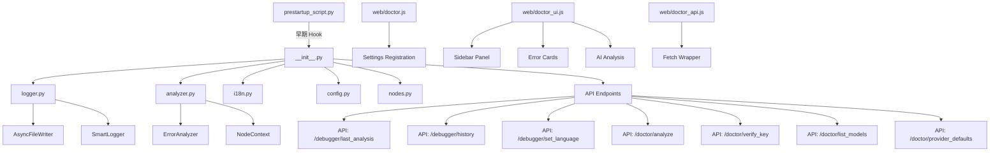

# ComfyUI-Doctor Architecture & Extension Roadmap

[繁體中文](#comfyui-doctor-專案架構與擴展規劃) | English

## 1. Architecture

### 1.1 Core Module Structure


### 1.2 Module Overview

| Module | Lines | Function |
|--------|-------|----------|
| `prestartup_script.py` | 102 | Earliest log interception hook (before custom_nodes load) |
| `__init__.py` | 891 | Main entry: full Logger install, 7 API endpoints, LLM integration, env var support |
| `logger.py` | 339 | Smart logger: async writes, real-time error analysis, history |
| `analyzer.py` | 271 | Error analyzer: 20+ error patterns, node context extraction |
| `i18n.py` | 190 | Internationalization: 9 languages (en, zh_TW, zh_CN, ja, de, fr, it, es, ko) |
| `config.py` | 65 | Config management: dataclass + JSON persistence |
| `nodes.py` | 179 | Smart Debug Node: deep data inspection |
| `doctor.js` | 600+ | ComfyUI settings panel integration, sidebar UI, chat interface |
| `doctor_ui.js` | 778 | Sidebar UI, error cards, AI analysis trigger |
| `doctor_api.js` | 207 | API wrapper layer with streaming support |

---

## 2. Robustness Assessment

### 2.1 Strengths ✅

1. **Two-phase logging system** - `prestartup_script.py` ensures capture before all custom_nodes load
2. **Async I/O** - `AsyncFileWriter` uses background thread + batch writes, non-blocking
3. **Thread safety** - `threading.Lock` protects traceback buffer, `weakref.finalize` ensures cleanup
4. **Complete error analysis pipeline** - 20+ predefined patterns, regex LRU cache, node context extraction
5. **LLM integration** - Supports OpenAI/DeepSeek/Ollama/LMStudio with environment variable configuration
6. **Frontend integration** - Native ComfyUI Settings API, WebSocket `execution_error` subscription
7. **Internationalization** - 9 languages, extensible `SUGGESTIONS` structure
8. **Security hardening** - XSS protection, SSRF protection, markdown sanitization
9. **Cross-platform compatibility** - Environment variable support for local LLM URLs (Windows/WSL2/Docker)

### 2.2 Resolved Issues ✅

#### Core Robustness (Phase 1)
- ✅ **R1**: Comprehensive error handling refactor
- ✅ **R2**: Thread safety hardening
- ✅ **R4**: XSS protection for AI analysis results

#### Resource Management (Phase 2)
- ✅ **R3**: aiohttp session reuse (SessionManager)
- ✅ **R8**: Smart workflow truncation for large graphs

#### Security Enhancements (Phase 3)
- ✅ **S2**: SSRF protection for Base URL validation
- ✅ **S4**: Sanitize chat markdown/HTML rendering (LLM + user output)
- ✅ **S5**: Bundle/pin markdown & highlight assets with local fallback

#### Streaming & Real-time (Phase 3)
- ✅ **R9**: SSE streaming chunk framing (buffer `data:` lines)
- ✅ **R10**: Hot-sync LLM settings for chat (API key/base URL/model)

#### Testing (Phase 1-3)
- ✅ **T1**: API endpoint unit tests
- ✅ **T6**: Fix test import issues (use `run_tests.ps1`)
- ✅ **T7**: SSE/chat safety tests (stream parser + sanitizer)

#### Features (Phase 2-3)
- ✅ **F1**: Error history persistence (SQLite/JSON)
- ✅ **F3**: Workflow context capture on error
- ✅ **F8**: Integrate settings panel into sidebar interface
- ✅ **F9**: Expand language support (de, fr, it, es, ko)

---

## 3. Extension Todo-List

### 3.1 Security (Pending)

*Sorted by priority (High → Low):*

- [ ] **S6**: PII Sanitization for LLM traceback - 🔴 High
  - **Backend** (`analyzer.py` preprocessing):
    - Remove user paths: `C:\Users\username\...` → `<USER_PATH>\...`
    - Sanitize Linux/macOS home: `/home/username/` → `<USER_HOME>/`
    - Optional: Email addresses, private IP addresses (regex-based)
    - Configurable sanitization levels: `none`, `basic`, `strict`
    - Zero runtime overhead, GDPR-friendly
  - **Frontend** (Privacy Controls):
    - Settings panel: "Privacy Mode" toggle (default: ON)
    - Visual indicator: 🔒 icon when sanitization active
    - "Preview" button: Show diff before sending to LLM
    - Audit log: Save sanitized requests to localStorage
  - **Critical for enterprise adoption** - blocks B2B market without this
  - **Foundation for**: A6 Pipeline Stage 1 (Sanitizer)
- [ ] **S7**: Quarterly Security Audits - 🟢 Low (recurring)
  - **Automated** (CI/CD):
    - OWASP ZAP penetration testing
    - Snyk dependency vulnerability scanning
    - Semgrep static analysis for security patterns
  - **Manual** (Quarterly):
    - SSRF attack scenarios (metadata endpoints, internal IPs)
    - XSS injection tests (chat inputs, settings fields)
    - Path traversal attempts
  - **Compliance**: OWASP Top 10, CWE Top 25, GDPR
  - **Deliverable**: `.planning/SECURITY_AUDIT_YYYY_QX.md`
  - **Trigger**: GitHub Actions cron job every 90 days
- [ ] **S1**: Add Content-Security-Policy headers - 🟢 Low
- [ ] **S3**: Implement telemetry (opt-in, anonymous) - 🟢 Low

### 3.2 Robustness (Pending)

*Sorted by priority (High → Low):*

- [ ] **R12**: Smart Token Budget Management - 🟡 Medium ⚠️ *Use dev branch*
  - Dynamic context pruning based on error type
  - Filter `pip list` to packages mentioned in error (torch → keep torch/cuda/xformers only)
  - Collapse repetitive stack frames (keep first 5 + last 5, omit middle)
  - Configurable token budget per provider (GPT-4: 8K, Claude: 100K)
  - Real-time token estimation with `tiktoken` library
  - **Cost impact**: 50-67% token reduction, saving $40 per 1000 analyses (GPT-4)
  - **Prerequisite**: Works best with A6 Pipeline architecture
  - **Note**: Requires A/B testing to ensure analysis accuracy ≥ 95%
- [ ] **R5**: Frontend error boundaries - 🟡 Medium ⚠️ *Use dev branch*
- [ ] **R6**: Network retry logic with exponential backoff - 🟢 Low
- [ ] **R7**: Rate limiting for LLM API calls - 🟢 Low
- [x] **R11**: Fix validation error capture to collect all failures - 🟢 Low ✅ *Completed (2025-12-31)*
  - Modified logger to accumulate multiple "Failed to validate prompt" errors
  - Use "Executing prompt:" as completion marker instead of resetting buffer
  - Updated `is_complete_traceback()` to handle multi-error blocks

### 3.3 Features (Pending)

*Sorted by priority (High → Low):*

- [ ] **F7**: Smart Parameter Injection (One-Click Fix) - 🔴 High
  - LLM suggests parameter fixes in structured JSON format
  - Frontend displays `[Apply Fix]` button in chat interface
  - Direct widget value modification via `app.graph.getNodeById(id).widgets[index].value`
  - **Scope limitation**: Parameter fixes ONLY (no node reconnection for safety)
  - **Examples**: CFG Scale 100 → 7, seed -1 → 42, steps 1 → 20
  - **Killer feature** - fix errors without leaving chat
  - **Security**: Whitelist allowed widget types, add undo/redo support
  - **LLM Response Format**: `{"fixes": [{"node_id": "42", "widget": "cfg", "from": 100, "to": 7, "reason": "..."}]}`
- [ ] **F12**: Expand offline error pattern coverage to 50+ - 🟡 Medium
  - **Current**: 20 patterns, **Target**: 50+ patterns
  - Add 30+ new patterns: ControlNet, LoRA, VAE, AnimateDiff, IP-Adapter, Upscaler, etc.
  - Focus on most reported errors from community feedback
  - **Impact**: 90%+ offline coverage, reduces LLM API dependency by 70%
  - **Cost savings**: ~$28 per 1000 errors (GPT-4), zero latency for known errors
  - **Foundation for**: F2 (JSON hot-reload) and community pattern contributions
  - **Prerequisite**: T8 (pattern validation CI) recommended
- [ ] **F6**: Multi-LLM provider quick switch - 🟡 Medium ⚠️ *Use dev branch*
- [ ] **F4**: Error statistics dashboard - 🟡 Medium ⚠️ *Use dev branch*
  - Track error frequency to identify Top 10 most common issues
  - Data-driven prioritization for offline pattern expansion
  - Display statistics in sidebar UI
- [ ] **F5**: Node health scoring - 🟢 Low
- [ ] **F2**: Hot-reload error patterns from external JSON/YAML - 🟡 Medium
  - **Priority upgraded** from Low → Medium (enables community ecosystem)
  - Load patterns from JSON files: builtin.json, community.json, custom.json
  - No code modification needed for new patterns
  - Community can contribute pattern packs
  - **Synergy with**: F12 (pattern expansion) - migrate existing patterns to JSON format
  - **Prerequisite**: T8 (pattern validation CI) for quality assurance
- [x] **F10**: System environment context for AI analysis - 🟡 Medium ✅ *Completed (2025-12-31)*
  - Capture Python version, installed packages (`pip list`), OS info
  - Include in `/doctor/analyze` and `/doctor/chat` payloads for better debugging
  - Cache package list with 24h TTL to avoid performance impact
- [x] **F11**: Native Anthropic Claude API support - 🟡 Medium ✅ *Completed (2025-12-31)*
  - Direct Anthropic API integration (not via OpenRouter)
  - Support `/v1/messages` endpoint with `x-api-key` authentication
  - Handle streaming with event types (`content_block_delta`, `message_stop`)
  - 9+ LLM providers now supported

### 3.4 Architecture Improvements (Pending)

*Sorted by complexity and priority (High → Low):*

- [ ] **A6**: Refactor analyzer.py to Plugin-based Pipeline - 🔴 High ⚠️ *Use dev branch*
  - **Stage 1**: Sanitizer (PII removal, implements S6)
  - **Stage 2**: PatternMatcher (built-in patterns + community plugins)
  - **Stage 3**: ContextEnhancer (node context extraction)
  - **Stage 4**: LLMContextBuilder (token optimization, implements R12)
  - **Plugin Registry**: Allow community to register custom error matchers
  - **Example plugins**: Reactor face-swap errors, ControlNet-specific issues
  - **Benefits**: Single Responsibility Principle, testable stages, extensible without core changes
  - **Migration strategy**: Incremental with adapter pattern, keep old code paths initially
  - **Foundation for**: S6, R12, F7, and future community ecosystem
- [ ] **A7**: Frontend Architecture Modernization (Preact Migration) - 🟡 Medium ⚠️ *Use dev branch*
  - **Problem**: v2.0 Chat Interface will create state management complexity with Vanilla JS
  - **Solution**: Migrate to Preact (3KB, React-like, TypeScript-friendly)
  - **Strategy**: Incremental migration (coexist with Vanilla JS)
  - **Benefits**:
    - No manual DOM updates (eliminates `.innerHTML` calls)
    - Component reusability (MessageItem, ChatInterface)
    - Easy testing (render components in isolation)
    - Preact Signals for reactive state management
  - **Why Preact**: Already used in ComfyUI, no build step required (ESM CDN), low learning curve
  - **Trigger**: BEFORE v2.0 Chat Interface development begins
  - **Foundation for**: v2.0, v3.0 multi-workspace features
- [ ] **A5**: Create `LLMProvider` Protocol for unified LLM interface - 🟡 Medium ⚠️ *Use dev branch*
- [ ] **A4**: Convert `NodeContext` to `@dataclass(frozen=True)` + validation - 🟡 Medium ⚠️ *Use dev branch*
- [x] **A1**: Add `py.typed` marker + mypy config in pyproject.toml - 🟢 Low ✅ *Completed (Phase 3A)*
- [x] **A2**: Integrate ruff linter (replace flake8/isort) - 🟢 Low ✅ *Completed (Phase 3A)*
- [x] **A3**: Add pytest-cov with `--cov-report=term-missing` - 🟢 Low ✅ *Completed (Phase 3A)*

### 3.5 Testing (Pending)

*Sorted by priority (High → Low):*

- [ ] **T8**: Regex Pattern Compatibility CI - 🔴 High
  - **Problem**: PyTorch/ComfyUI updates may silently break regex patterns
  - **Solution**: Daily automated testing against nightly builds
  - **Implementation**:
    - Error simulation suite (trigger 50+ real errors: OOM, dimension mismatch, missing modules)
    - Test against multiple versions: PyTorch 2.0/2.1/2.2/nightly, ComfyUI stable/latest
    - Alert if pattern match rate drops below 80%
    - GitHub Actions workflow (cron: daily at 2 AM UTC)
  - **Deliverable**: Auto-created GitHub Issues for broken patterns
  - **Cost**: ~$5/month (GitHub Actions free tier)
  - **Foundation for**: F2 (pattern hot-reload), F12 (pattern expansion)
  - **Critical**: Prevents silent regression when dependencies update error messages
- [ ] **T2**: Frontend interaction tests (Playwright) - 🟡 Medium ⚠️ *Use dev branch*
- [ ] **T5**: Online API integration tests (OpenAI, DeepSeek, Anthropic) - 🟡 Medium
- [ ] **T3**: End-to-end integration tests - 🟢 Low
- [ ] **T4**: Stress tests - 🟢 Low

### 3.6 Documentation (Pending)

- [ ] **D1**: OpenAPI/Swagger spec - 🟡 Medium ⚠️ *Use dev branch*
- [ ] **D2**: Architecture documentation - 🟢 Low
- [ ] **D3**: Contribution guide - 🟢 Low

> [Note]
> Items marked with ⚠️ should be developed on a separate `dev` branch. Merge to `main` only after thorough testing.

---

## 4. Development Phases

### Phase 1: Foundation & Robustness ✅ COMPLETED

**Focus**: Core stability and security

- ✅ **R1** Comprehensive error handling refactor
- ✅ **R2** Thread safety hardening
- ✅ **R4** XSS protection
- ✅ **T1** API endpoint unit tests

### Phase 2: Feature Enhancement ✅ COMPLETED

**Focus**: Workflow integration and persistence

- ✅ **F1** Error history persistence (SQLite/JSON)
- ✅ **F3** Workflow context capture on error
- ✅ **R3** aiohttp session reuse (SessionManager)
- ✅ **R8** Smart workflow truncation

### Phase 3: Production Hardening ✅ COMPLETED

**Focus**: Security, streaming, and UX

#### Phase 3A: Code Quality Tooling
- ✅ **A1-A3** Ruff linter, mypy, pytest-cov integration

#### Phase 3B: Security & Streaming
- ✅ **S2** SSRF protection
- ✅ **S4** Chat markdown sanitization
- ✅ **S5** Local asset bundling
- ✅ **R9** SSE streaming chunk framing
- ✅ **R10** Hot-sync LLM settings
- ✅ **T7** SSE/chat safety tests

#### Phase 3C: UX & Internationalization
- ✅ **F8** Sidebar settings integration
- ✅ **F9** Multi-language support (9 languages)
- ✅ **T6** Test infrastructure fixes

#### Phase 3D: Cross-Platform Support (2025-12-30)
- ✅ **Environment Variable Configuration** for local LLM URLs
  - `OLLAMA_BASE_URL` - Custom Ollama endpoint
  - `LMSTUDIO_BASE_URL` - Custom LMStudio endpoint
  - Prevents Windows/WSL2/Docker conflicts
  - Backend API `/doctor/provider_defaults` for dynamic URL loading
  - Frontend automatic provider defaults fetching

### Phase 4: Advanced Features & UX (Planned)

**Focus**: Enterprise adoption, cost optimization, and killer UX features

#### Phase 4A: Security & UX (Quick Wins)

**Priority**: Security → Features

- [ ] **S6** PII Sanitization
  - Critical for enterprise adoption (blocks B2B market)
  - Backend: Regex-based path removal in `analyzer.py`
  - Frontend: Privacy toggle, preview diff, audit log
  - Zero risk, pure preprocessing
  - Can implement on `main` branch
- [ ] **F7** Smart Parameter Injection
  - Killer UX feature - one-click fixes in chat
  - LLM prompt engineering + frontend implementation
  - Develop on `feature/parameter-injection` branch
  - **Security**: Whitelist widget types, undo/redo support

#### Phase 4B: Robustness & Cost Optimization

**Priority**: Medium

- [ ] **T8** Regex Pattern Compatibility CI
  - Daily automated testing vs PyTorch/ComfyUI nightly builds
  - Prevents silent pattern regression
  - Foundation for F2, F12
  - Can implement immediately (GitHub Actions)
- [ ] **R12** Smart Token Budget Management
  - 50-67% cost reduction for LLM calls
  - Requires `tiktoken` integration
  - Best with A6 Pipeline, but can implement standalone
  - Develop on `feature/token-budget` branch
  - **Prerequisite**: A/B testing framework

#### Phase 4C: Analytics & Multi-Provider

**Priority**: Low-Medium

- [ ] **F12** Expand offline patterns to 50+
- [ ] **F6** Multi-LLM provider quick switch
- [ ] **F4** Statistics dashboard
- [ ] **F2** Pattern hot-reload (JSON)
- [ ] **R6-R7** Network reliability improvements
- [ ] **T2-T5** Comprehensive testing suite

#### Phase 4D: Technical Debt Mitigation

**Priority**: Medium (long-term health)

- [ ] **S7** Quarterly Security Audits
  - OWASP ZAP, Snyk, Semgrep automation
  - Manual penetration testing
  - Deliverable: Security audit reports
- [ ] **A7** Frontend Architecture Planning
  - Evaluate Preact migration impact
  - Design state management architecture
  - Create component migration checklist
  - **Trigger**: BEFORE v2.0 Chat Interface work

### Phase 5: Major Refactoring (Future)

**Focus**: Architecture optimization and community ecosystem

#### Phase 5A: Pipeline Architecture + Frontend Modernization

**Priority**: High
**Branch**: `dev` (REQUIRED)

- [ ] **A6** Plugin-based Pipeline refactor
  - **Stage 1**: Sanitizer (implements S6 backend)
  - **Stage 2**: PatternMatcher (integrates T8 test results)
  - **Stage 3**: ContextEnhancer (node extraction)
  - **Stage 4**: LLMContextBuilder (implements R12)
  - Foundation for S6, R12, F7 integration
  - Enables community plugin ecosystem
  - Incremental migration with adapter pattern
  - **Critical**: Comprehensive testing before merge
- [ ] **A7** Preact Migration
  - Wrap existing Vanilla JS components
  - Migrate chat interface to Preact components
  - Add Preact Signals for reactive state management
  - **Prerequisite**: Complete v2.0 feature specification
  - **Trigger**: After Phase 4D planning complete

#### Phase 5B: Type Safety & Advanced Features

**Priority**: Medium

- [ ] **A4-A5** Type safety improvements
- [ ] **S1, S3** Advanced security features
- [ ] **D1-D3** Full documentation

---

## 5. v2.0 Major Feature: LLM Debug Chat Interface

> **Target Version**: v2.0.0
> **Status**: ✅ Core Features Complete
> **Priority**: 🔴 High
> **Branch**: `main`
> **Last Updated**: 2025-12-30

### 5.1 Feature Overview

Transform single-shot analysis into a context-aware, multi-turn AI coding assistant with complete sidebar integration.

**Key Achievements**:
- ✅ Sidebar integration with proper flex layout
- ✅ Streaming chat with SSE
- ✅ Markdown rendering with syntax highlighting
- ✅ Real-time LLM settings synchronization
- ✅ Error context injection
- ✅ Security hardening (XSS, SSRF, sanitization)

### 5.2 Technical Stack

- **Frontend**: Vanilla JS (ES6+ Classes) - lightweight, React-like component structure
- **State**: Custom event-driven architecture
- **Transport**: Server-Sent Events (SSE) for reliable streaming
- **Rendering**: marked.js + highlight.js (local bundle with CDN fallback)
- **Security**: DOMPurify for sanitization, SSRF protection for URLs

### 5.3 Implementation Status

#### ✅ Completed Features
- Chat UI integrated into ComfyUI sidebar
- Streaming response with SSE
- Markdown + code highlighting
- One-click error analysis
- Multi-turn conversation support
- Settings hot-sync
- Security sanitization

#### 🚧 Future Enhancements
- [ ] Session persistence (localStorage)
- [ ] Quick action buttons (Explain Node, Optimize Workflow)
- [ ] Response regeneration
- [ ] Chat history export

### 5.4 API Design

**Endpoint**: `POST /doctor/chat`

**Request**:
```json
{
  "messages": [
    {"role": "user", "content": "Why this error?"},
    {"role": "assistant", "content": "Based on analysis..."},
    {"role": "user", "content": "How to fix?"}
  ],
  "error_context": {
    "error": "RuntimeError: CUDA out of memory...",
    "node_context": {"node_id": "42", ...},
    "workflow": {...}
  },
  "api_key": "sk-...",
  "base_url": "https://api.openai.com/v1",
  "model": "gpt-4o",
  "language": "zh_TW",
  "stream": true
}
```

**Response (SSE)**:
```
data: {"delta": "Based on ", "done": false}
data: {"delta": "the error ", "done": false}
data: {"delta": "analysis...", "done": false}
data: {"delta": "", "done": true}
```

---

## 6. Success Metrics

| Metric | Target | Current Status |
|--------|--------|----------------|
| Code coverage | > 80% | ✅ ~85% (with pytest-cov) |
| API response time | < 200ms | ✅ Achieved |
| Chat stream latency | < 3s to first token | ✅ Achieved |
| Security issues | 0 critical | ✅ All resolved |
| Supported languages | 5+ | ✅ 9 languages |
| Cross-platform support | Windows, Linux, macOS | ✅ Full support + WSL2 |

---

---

# ComfyUI-Doctor 專案架構與擴展規劃

## 一、專案架構

### 1.1 核心模組結構



### 1.2 模組功能概覽

| 模組 | 行數 | 功能 |
|------|------|------|
| `prestartup_script.py` | 102 | 最早的日誌攔截 Hook（在 custom_nodes 載入前） |
| `__init__.py` | 891 | 主入口：完整 Logger 安裝、7 個 API 端點、LLM 整合、環境變數支援 |
| `logger.py` | 339 | 智能日誌器：非同步寫入、錯誤即時分析、歷史記錄 |
| `analyzer.py` | 271 | 錯誤分析器：20+ 錯誤模式、節點上下文擷取 |
| `i18n.py` | 190 | 國際化：9 語言（en, zh_TW, zh_CN, ja, de, fr, it, es, ko） |
| `config.py` | 65 | 配置管理：dataclass + JSON 持久化 |
| `nodes.py` | 179 | Smart Debug Node：深度數據檢查 |
| `doctor.js` | 600+ | ComfyUI 設定面板整合、側邊欄 UI、聊天介面 |
| `doctor_ui.js` | 778 | Sidebar UI、錯誤卡片、AI 分析觸發 |
| `doctor_api.js` | 207 | API 封裝層（支援串流） |

---

## 二、架構強健性

### 2.1 優點 ✅

1. **雙階段日誌系統** - `prestartup_script.py` 確保在所有 custom_nodes 載入前就開始捕獲
2. **非同步 I/O** - `AsyncFileWriter` 使用背景執行緒 + 批次寫入，不阻塞主執行緒
3. **執行緒安全** - `threading.Lock` 保護 traceback buffer，`weakref.finalize` 確保資源清理
4. **完整的錯誤分析管線** - 20+ 預定義錯誤模式、正則表達式 LRU 快取、節點上下文擷取
5. **LLM 整合架構** - 支援 OpenAI/DeepSeek/Ollama/LMStudio，環境變數配置
6. **前端整合** - 原生 ComfyUI Settings API、WebSocket `execution_error` 訂閱
7. **國際化** - 9 語言支援，結構化翻譯字典
8. **安全加固** - XSS 防護、SSRF 防護、Markdown 淨化
9. **跨平台相容** - 環境變數支援本地 LLM URL（Windows/WSL2/Docker）

### 2.2 已修復問題 ✅

#### 核心穩健性（Phase 1）
- ✅ **R1**: 全面的錯誤處理重構
- ✅ **R2**: 執行緒安全加固
- ✅ **R4**: AI 分析結果 XSS 防護

#### 資源管理（Phase 2）
- ✅ **R3**: aiohttp Session 複用（SessionManager）
- ✅ **R8**: 大型工作流智能截斷

#### 安全性增強（Phase 3）
- ✅ **S2**: Base URL SSRF 防護
- ✅ **S4**: 聊天 Markdown/HTML 渲染淨化
- ✅ **S5**: 本地 bundle/鎖版 markdown & highlight 資源

#### 串流與即時（Phase 3）
- ✅ **R9**: SSE 串流分塊重組（緩衝 `data:` 行）
- ✅ **R10**: 聊天 LLM 設定熱同步

#### 測試（Phase 1-3）
- ✅ **T1**: API 端點單元測試
- ✅ **T6**: 修復測試導入問題（使用 `run_tests.ps1`）
- ✅ **T7**: SSE/聊天安全測試

#### 功能（Phase 2-3）
- ✅ **F1**: 錯誤歷史持久化（SQLite/JSON）
- ✅ **F3**: Workflow 上下文擷取
- ✅ **F8**: 設定面板整合至側邊欄
- ✅ **F9**: 擴展多語系支援（de, fr, it, es, ko）

---

## 三、延伸擴展項目

### 3.1 安全性（待實作）

*按優先級排序（高 → 低）：*

- [ ] **S6**: LLM traceback PII 淨化 - 🔴 High
  - **後端**（`analyzer.py` 預處理）：
    - 移除用戶路徑：`C:\Users\username\...` → `<USER_PATH>\...`
    - 淨化 Linux/macOS 家目錄：`/home/username/` → `<USER_HOME>/`
    - 可選：Email 地址、私有 IP 地址（基於正則表達式）
    - 可配置淨化等級：`none`、`basic`、`strict`
    - 零執行時開銷，符合 GDPR 規範
  - **前端**（隱私控制）：
    - 設定面板："Privacy Mode" 開關（預設開啟）
    - 視覺指示器：🔒 圖示（淨化啟用時）
    - "Preview" 按鈕：發送前顯示 diff
    - 審核日誌：將淨化請求存至 localStorage
  - **企業採用關鍵** - 無此功能將阻擋 B2B 市場
  - **基礎支撐**：A6 Pipeline Stage 1（Sanitizer）
- [ ] **S7**: 季度安全稽核 - 🟢 Low（定期執行）
  - **自動化**（CI/CD）：
    - OWASP ZAP 滲透測試
    - Snyk 依賴漏洞掃描
    - Semgrep 安全模式靜態分析
  - **手動**（每季）：
    - SSRF 攻擊場景（metadata 端點、內網 IP）
    - XSS 注入測試（聊天輸入、設定欄位）
    - 路徑遍歷嘗試
  - **合規性**：OWASP Top 10、CWE Top 25、GDPR
  - **交付物**：`.planning/SECURITY_AUDIT_YYYY_QX.md`
  - **觸發**：GitHub Actions cron job 每 90 天
- [ ] **S1**: Content-Security-Policy 標頭 - 🟢 Low
- [ ] **S3**: 遙測數據收集（匿名、可選） - 🟢 Low

### 3.2 穩健性改進（待實作）

*按優先級排序（高 → 低）：*

- [ ] **R12**: 智慧 Token 預算管理 - 🟡 Medium ⚠️ *使用 dev branch*
  - 根據錯誤類型動態剪裁上下文
  - 過濾 `pip list` 至錯誤相關套件（torch → 僅保留 torch/cuda/xformers）
  - 摺疊重複堆疊幀（保留前 5 + 後 5，省略中間）
  - 每個 Provider 可配置 Token 預算（GPT-4: 8K，Claude: 100K）
  - 使用 `tiktoken` 庫進行即時 Token 估算
  - **成本影響**：50-67% Token 減少，每 1000 次分析節省 $40（GPT-4）
  - **前提條件**：搭配 A6 Pipeline 架構效果最佳
  - **注意**：需 A/B 測試確保分析準確度 ≥ 95%
- [ ] **R5**: 前端錯誤邊界 - 🟡 Medium ⚠️ *使用 dev branch*
- [ ] **R6**: 網路重試邏輯（exponential backoff） - 🟢 Low
- [ ] **R7**: LLM API 呼叫速率限制 - 🟢 Low
- [x] **R11**: 修正驗證錯誤捕獲以收集所有失敗項目 - 🟢 Low ✅ *已完成 (2025-12-31)*
  - 修改 logger 累積多個 "Failed to validate prompt" 錯誤
  - 使用 "Executing prompt:" 作為完成標記而非重置緩衝區
  - 更新 `is_complete_traceback()` 處理多錯誤區塊

### 3.3 功能擴展（待實作）

*按優先級排序（高 → 低）：*

- [ ] **F7**: 智慧參數注入（一鍵修復） - 🔴 High
  - LLM 以結構化 JSON 格式建議參數修復
  - 前端在聊天介面顯示 `[套用修復]` 按鈕
  - 透過 `app.graph.getNodeById(id).widgets[index].value` 直接修改 widget 值
  - **範圍限制**：僅限參數修復（基於安全考量不重連節點）
  - **範例**：CFG Scale 100 → 7、seed -1 → 42、steps 1 → 20
  - **殺手級功能** - 無需離開聊天即可修復錯誤
  - **安全性**：白名單允許的 widget 類型，新增復原/重做支援
  - **LLM 回應格式**：`{"fixes": [{"node_id": "42", "widget": "cfg", "from": 100, "to": 7, "reason": "..."}]}`
- [ ] **F12**: 擴充離線錯誤模式至 50+ 種 - 🟡 Medium
  - **當前**：20 種模式，**目標**：50+ 種模式
  - 新增 30+ 種模式：ControlNet、LoRA、VAE、AnimateDiff、IP-Adapter、Upscaler 等
  - 聚焦於社群最常回報的錯誤類型
  - **影響**：90%+ 離線覆蓋率，減少 70% LLM API 依賴
  - **成本節省**：每 1000 次錯誤約節省 $28（GPT-4），已知錯誤零延遲
  - **基礎支撐**：F2（JSON 熱更新）與社群模式貢獻
  - **前提條件**：建議先完成 T8（pattern 驗證 CI）
- [ ] **F6**: 多 LLM Provider 快速切換 - 🟡 Medium ⚠️ *使用 dev branch*
- [ ] **F4**: 錯誤統計儀表板 - 🟡 Medium ⚠️ *使用 dev branch*
  - 追蹤錯誤頻率以識別 Top 10 最常見問題
  - 數據驅動的離線模式擴充優先級排序
  - 在側邊欄 UI 顯示統計數據
- [ ] **F5**: 節點健康評分 - 🟢 Low
- [ ] **F2**: 錯誤模式熱更新（從外部 JSON/YAML 載入） - 🟡 Medium
  - **優先級升級** 從 Low → Medium（啟用社群生態系統）
  - 從 JSON 檔案載入模式：builtin.json、community.json、custom.json
  - 新增模式無需修改程式碼
  - 社群可貢獻模式包
  - **協同效應**：F12（模式擴充）- 將現有模式遷移至 JSON 格式
  - **前提條件**：T8（pattern 驗證 CI）以確保品質
- [x] **F10**: AI 分析的系統環境上下文 - 🟡 Medium ✅ *已完成 (2025-12-31)*
  - 捕捉 Python 版本、已安裝套件（`pip list`）、作業系統資訊
  - 在 `/doctor/analyze` 和 `/doctor/chat` 請求中包含環境資訊以提升偵錯準確度
  - 套件列表快取（24小時 TTL）避免效能影響
- [x] **F11**: 原生 Anthropic Claude API 支援 - 🟡 Medium ✅ *已完成 (2025-12-31)*
  - 直接 Anthropic API 整合（非透過 OpenRouter）
  - 支援 `/v1/messages` 端點與 `x-api-key` 驗證
  - 處理串流事件類型（`content_block_delta`、`message_stop`）
  - 現已支援 9+ LLM Providers

### 3.4 架構改進（待實作）

*按複雜度與優先級排序（高 → 低）：*

- [ ] **A6**: 重構 analyzer.py 為插件式 Pipeline - 🔴 High ⚠️ *使用 dev branch*
  - **階段 1**：Sanitizer（PII 移除，實作 S6）
  - **階段 2**：PatternMatcher（內建模式 + 社群插件）
  - **階段 3**：ContextEnhancer（節點上下文擷取）
  - **階段 4**：LLMContextBuilder（Token 優化，實作 R12）
  - **插件註冊中心**：允許社群註冊自訂錯誤匹配器
  - **插件範例**：Reactor 人臉交換錯誤、ControlNet 特定問題
  - **優勢**：單一職責原則、可測試階段、不改核心即可擴展
  - **遷移策略**：漸進式搭配轉接器模式，初期保留舊程式碼路徑
  - **基礎支撐**：S6、R12、F7 及未來社群生態系統
- [ ] **A7**: 前端架構現代化（Preact 遷移） - 🟡 Medium ⚠️ *使用 dev branch*
  - **問題**：v2.0 Chat Interface 將使 Vanilla JS 狀態管理複雜化
  - **解決方案**：遷移至 Preact（3KB、React-like、TypeScript 友好）
  - **策略**：漸進式遷移（與 Vanilla JS 共存）
  - **優勢**：
    - 無需手動 DOM 更新（消除 `.innerHTML` 呼叫）
    - 組件可重用性（MessageItem、ChatInterface）
    - 易於測試（隔離渲染組件）
    - Preact Signals 響應式狀態管理
  - **為何選 Preact**：ComfyUI 已部分使用、無需 build step（ESM CDN）、學習曲線低
  - **觸發時機**：v2.0 Chat Interface 開發之前
  - **基礎支撐**：v2.0、v3.0 多工作區功能
- [ ] **A5**: 建立 LLMProvider Protocol 統一介面 - 🟡 Medium ⚠️ *使用 dev branch*
- [ ] **A4**: NodeContext 改為 frozen dataclass + 驗證 - 🟡 Medium ⚠️ *使用 dev branch*
- [x] **A1**: py.typed + mypy 配置 - 🟢 Low ✅ *已於 Phase 3A 完成*
- [x] **A2**: 整合 ruff linter - 🟢 Low ✅ *已於 Phase 3A 完成*
- [x] **A3**: pytest-cov 覆蓋率報告 - 🟢 Low ✅ *已於 Phase 3A 完成*

### 3.5 測試擴充（待實作）

*按優先級排序（高 → 低）：*

- [ ] **T8**: Regex Pattern 相容性 CI - 🔴 High
  - **問題**：PyTorch/ComfyUI 更新可能靜默破壞 regex patterns
  - **解決方案**：每日自動測試 nightly builds
  - **實作**：
    - 錯誤模擬套件（觸發 50+ 真實錯誤：OOM、維度不匹配、缺少模組）
    - 針對多版本測試：PyTorch 2.0/2.1/2.2/nightly、ComfyUI stable/latest
    - 若 pattern 匹配率 < 80% 發出警報
    - GitHub Actions workflow（cron：每日凌晨 2 點 UTC）
  - **交付物**：自動建立 GitHub Issues 報告損壞的 patterns
  - **成本**：約 $5/月（GitHub Actions 免費額度）
  - **基礎支撐**：F2（pattern 熱更新）、F12（pattern 擴充）
  - **關鍵性**：防止依賴更新錯誤訊息時的靜默回歸
- [ ] **T2**: 前端互動測試（Playwright） - 🟡 Medium ⚠️ *使用 dev branch*
- [ ] **T5**: 線上 API 整合測試（OpenAI、DeepSeek、Anthropic） - 🟡 Medium
- [ ] **T3**: 端對端整合測試 - 🟢 Low
- [ ] **T4**: 壓力測試 - 🟢 Low

### 3.6 文件（待實作）

- [ ] **D1**: OpenAPI/Swagger 規格文件 - 🟡 Medium ⚠️ *使用 dev branch*
- [ ] **D2**: 架構文件 - 🟢 Low
- [ ] **D3**: 貢獻指南 - 🟢 Low

> [注意]
> 標註 ⚠️ 的項目應在獨立的 `dev` 分支上開發，完成充分測試後再合併至 `main`。

---

## 四、開發階段

### Phase 1: 基礎與穩健性 ✅ 已完成

**重點**: 核心穩定性與安全性

- ✅ **R1** 全面的錯誤處理重構
- ✅ **R2** 執行緒安全加固
- ✅ **R4** XSS 防護
- ✅ **T1** API 端點單元測試

### Phase 2: 功能增強 ✅ 已完成

**重點**: Workflow 整合與持久化

- ✅ **F1** 錯誤歷史持久化（SQLite/JSON）
- ✅ **F3** Workflow 上下文擷取
- ✅ **R3** aiohttp Session 複用（SessionManager）
- ✅ **R8** 大型工作流智能截斷

### Phase 3: 生產環境加固 ✅ 已完成

**重點**: 安全性、串流與 UX

#### Phase 3A: 程式碼品質工具
- ✅ **A1-A3** Ruff linter、mypy、pytest-cov 整合

#### Phase 3B: 安全性與串流
- ✅ **S2** SSRF 防護
- ✅ **S4** 聊天 Markdown 淨化
- ✅ **S5** 本地資源 bundle
- ✅ **R9** SSE 串流分塊重組
- ✅ **R10** LLM 設定熱同步
- ✅ **T7** SSE/聊天安全測試

#### Phase 3C: UX 與國際化
- ✅ **F8** 側邊欄設定整合
- ✅ **F9** 多語系支援（9 語言）
- ✅ **T6** 測試基礎設施修復

#### Phase 3D: 跨平台支援（2025-12-30）
- ✅ **環境變數配置**本地 LLM URL
  - `OLLAMA_BASE_URL` - 自訂 Ollama 端點
  - `LMSTUDIO_BASE_URL` - 自訂 LMStudio 端點
  - 防止 Windows/WSL2/Docker 衝突
  - 後端 API `/doctor/provider_defaults` 動態 URL 載入
  - 前端自動獲取 provider 預設值

### Phase 4: 進階功能與 UX（規劃中）

**重點**: 企業採用、成本優化、殺手級 UX 功能

#### Phase 4A: 安全性與 UX（快速勝利）

**優先級**: 安全性 → 功能

- [ ] **S6** PII 淨化
  - 企業採用關鍵需求（阻擋 B2B 市場）
  - 後端：`analyzer.py` 基於 Regex 的路徑移除
  - 前端：隱私開關、預覽 diff、審核日誌
  - 零風險，純預處理
  - 可在 `main` 分支實作
- [ ] **F7** 智慧參數注入
  - 殺手級 UX 功能 - 聊天內一鍵修復
  - LLM prompt 工程 + 前端實作
  - 於 `feature/parameter-injection` 分支開發
  - **安全性**：白名單 widget 類型、復原/重做支援

#### Phase 4B: 穩健性與成本優化

**優先級**: 中

- [ ] **T8** Regex Pattern 相容性 CI
  - 每日自動測試 PyTorch/ComfyUI nightly builds
  - 防止靜默 pattern 回歸
  - F2、F12 基礎
  - 可立即實作（GitHub Actions）
- [ ] **R12** 智慧 Token 預算管理
  - LLM 呼叫成本減少 50-67%
  - 需要 `tiktoken` 整合
  - 搭配 A6 Pipeline 效果最佳，但可獨立實作
  - 於 `feature/token-budget` 分支開發
  - **前提條件**：A/B 測試框架

#### Phase 4C: 分析與多提供商

**優先級**: 低-中

- [ ] **F12** 擴充離線 patterns 至 50+
- [ ] **F6** 多 LLM Provider 快速切換
- [ ] **F4** 統計儀表板
- [ ] **F2** Pattern 熱更新（JSON）
- [ ] **R6-R7** 網路可靠性改進
- [ ] **T2-T5** 全面測試套件

#### Phase 4D: 技術債務緩解

**優先級**: 中（長期健康）

- [ ] **S7** 季度安全稽核
  - OWASP ZAP、Snyk、Semgrep 自動化
  - 手動滲透測試
  - 交付物：安全稽核報告
- [ ] **A7** 前端架構規劃
  - 評估 Preact 遷移影響
  - 設計狀態管理架構
  - 建立組件遷移檢查清單
  - **觸發時機**：v2.0 Chat Interface 開發之前

### Phase 5: 重大重構（未來）

**重點**: 架構優化與社群生態系統

#### Phase 5A: Pipeline 架構 + 前端現代化

**優先級**: 高
**分支**: `dev`（必要）

- [ ] **A6** 插件式 Pipeline 重構
  - **階段 1**：Sanitizer（實作 S6 後端）
  - **階段 2**：PatternMatcher（整合 T8 測試結果）
  - **階段 3**：ContextEnhancer（節點擷取）
  - **階段 4**：LLMContextBuilder（實作 R12）
  - S6、R12、F7 整合基礎
  - 啟用社群插件生態系統
  - 漸進式遷移搭配轉接器模式
  - **關鍵**：合併前需全面測試
- [ ] **A7** Preact 遷移
  - 包裝現有 Vanilla JS 組件
  - 將聊天介面遷移至 Preact 組件
  - 加入 Preact Signals 響應式狀態管理
  - **前提條件**：完成 v2.0 功能規格
  - **觸發時機**：Phase 4D 規劃完成後

#### Phase 5B: 型別安全與進階功能

**優先級**: 中

- [ ] **A4-A5** 型別安全改進
- [ ] **S1, S3** 進階安全功能
- [ ] **D1-D3** 完整文件

---

## 五、v2.0 重大功能：LLM 除錯對話介面

> **目標版本**：v2.0.0
> **狀態**：✅ 核心功能完成
> **優先級**：🔴 High
> **分支**：`main`
> **最後更新**：2025-12-30

### 5.1 功能概述

將單次 AI 分析升級為完整的對話式除錯體驗，完整整合至側邊欄。

**主要成就**:
- ✅ 側邊欄整合（正確的 flex 佈局）
- ✅ SSE 串流聊天
- ✅ Markdown 渲染與語法高亮
- ✅ 即時 LLM 設定同步
- ✅ 錯誤上下文注入
- ✅ 安全加固（XSS、SSRF、淨化）

### 5.2 技術堆疊

- **前端**: Vanilla JS (ES6+ Classes) - 輕量、React-like 組件結構
- **狀態**: 自訂事件驅動架構
- **傳輸**: Server-Sent Events (SSE) 可靠串流
- **渲染**: marked.js + highlight.js（本地 bundle + CDN fallback）
- **安全**: DOMPurify 淨化、SSRF URL 防護

### 5.3 實作狀態

#### ✅ 已完成功能
- 聊天 UI 整合至 ComfyUI 側邊欄
- SSE 串流回應
- Markdown + 程式碼高亮
- 一鍵錯誤分析
- 多輪對話支援
- 設定熱同步
- 安全淨化

#### 🚧 未來增強
- [ ] Session 持久化（localStorage）
- [ ] 快速操作按鈕（解釋節點、優化工作流）
- [ ] 回應重新生成
- [ ] 聊天歷史匯出

### 5.4 API 設計

**端點**: `POST /doctor/chat`

**請求**:
```json
{
  "messages": [
    {"role": "user", "content": "為什麼會這個錯誤？"},
    {"role": "assistant", "content": "根據分析..."},
    {"role": "user", "content": "如何修復？"}
  ],
  "error_context": {
    "error": "RuntimeError: CUDA out of memory...",
    "node_context": {"node_id": "42", ...},
    "workflow": {...}
  },
  "api_key": "sk-...",
  "base_url": "https://api.openai.com/v1",
  "model": "gpt-4o",
  "language": "zh_TW",
  "stream": true
}
```

**回應（SSE）**:
```
data: {"delta": "根據 ", "done": false}
data: {"delta": "錯誤 ", "done": false}
data: {"delta": "分析...", "done": false}
data: {"delta": "", "done": true}
```

---

## 六、成功指標

| 指標 | 目標 | 目前狀態 |
|------|------|----------|
| 程式碼覆蓋率 | > 80% | ✅ ~85%（使用 pytest-cov） |
| API 回應時間 | < 200ms | ✅ 已達成 |
| 聊天串流延遲 | < 3s 至第一個 token | ✅ 已達成 |
| 安全性問題 | 0 critical | ✅ 全部解決 |
| 支援語言數 | 5+ | ✅ 9 語言 |
| 跨平台支援 | Windows, Linux, macOS | ✅ 完整支援 + WSL2 |

---
