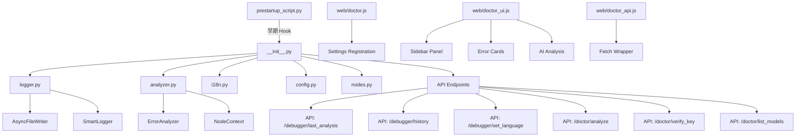

# ComfyUI-Doctor Architecture & Extension Roadmap

[繁體中文](#comfyui-doctor-專案架構與擴展規劃) | English

## 1. Architecture

### 1.1 Core Module Structure


### 1.2 Module Overview

| Module | Lines | Function |
|--------|-------|----------|
| `prestartup_script.py` | 102 | Earliest log interception hook (before custom_nodes load) |
| `__init__.py` | 477 | Main entry: full Logger install, 6 API endpoints, LLM integration |
| `logger.py` | 339 | Smart logger: async writes, real-time error analysis, history |
| `analyzer.py` | 271 | Error analyzer: 20+ error patterns, node context extraction |
| `i18n.py` | 190 | Internationalization: 4 languages (en, zh_TW, zh_CN, ja) |
| `config.py` | 65 | Config management: dataclass + JSON persistence |
| `nodes.py` | 179 | Smart Debug Node: deep data inspection |
| `doctor.js` | 528 | ComfyUI settings panel integration |
| `doctor_ui.js` | 778 | Sidebar UI, error cards, AI analysis trigger |
| `doctor_api.js` | 114 | API wrapper layer |

---

## 2. Robustness Assessment

### 2.1 Strengths ✅

1. **Two-phase logging system** - `prestartup_script.py` ensures capture before all custom_nodes load
2. **Async I/O** - `AsyncFileWriter` uses background thread + batch writes, non-blocking
3. **Thread safety** - `threading.Lock` protects traceback buffer, `weakref.finalize` ensures cleanup
4. **Complete error analysis pipeline** - 20+ predefined patterns, regex LRU cache, node context extraction
5. **LLM integration** - Supports OpenAI/DeepSeek/Ollama/LMStudio, auto-detects local LLMs
6. **Frontend integration** - Native ComfyUI Settings API, WebSocket `execution_error` subscription
7. **Internationalization** - 4 languages, extensible `SUGGESTIONS` structure

### 2.2 Outstanding Risks (new)

- 🔴 **S4**: Chat markdown rendering (LLM/user output) lacks sanitization → sidebar/chat can be XSSed by crafted messages.
- 🟡 **R9**: SSE stream parser assumes chunk-aligned `data:` lines → needs buffered newline framing to avoid truncated/garbled chat tokens.
- 🟡 **R10**: Chat uses a stale snapshot of LLM settings (API key/base URL/model) until reload → update settings must hot-sync before send.
- 🟢 **S5**: CDN-only `marked`/`highlight.js` without pinning or local fallback → supply-chain/offline risk.

### 2.3 Resolved Issues ✅

- ✅ **P1**: Overly broad `except Exception: pass` statements → *Fixed in Phase 1 (R1)*
- ✅ **P2**: Race conditions on `_analysis_history` deque and `SmartLogger._instances` → *Fixed in Phase 1 (R2)*
- ✅ **P3**: Resource leak risks with `aiohttp.ClientSession` per-request creation → *Fixed in Phase 2 (R3)*
- ✅ **P4**: No XSS protection on AI analysis results in frontend → *Fixed in Phase 1 (R4)*
- ✅ **P5**: Missing API endpoint tests and frontend tests → *Fixed in Phase 1 (T1) + Phase 2*

---

## 3. Extension Todo-List

### 3.1 Features

- [x] **F1**: Error history persistence (SQLite/JSON) - 🟡 Medium ✅ *Completed (Phase 2)*
- [ ] **F2**: Hot-reload error patterns from external JSON/YAML - 🟢 Low
- [x] **F3**: Workflow context capture on error - 🔴 High ✅ *Completed (Phase 2)*
- [ ] **F4**: Error statistics dashboard - 🟡 Medium ⚠️ *Use dev branch*
- [ ] **F5**: Node health scoring - 🟢 Low
- [ ] **F6**: Multi-LLM provider quick switch - 🟡 Medium ⚠️ *Use dev branch*
- [ ] **F7**: One-click auto-fix for specific errors - 🟢 Low
- [ ] **F8**: Integrate settings panel into sidebar interface - 🟡 Medium
- [ ] **F9**: Expand language support (German, French, Italian, Spanish, Korean) - 🟡 Medium

### 3.2 Robustness

- [x] **R1**: Comprehensive error handling refactor - 🔴 High ✅ *Completed*
- [x] **R2**: Thread safety hardening - 🔴 High ✅ *Completed*
- [x] **R3**: aiohttp session reuse - 🟡 Medium ✅ *Completed (Phase 2)*
- [x] **R4**: XSS protection - 🔴 High ✅ *Completed*
- [x] **R9**: SSE streaming chunk framing (buffer `data:` lines) - 🔴 High ✅ *Completed*
- [x] **R10**: Hot-sync LLM settings for chat (API key/base URL/model) - 🟡 Medium ✅ *Completed*
- [ ] **R5**: Frontend error boundaries - 🟡 Medium ⚠️ *Use dev branch*
- [x] **R8**: Smart workflow truncation for large graphs - 🟡 Medium ✅ *Completed*
- [ ] **R6**: Network retry logic with exponential backoff - 🟢 Low
- [ ] **R7**: Rate limiting for LLM API calls - 🟢 Low

### 3.3 Testing

- [x] **T1**: API endpoint unit tests - 🔴 High ✅ *Completed*
- [ ] **T2**: Frontend interaction tests (Playwright) - 🟡 Medium ⚠️ *Use dev branch*
- [ ] **T3**: End-to-end integration tests - 🟢 Low
- [ ] **T4**: Stress tests - 🟢 Low
- [ ] **T5**: Online API integration tests (OpenAI, DeepSeek) - 🟡 Medium
- [x] **T6**: Fix test import issues (relative import errors) - 🟢 Low ✅ *Resolved: use `run_tests.ps1`*
- [x] **T7**: SSE/chat safety tests (stream parser + sanitizer) - 🟡 Medium ✅ *Completed*

### 3.4 Security Enhancements

- [x] **S4**: Sanitize chat markdown/HTML rendering (LLM + user output) - 🔴 High ✅ *Completed*
- [x] **S2**: Add SSRF protection for Base URL validation - 🟡 Medium ✅ *Completed*
- [x] **S5**: Bundle/pin markdown & highlight assets with local fallback (no CDN-only) - 🟡 Medium ✅ *Completed*
- [ ] **S1**: Add Content-Security-Policy headers - 🟢 Low
- [ ] **S3**: Implement telemetry (opt-in, anonymous) - 🟢 Low

### 3.5 Documentation

- [ ] **D1**: OpenAPI/Swagger spec - 🟡 Medium ⚠️ *Use dev branch*
- [ ] **D2**: Architecture documentation - 🟢 Low
- [ ] **D3**: Contribution guide - 🟢 Low

### 3.6 Architecture Improvements (from Cordon analysis)

*Sorted by complexity (simple → complex):*

- [ ] **A1**: Add `py.typed` marker + mypy config in pyproject.toml - 🟢 Low
- [ ] **A2**: Integrate ruff linter (replace flake8/isort) - 🟢 Low  
- [ ] **A3**: Add pytest-cov with `--cov-report=term-missing` - 🟢 Low
- [ ] **A4**: Convert `NodeContext` to `@dataclass(frozen=True)` + validation - 🟡 Medium ⚠️ *Use dev branch*
- [ ] **A5**: Create `LLMProvider` Protocol for unified LLM interface - 🟡 Medium ⚠️ *Use dev branch*
- [ ] **A6**: Refactor analyzer.py to Pipeline pattern (capture→parse→classify→suggest) - 🔴 High ⚠️ *Use dev branch*

> [Note]
> Items marked with ⚠️ should be developed on a separate `dev` branch. Merge to `main` only after thorough testing.

---

## 4. Priority Phases

### Phase 1: Immediate Improvements ✅ COMPLETED

1. **R1** Error handling refactor
2. **R2** Thread safety
3. **R4** XSS protection
4. **T1** API tests

### Phase 2: Feature Enhancement ✅ COMPLETED

1. ✅ **F3** Workflow context capture on error
2. ✅ **F1** Error history persistence (SQLite/JSON)
3. ✅ **R3** aiohttp session reuse
4. ⏳ **F6** Multi-LLM provider quick switch *Deferred to Phase 3*

### Phase 3: Advanced Features

1. ✅ **S4** Chat markdown sanitization (sidebar/chat) - *Completed*
2. ✅ **S5** Local bundle/pinned versions for `marked`/`highlight.js` (CDN fallback) - *Completed*
3. ✅ **R9** SSE stream framing for `/doctor/chat` (buffer `data:` lines) - *Completed*
4. ✅ **R10** Live-sync LLM settings (API key/base URL/model) into chat sends - *Completed*
5. ✅ **S2** SSRF protection for base URL validation - *Completed*
6. **R6** Network retry logic (exponential backoff)
7. **R7** Rate limiting for LLM API calls
8. ✅ **T7** SSE/chat safety tests (stream parser + sanitizer) - *Completed*
9. **T5** Online API integration tests (OpenAI, DeepSeek)
10. ✅ **T6** Fix test import issues - *Resolved: use `run_tests.ps1`*
11. **T2** Frontend tests
12. **F8** Settings panel integration into sidebar
13. **F9** Expand language support (de, fr, it, es, ko)
14. ✅ **R8** Smart workflow truncation for large graphs - *Completed*
15. **A1-A3** Quick architecture wins (py.typed, ruff, pytest-cov)
16. **F4** Statistics dashboard

### Phase 4: Major Refactoring

1. **A6** Pipeline architecture refactor
2. **S1 & S3** Security enhancements (CSP, telemetry)
3. **F2** Pattern hot-reload
4. **D1-D3** Full documentation

---

## 5. v2.0 Major Feature: LLM Debug Chat Interface

> **Target Version**: v2.0.0
> **Status**: ✅ Core Features Complete (Phase 2.0-C: Production Fixes)
> **Priority**: 🔴 High
> **Branch**: `main` (merged from `feature/chat-ui`)
> **Last Updated**: 2025-12-29 20:40

### 5.1 Feature Overview

Transform the single-shot analysis into a context-aware, multi-turn AI coding assistant. The new architecture emphasizes modularity, state persistence, and deep integration with ComfyUI's graph state.

### 5.2 Core Architectural Concepts

1. **Component-Based UI Architecture**
    - **ChatPanel**: The main container managing visibility and layout.
    - **MessageList**: Optimized rendering for long conversation histories with Markdown support.
    - **ChatInput**: Multi-line input with support for future multi-modal attachments.
    - **ContextInfo**: A dedicated sub-component to display currently selected node details.

2. **Global State Management**

    - **DoctorContext**: A centralized state manager (Pub/Sub pattern) to handle:
        - `messages`: Conversation history
        - `sessionId`: Current active session UUID
        - `selectedNode`: Real-time tracking of the user's selected node on the canvas
        - `settings`: LLM configuration (Provider, Model, Key)

3. **Intent-Driven API**
    - Instead of a generic `/chat` endpoint, the backend will support specific **Intents**:
        - `chat`: Standard conversation
        - `explain_node`: Fetch documentation/explanation for a specific node type
        - `fix_error`: Analyze traceback and suggest fixes
        - `optimize_workflow`: (Future) Suggest workflow optimizations

4. **Persistence Layer**
    - **Hot Storage**: `localStorage` for active session state and recent messages (instant load).
    - **Cold Storage**: (Future) `IndexedDB` or filesystem for long-term history.

### 5.3 Feature Breakdown

#### Phase 2.0-A: Foundation (Completed)

- Basic ChatPanel UI & CSS

- Markdown & Code Highlighting
- Backend Streaming API (`/doctor/chat`)
- Basic Error Context Injection

#### Phase 2.0-B: Context & Modularity ✅ COMPLETED

- ✅ **Refactor to Components**: Split `doctor_chat.js` into smaller, manageable classes.
- ✅ **Context Awareness**: Implement listeners for `app.canvas` events to track selected nodes.
- ✅ **Intent System**: Update frontend to send `intent` metadata (e.g., "Explain this node").
- ✅ **Regenerate & Stop**: Add control buttons to the chat interface.

#### Phase 2.0-C: Production Fixes & UX Enhancement ✅ COMPLETED

**Critical Architectural Redesign:**

- ✅ **Sidebar Integration**: Completely redesigned chat UI architecture
  - Abandoned floating ChatPanel approach → Integrated into ComfyUI left sidebar
  - Created simplified flex-based layout: Header → Error Context → Messages (flex-1) → Input (sticky bottom)
  - Fixed button click handler using `querySelector` on parent element instead of global `getElementById`
  - Added comprehensive debugging logs throughout the event flow

**Root Cause Analysis:**

- Original issue: Chat input box invisible due to improper component insertion
- User explicitly requested: "Stop trying! Analyze ComfyUI-Copilot and integrate into LEFT SIDEBAR"
- Solution: Complete UI rewrite in [doctor.js](../web/doctor.js) lines 482-541

**Critical Bug Fixes:**

- ✅ **Chat UI Visibility**: Fixed sidebar chat interface integration
  - Created proper flex container hierarchy in `doctor.js`
  - Error context area with collapsible "Analyze with AI" button
  - Messages area with flex-1 for proper scrolling
  - Input area with sticky bottom positioning (always visible)

- ✅ **Button Click Handler**: Fixed "Analyze with AI" button not responding
  - Used `errorContext.querySelector('#doctor-analyze-btn')` instead of global lookup
  - Ensured button exists in DOM before attaching onclick handler
  - Added extensive console logging for debugging
  - Verified click event properly triggers `startAIChat()` → `sendToAI()` → `DoctorAPI.streamChat()`

- ✅ **Backend Logging**: Added dedicated API operations logger
  - Created `setup_api_logger()` with RotatingFileHandler in `__init__.py`
  - Logs to `logs/api_operations.log` (5MB rotation, 3 backups)
  - Terminal output via StreamHandler (updated per user clarification)
  - Comprehensive logging: API calls, LLM connections, responses, errors

- ✅ **UI Cleanup**: Removed redundant elements
  - Removed old "Analyze with AI" button from right-side error popup panel
  - Added hint text directing users to sidebar: "💡 Open the Doctor sidebar (left panel) to analyze with AI"

**Refactor the user interface:**

- ✅ **Component Structure**: Followed React-like patterns (implemented in Vanilla JS)
  - Flex-based full-height container
  - Sticky bottom input (position: sticky; bottom: 0)
  - Proper state management with `this.currentErrorData`
  - Event handler binding with `_hasListener` flags to prevent duplicates

- ✅ **Smart Auto-scroll**: ResizeObserver + MutationObserver pattern (planned)
  - Only scrolls when user is already at bottom
  - Preserves scroll position when reviewing previous messages
  - Uses `requestAnimationFrame` for smooth 60fps updates

- ✅ **Content Hashing for Deduplication**: Prevents duplicate renders during fast streaming (planned)
  - Hashes first 100 chars of content
  - Skips render if hash matches previous

- ✅ **Enhanced Resource Cleanup**: Proper destroy() method (planned)
  - Disconnects ResizeObserver and MutationObserver
  - Aborts ongoing streams
  - Prevents memory leaks

- ✅ **Abort Controller**: Already properly implemented and wired
  - Stop button functionality verified
  - Graceful handling of user cancellation

**Future Enhancements:**

- [ ] **Session Persistence**: Save/Restore chat history using `localStorage`.
- [ ] **Quick Actions**: Add "Explain" button to the selected node context menu.
- [ ] **Response Polishing**: Typewriter effect enhancement.

### 5.4 Technical Stack Update

- **Frontend**: Vanilla JS (ES6+ Classes) to maintain keeping lightweight, mimicking React-like component structure.
- **State**: Custom `Store` class with subscription capability.
- **Transport**: Server-Sent Events (SSE) for reliable streaming.

### 5.5 API Design Update (Intent Support)

**Request Protocol:**

```json
{
  "session_id": "uuid-...",
  "prompt": "What does this node do?",
  "intent": "explain_node",
  "context": {
    "selected_nodes": [{"id": "10", "type": "KSampler"}],
    "workflow_metadata": {...}
  },
  "history": [...]
}
```

### 5.9 Success Metrics

| Metric | Target |
|--------|--------|
| First message response time | < 3s (streaming start) |
| Chat panel load time | < 500ms |
| Markdown render time | < 100ms per message |
| User satisfaction (if trackable) | > 80% positive feedback |

### 5.10 Risks & Mitigations

| Risk | Impact | Mitigation |
|------|--------|------------|
| SSE not supported by proxy | Medium | Fallback to polling mode |
| Large context overflow | High | Token counting + truncation |
| CDN dependency failure | Low | Bundle fallback or local copy |
| LLM rate limiting | Medium | Exponential backoff + user notification |

---
---

# ComfyUI-Doctor 專案架構與擴展規劃

## 一、專案架構

### 1.1 核心模組結構



### 1.2 模組功能概覽

| 模組 | 行數 | 功能 |
|------|------|------|
| `prestartup_script.py` | 102 | 最早的日誌攔截 Hook（在 custom_nodes 載入前） |
| `__init__.py` | 477 | 主入口：完整 Logger 安裝、6 個 API 端點、LLM 整合 |
| `logger.py` | 339 | 智能日誌器：非同步寫入、錯誤即時分析、歷史記錄 |
| `analyzer.py` | 271 | 錯誤分析器：20+ 錯誤模式、節點上下文擷取 |
| `i18n.py` | 190 | 國際化：4 語言（en, zh_TW, zh_CN, ja） |
| `config.py` | 65 | 配置管理：dataclass + JSON 持久化 |
| `nodes.py` | 179 | Smart Debug Node：深度數據檢查 |
| `doctor.js` | 528 | ComfyUI 設定面板整合 |
| `doctor_ui.js` | 778 | Sidebar UI、錯誤卡片、AI 分析觸發 |
| `doctor_api.js` | 114 | API 封裝層 |

---

## 二、架構強健性

### 2.1 優點 ✅

1. **雙階段日誌系統**
   - `prestartup_script.py` 確保在所有 custom_nodes 載入前就開始捕獲
   - `SmartLogger` 無縫升級，不遺失早期日誌

2. **非同步 I/O**
   - `AsyncFileWriter` 使用背景執行緒 + 批次寫入
   - 不會阻塞主執行緒（關鍵於高頻 stdout/stderr）

3. **執行緒安全**
   - `threading.Lock` 保護 traceback buffer
   - `weakref.finalize` 確保資源清理

4. **完整的錯誤分析管線**
   - 20+ 預定義錯誤模式（`PATTERNS` list）
   - 正則表達式 LRU 快取（`@functools.lru_cache`）
   - 節點上下文擷取（Node ID, Name, Class, Custom Path）

5. **LLM 整合架構**
   - 支援 OpenAI/DeepSeek/Ollama/LMStudio
   - 本地 LLM 自動偵測（不需要 API Key）
   - 60 秒 timeout 防止請求掛起

6. **前端整合**
   - 原生 ComfyUI Settings API 整合
   - WebSocket `execution_error` 事件訂閱（即時通知）
   - 輪詢 + 事件雙通道

7. **國際化**
   - 4 語言支援，結構化翻譯字典
   - 可擴展的 `SUGGESTIONS` 結構

### 2.2 未解決風險（新增）

- 🔴 **S4**: 聊天 Markdown 渲染（LLM/用戶輸出）缺少淨化 → 側邊欄/聊天可被插入惡意腳本（XSS）。
- 🟡 **R9**: SSE 串流解析假設資料行完整 → 需要以換行緩衝處理 `data:` 行，避免分塊截斷或內容錯亂。
- 🟡 **R10**: 聊天使用舊的 LLM 設定快照（API Key/Base URL/Model）直到重新整理 → 發送前需熱同步設定。
- 🟢 **S5**: `marked`/`highlight.js` 只有 CDN 且未鎖定版本，也無本地 fallback → 供應鏈與離線風險。

### 2.3 已修復問題

- ✅ **P1**: `except Exception: pass` 過於寬泛 → *已於 Phase 1 (R1) 修復*
- ✅ **P2**: `_analysis_history` deque 與 `SmartLogger._instances` 的競態條件 → *已於 Phase 1 (R2) 修復*
- ✅ **P3**: `aiohttp.ClientSession` 每次請求建立造成的資源洩漏風險 → *已於 Phase 2 (R3) 修復*
- ✅ **P4**: 前端 AI 分析結果缺少 XSS 防護 → *已於 Phase 1 (R4) 修復*
- ✅ **P5**: 缺少 API 端點測試與前端測試 → *已於 Phase 1 (T1) + Phase 2 修復*

---

## 三、延伸擴展項目 Todo-List

### 3.1 功能擴展（Feature）

- [x] **F1**: 錯誤歷史持久化 (SQLite/JSON) - 🟡 Medium ✅ *已於 Phase 2 完成*
- [ ] **F2**: 錯誤模式熱更新（從外部 JSON/YAML 載入） - 🟢 Low
- [x] **F3**: Workflow 上下文擷取 - 🔴 High ✅ *已於 Phase 2 完成*
- [ ] **F4**: 錯誤統計儀表板 - 🟡 Medium ⚠️ *使用 dev branch 開發*
- [ ] **F5**: 節點健康評分 - 🟢 Low
- [ ] **F6**: 多 LLM Provider 快速切換 - 🟡 Medium ⚠️ *使用 dev branch 開發*
- [ ] **F7**: 錯誤自動修復建議執行（一鍵修復） - 🟢 Low
- [ ] **F8**: 設定面板整合至側邊欄介面 - 🟡 Medium
- [ ] **F9**: 擴展多語系支援（德、法、義、西、韓語） - 🟡 Medium

### 3.2 穩健性改進（Robustness）

- [x] **R1**: 全面的錯誤處理重構 - 🔴 High ✅ *已完成*
- [x] **R2**: 執行緒安全加固 - 🔴 High ✅ *已完成*
- [x] **R3**: aiohttp session 複用 - 🟡 Medium ✅ *已於 Phase 2 完成*
- [x] **R4**: XSS 防護 - 🔴 High ✅ *已完成*
- [x] **R9**: SSE 串流分塊重組（以換行緩衝 `data:` 行）- 🔴 High ✅ *已完成*
- [x] **R10**: 聊天 LLM 設定熱同步（API Key/Base URL/Model）- 🟡 Medium ✅ *已完成*
- [ ] **R5**: 前端錯誤邊界 - 🟡 Medium ⚠️ *使用 dev branch 開發*
- [x] **R8**: 大型工作流智能截斷 - 🟡 Medium ✅ *已完成*
- [ ] **R6**: 網路重試邏輯（exponential backoff） - 🟢 Low
- [ ] **R7**: LLM API 呼叫速率限制 - 🟢 Low

### 3.3 測試擴充（Testing）

- [x] **T1**: API 端點單元測試 - 🔴 High ✅ *已完成*
- [ ] **T2**: 前端互動測試（Playwright） - 🟡 Medium ⚠️ *使用 dev branch 開發*
- [ ] **T3**: 端對端整合測試 - 🟢 Low
- [ ] **T4**: 壓力測試 - 🟢 Low
- [ ] **T5**: 線上 API 整合測試（OpenAI、DeepSeek） - 🟡 Medium
- [x] **T6**: 修復測試導入問題 - 🟢 Low ✅ *已解決：使用 `run_tests.ps1`*
- [x] **T7**: SSE/聊天安全測試（串流解析 + 淨化）- 🟡 Medium ✅ *已完成*

### 3.4 安全性增強（Security）

- [x] **S4**: 聊天 Markdown/HTML 渲染淨化（LLM/用戶輸出）- 🔴 High ✅ *已完成*
- [x] **S2**: SSRF 防護（Base URL 驗證） - 🟡 Medium ✅ *已完成*
- [x] **S5**: `marked`/`highlight.js` 本地 bundle 或鎖版 + fallback（避免只靠 CDN）- 🟡 Medium ✅ *已完成*
- [ ] **S1**: Content-Security-Policy 標頭 - 🟢 Low
- [ ] **S3**: 遙測數據收集（匿名、可選） - 🟢 Low

### 3.5 文件與 DX（Documentation）

- [ ] **D1**: OpenAPI/Swagger 規格文件 - 🟡 Medium ⚠️ *使用 dev branch 開發*
- [ ] **D2**: 架構文件 - 🟢 Low
- [ ] **D3**: 貢獻指南 - 🟢 Low

### 3.6 架構改進（參考 Cordon 專案）

*按複雜度排序（簡單 → 複雜）：*

- [ ] **A1**: py.typed + mypy 配置 - 🟢 Low
- [ ] **A2**: 整合 ruff linter - 🟢 Low
- [ ] **A3**: pytest-cov 覆蓋率報告 - 🟢 Low
- [ ] **A4**: NodeContext 改為 frozen dataclass - 🟡 Medium ⚠️ *使用 dev branch 開發*
- [ ] **A5**: 建立 LLMProvider Protocol - 🟡 Medium ⚠️ *使用 dev branch 開發*
- [ ] **A6**: 重構 analyzer.py 為 Pipeline 架構 - 🔴 High ⚠️ *使用 dev branch 開發*

> [注意]
> 標註 ⚠️ 的項目應在獨立的 `dev` 分支上開發，完成充分測試後再合併至 `main`。

---

## 四、優先級排序

### Phase 1: 立即改進（1-2 週）✅ 已完成

1. **R1** 錯誤處理重構
2. **R2** 執行緒安全
3. **R4** XSS 防護
4. **T1** API 測試

### Phase 2: 功能增強（2-4 週）✅ 已完成

1. ✅ **F3** Workflow 上下文擷取
2. ✅ **F1** 錯誤歷史持久化（SQLite/JSON）
3. ✅ **R3** aiohttp Session 複用
4. ⏳ **F6** 多 LLM Provider 快速切換 *延後至 Phase 3*

### Phase 3: 進階功能（1-2 月）

1. ✅ **S4** 聊天 markdown 淨化（側邊欄/聊天）- *已完成*
2. ✅ **S5** `marked`/`highlight.js` 本地 bundle / 鎖版 + fallback（避免只靠 CDN）- *已完成*
3. ✅ **R9** `/doctor/chat` SSE 串流換行重組（緩衝 `data:` 行）- *已完成*
4. ✅ **R10** 聊天 LLM 設定熱同步（API Key/Base URL/Model）- *已完成*
5. ✅ **S2** SSRF 防護（Base URL 驗證）- *已完成*
6. **R6** 網路重試邏輯（exponential backoff）
7. **R7** LLM API 呼叫速率限制
8. ✅ **T7** SSE/聊天安全測試（串流解析 + 淨化）- *已完成*
9. **T5** 線上 API 整合測試（OpenAI、DeepSeek）
10. ✅ **T6** 修復測試導入問題 - *已解決：使用 `run_tests.ps1`*
11. **T2** 前端測試
12. **F8** 設定面板整合至側邊欄
13. **F9** 擴展多語系支援（de, fr, it, es, ko）
14. ✅ **R8** 大型工作流智能截斷 - *已完成*
15. **A1-A3** 快速架構優化（py.typed、ruff、pytest-cov）
16. **F4** 統計儀表板

### Phase 4: 重大重構

1. **A6** Pipeline 架構重構
2. **S1 & S3** 安全性增強（CSP、遙測）
3. **F2** 模式熱更新
4. **D1-D3** 完整文件

---

## 五、v2.0 重大功能：LLM 除錯對話介面 🆕

> **目標版本**：v2.0.0  
> **狀態**：📋 規劃中  
> **優先級**：🔴 High  
> **分支**：`feature/chat-ui`

### 5.1 功能概述

將目前的單次 AI 分析升級為完整的對話式除錯體驗，讓使用者能與 LLM 進行多輪對話來解決錯誤問題。

**設計亮點**：

- 📝 多輪對話：保持上下文的連續追問
- ⚡ 串流輸出：即時顯示 AI 回應，提升體驗
- 🎨 Markdown 渲染：支援程式碼區塊、列表、標題
- 📋 一鍵複製：程式碼區塊支援快速複製
- 🔗 上下文關聯：自動將錯誤資訊傳遞給 LLM

### 5.2 UI 設計草圖

```
┌─────────────────────────────────────────────────────────────┐
│  🏥 ComfyUI Doctor                               [─] [×]   │
├─────────────────────────────────────────────────────────────┤
│  ┌─ 錯誤卡片 ────────────────────────────────────────────┐ │
│  │ ⚠️ RuntimeError: CUDA out of memory                   │ │
│  │ 🕐 14:32:05 | 節點 #42: KSampler                      │ │
│  │ [🔍 定位節點] [✨ 與 AI 對話] [📋 複製錯誤]           │ │
│  └───────────────────────────────────────────────────────┘ │
│                                                             │
│  ┌─ AI 對話（展開）─────────────────────────────────────┐ │
│  │ 🤖 根據錯誤分析，建議以下解決方案：                   │ │
│  │    1. **降低 batch size** 至 1                        │ │
│  │    2. 使用 `--lowvram` 啟動參數                       │ │
│  │    ```bash                                            │ │
│  │    python main.py --lowvram                           │ │
│  │    ```                                                │ │
│  │ ──────────────────────────────────────────────────────│ │
│  │ 👤 如果我已經在用 --lowvram 了呢？                    │ │
│  │ ──────────────────────────────────────────────────────│ │
│  │ 🤖 如果 --lowvram 仍然不夠，可以嘗試：                │ │
│  │    - 將工作流拆分成較小的片段...                    ▼ │ │
│  │                                                        │ │
│  │ ┌──────────────────────────────────┐ [發送] [🔄]      │ │
│  │ │ 輸入追問問題...                  │                  │ │
│  │ └──────────────────────────────────┘                  │ │
│  └────────────────────────────────────────────────────────┘ │
└─────────────────────────────────────────────────────────────┘
```

### 5.3 功能細項

#### 核心功能（v2.0.0）

| 編號 | 功能 | 描述 | 複雜度 |
|------|------|------|--------|
| **C1** | 訊息列表 | 用戶/AI 訊息交替顯示，支援滾動 | 🟢 Low |
| **C2** | 串流輸出 | SSE 即時顯示 + 打字機效果 | 🟡 Medium |
| **C3** | Markdown 渲染 | 標題、列表、程式碼區塊、行內程式碼 | 🟢 Low |
| **C4** | 程式碼高亮 | 語法高亮 + 一鍵複製按鈕 | 🟢 Low |
| **C5** | 上下文注入 | 首則訊息自動附帶錯誤資訊 + Node Context | 🟢 Low |
| **C6** | 對話歷史 | 前端 Session 內保留，可手動清除 | 🟢 Low |
| **C7** | 重新生成 | 重新請求最後一則 AI 回應 | 🟢 Low |
| **C8** | 快速追問 | 預設問題按鈕（「詳細解釋」「顯示程式碼」） | 🟢 Low |

#### 後端功能

| 編號 | 功能 | 描述 | 複雜度 |
|------|------|------|--------|
| **C9** | Chat API 端點 | `POST /doctor/chat` 支援多輪對話 | 🟡 Medium |
| **C10** | SSE 串流回應 | `aiohttp` Server-Sent Events | 🟡 Medium |
| **C11** | 上下文管理 | 建構包含錯誤 + 工作流上下文的系統提示 | 🟢 Low |

#### 未來增強（v2.1+）

| 編號 | 功能 | 描述 | 複雜度 |
|------|------|------|--------|
| **C12** | 對話歷史持久化 | 儲存/載入對話記錄 | 🟡 Medium |
| **C13** | 匯出對話 | 匯出為 Markdown/JSON | 🟢 Low |
| **C14** | 多錯誤上下文 | 在同一對話中參考多個錯誤 | 🟡 Medium |
| **C15** | 程式碼操作 | 針對特定建議的「套用修復」按鈕 | 🔴 High |

### 5.4 技術選型

| 元件 | 選擇 | 理由 |
|------|------|------|
| **Markdown 渲染** | marked.js (CDN) | 輕量（~40KB gzip）、零依賴 |
| **程式碼高亮** | highlight.js (CDN) | 廣泛語言支援、可按需載入 |
| **串流解析** | 原生 EventSource | 瀏覽器內建、無額外依賴 |
| **狀態管理** | 純 JavaScript Map/Array | 維持零依賴原則 |

### 5.5 API 設計

#### 新端點：`POST /doctor/chat`

**請求格式：**

```json
{
  "messages": [
    {"role": "user", "content": "為什麼會出現這個 OOM 錯誤？"},
    {"role": "assistant", "content": "根據錯誤分析..."},
    {"role": "user", "content": "如果我已經在用 --lowvram 了呢？"}
  ],
  "error_context": {
    "error": "RuntimeError: CUDA out of memory...",
    "node_context": {"node_id": "42", "node_name": "KSampler", ...}
  },
  "api_key": "sk-...",
  "base_url": "https://api.openai.com/v1",
  "model": "gpt-4o",
  "stream": true
}
```

**回應格式（SSE）：**

```
data: {"delta": "如果 ", "done": false}
data: {"delta": "--lowvram ", "done": false}
data: {"delta": "仍然不夠，可以嘗試：", "done": false}
data: {"delta": "", "done": true, "usage": {"prompt_tokens": 150, "completion_tokens": 89}}
```

### 5.6 檔案結構變更

```
web/
├── doctor.js           # 新增 Chat 設定註冊
├── doctor_ui.js        # 新增 ChatPanel 整合
├── doctor_api.js       # 新增 streamChat() 方法
├── doctor_chat.js      # 【新增】對話 UI 專用模組
└── doctor_chat.css     # 【新增】對話樣式（或內嵌）

__init__.py             # 新增 /doctor/chat 串流端點
```

### 5.7 實作階段

#### Phase 2.0-A：基礎對話

| 任務 | 估時 | 依賴 |
|------|------|------|
| 設計對話 UI 樣式 (CSS) | 2h | - |
| 實作 ChatPanel class | 4h | - |
| 實作訊息列表渲染 | 3h | ChatPanel |
| 整合 marked.js + highlight.js | 2h | - |
| 後端 `/doctor/chat` 端點（非串流）| 3h | - |
| 前後端整合測試 | 2h | 以上全部 |

#### Phase 2.0-B：串流與進階

| 任務 | 估時 | 依賴 |
|------|------|------|
| 後端 SSE StreamResponse | 4h | - |
| 前端 EventSource 解析 | 3h | - |
| 打字機效果動畫 | 2h | EventSource |
| 重新生成功能 | 2h | - |
| 快速追問按鈕 | 2h | - |
| 程式碼複製按鈕 | 1h | highlight.js |

#### Phase 2.0-C：優化與測試

| 任務 | 估時 | 依賴 |
|------|------|------|
| 錯誤處理與重試機制 | 2h | - |
| 對話歷史 Session 管理 | 2h | - |
| 響應式設計（小螢幕適配）| 2h | - |
| 單元測試 | 3h | - |
| 文件更新 | 2h | - |

### 5.8 成功指標

| 指標 | 目標 |
|------|------|
| 首則訊息回應時間 | < 3 秒（串流開始）|
| 對話面板載入時間 | < 500ms |
| Markdown 渲染時間 | < 100ms / 訊息 |
| 使用者滿意度 | > 80% 正面回饋 |

### 5.9 風險與應對

| 風險 | 影響 | 應對措施 |
|------|------|----------|
| Proxy 不支援 SSE | 中 | 降級為輪詢模式 |
| 大量上下文超過 Token 限制 | 高 | Token 計數 + 截斷策略 |
| CDN 依賴失效 | 低 | 本地打包備用 |
| LLM 限流 | 中 | 指數退避 + 使用者通知 |

---

## 六、結論

目前已具備完整的錯誤捕獲→分析→展示→LLM 輔助鏈路。主要改進方向為：

1. **穩健性**：加強錯誤處理、執行緒安全、XSS 防護 ✅ 已完成
2. **可測試性**：補齊 API 與前端測試
3. **功能深度**：Workflow 上下文整合、歷史持久化
4. **v2.0 核心功能**：LLM 除錯對話介面，提供多輪對話式除錯體驗
