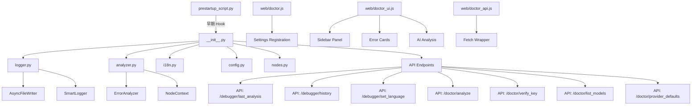

# ComfyUI-Doctor Architecture & Extension Roadmap

[繁體中文](#comfyui-doctor-專案架構與擴展規劃) | English

## 1. Architecture

### 1.1 Core Module Structure


### 1.2 Module Overview

| Module | Lines | Function |
|--------|-------|----------|
| `prestartup_script.py` | 102 | Earliest log interception hook (before custom_nodes load) |
| `__init__.py` | 891 | Main entry: full Logger install, 7 API endpoints, LLM integration, env var support |
| `logger.py` | 339 | Smart logger: async writes, real-time error analysis, history |
| `analyzer.py` | 271 | Error analyzer: 20+ error patterns, node context extraction |
| `i18n.py` | 190 | Internationalization: 9 languages (en, zh_TW, zh_CN, ja, de, fr, it, es, ko) |
| `config.py` | 65 | Config management: dataclass + JSON persistence |
| `nodes.py` | 179 | Smart Debug Node: deep data inspection |
| `doctor.js` | 600+ | ComfyUI settings panel integration, sidebar UI, chat interface |
| `doctor_ui.js` | 778 | Sidebar UI, error cards, AI analysis trigger |
| `doctor_api.js` | 207 | API wrapper layer with streaming support |

---

## 2. Robustness Assessment

### 2.1 Strengths ✅

1. **Two-phase logging system** - `prestartup_script.py` ensures capture before all custom_nodes load
2. **Async I/O** - `AsyncFileWriter` uses background thread + batch writes, non-blocking
3. **Thread safety** - `threading.Lock` protects traceback buffer, `weakref.finalize` ensures cleanup
4. **Complete error analysis pipeline** - 20+ predefined patterns, regex LRU cache, node context extraction
5. **LLM integration** - Supports OpenAI/DeepSeek/Ollama/LMStudio with environment variable configuration
6. **Frontend integration** - Native ComfyUI Settings API, WebSocket `execution_error` subscription
7. **Internationalization** - 9 languages, extensible `SUGGESTIONS` structure
8. **Security hardening** - XSS protection, SSRF protection, markdown sanitization
9. **Cross-platform compatibility** - Environment variable support for local LLM URLs (Windows/WSL2/Docker)

### 2.2 Resolved Issues ✅

#### Core Robustness (Phase 1)
- ✅ **R1**: Comprehensive error handling refactor
- ✅ **R2**: Thread safety hardening
- ✅ **R4**: XSS protection for AI analysis results

#### Resource Management (Phase 2)
- ✅ **R3**: aiohttp session reuse (SessionManager)
- ✅ **R8**: Smart workflow truncation for large graphs

#### Security Enhancements (Phase 3)
- ✅ **S2**: SSRF protection for Base URL validation
- ✅ **S4**: Sanitize chat markdown/HTML rendering (LLM + user output)
- ✅ **S5**: Bundle/pin markdown & highlight assets with local fallback

#### Streaming & Real-time (Phase 3)
- ✅ **R9**: SSE streaming chunk framing (buffer `data:` lines)
- ✅ **R10**: Hot-sync LLM settings for chat (API key/base URL/model)

#### Testing (Phase 1-3)
- ✅ **T1**: API endpoint unit tests
- ✅ **T6**: Fix test import issues (use `run_tests.ps1`)
- ✅ **T7**: SSE/chat safety tests (stream parser + sanitizer)

#### Features (Phase 2-3)
- ✅ **F1**: Error history persistence (SQLite/JSON)
- ✅ **F3**: Workflow context capture on error
- ✅ **F8**: Integrate settings panel into sidebar interface
- ✅ **F9**: Expand language support (de, fr, it, es, ko)

---

## 3. Extension Todo-List

### 3.1 Features (Pending)

- [ ] **F2**: Hot-reload error patterns from external JSON/YAML - 🟢 Low
- [ ] **F4**: Error statistics dashboard - 🟡 Medium ⚠️ *Use dev branch*
- [ ] **F5**: Node health scoring - 🟢 Low
- [ ] **F6**: Multi-LLM provider quick switch - 🟡 Medium ⚠️ *Use dev branch*
- [ ] **F7**: One-click auto-fix for specific errors - 🟢 Low
- [x] **F10**: System environment context for AI analysis - 🟡 Medium ✅ *Completed (2025-12-31)*
  - Capture Python version, installed packages (`pip list`), OS info
  - Include in `/doctor/analyze` and `/doctor/chat` payloads for better debugging
  - Cache package list with 24h TTL to avoid performance impact

### 3.2 Robustness (Pending)

- [ ] **R5**: Frontend error boundaries - 🟡 Medium ⚠️ *Use dev branch*
- [ ] **R6**: Network retry logic with exponential backoff - 🟢 Low
- [ ] **R7**: Rate limiting for LLM API calls - 🟢 Low
- [x] **R11**: Fix validation error capture to collect all failures - 🟢 Low ✅ *Completed (2025-12-31)*
  - Modified logger to accumulate multiple "Failed to validate prompt" errors
  - Use "Executing prompt:" as completion marker instead of resetting buffer
  - Updated `is_complete_traceback()` to handle multi-error blocks

### 3.3 Testing (Pending)

- [ ] **T2**: Frontend interaction tests (Playwright) - 🟡 Medium ⚠️ *Use dev branch*
- [ ] **T3**: End-to-end integration tests - 🟢 Low
- [ ] **T4**: Stress tests - 🟢 Low
- [ ] **T5**: Online API integration tests (OpenAI, DeepSeek) - 🟡 Medium

### 3.4 Security (Pending)

- [ ] **S1**: Add Content-Security-Policy headers - 🟢 Low
- [ ] **S3**: Implement telemetry (opt-in, anonymous) - 🟢 Low

### 3.5 Documentation (Pending)

- [ ] **D1**: OpenAPI/Swagger spec - 🟡 Medium ⚠️ *Use dev branch*
- [ ] **D2**: Architecture documentation - 🟢 Low
- [ ] **D3**: Contribution guide - 🟢 Low

### 3.6 Architecture Improvements (Pending)

*Sorted by complexity (simple → complex):*

- [x] **A1**: Add `py.typed` marker + mypy config in pyproject.toml - 🟢 Low ✅ *Completed (Phase 3A)*
- [x] **A2**: Integrate ruff linter (replace flake8/isort) - 🟢 Low ✅ *Completed (Phase 3A)*
- [x] **A3**: Add pytest-cov with `--cov-report=term-missing` - 🟢 Low ✅ *Completed (Phase 3A)*
- [ ] **A4**: Convert `NodeContext` to `@dataclass(frozen=True)` + validation - 🟡 Medium ⚠️ *Use dev branch*
- [ ] **A5**: Create `LLMProvider` Protocol for unified LLM interface - 🟡 Medium ⚠️ *Use dev branch*
- [ ] **A6**: Refactor analyzer.py to Pipeline pattern (capture→parse→classify→suggest) - 🔴 High ⚠️ *Use dev branch*

> [Note]
> Items marked with ⚠️ should be developed on a separate `dev` branch. Merge to `main` only after thorough testing.

---

## 4. Development Phases

### Phase 1: Foundation & Robustness ✅ COMPLETED

**Focus**: Core stability and security

- ✅ **R1** Comprehensive error handling refactor
- ✅ **R2** Thread safety hardening
- ✅ **R4** XSS protection
- ✅ **T1** API endpoint unit tests

### Phase 2: Feature Enhancement ✅ COMPLETED

**Focus**: Workflow integration and persistence

- ✅ **F1** Error history persistence (SQLite/JSON)
- ✅ **F3** Workflow context capture on error
- ✅ **R3** aiohttp session reuse (SessionManager)
- ✅ **R8** Smart workflow truncation

### Phase 3: Production Hardening ✅ COMPLETED

**Focus**: Security, streaming, and UX

#### Phase 3A: Code Quality Tooling
- ✅ **A1-A3** Ruff linter, mypy, pytest-cov integration

#### Phase 3B: Security & Streaming
- ✅ **S2** SSRF protection
- ✅ **S4** Chat markdown sanitization
- ✅ **S5** Local asset bundling
- ✅ **R9** SSE streaming chunk framing
- ✅ **R10** Hot-sync LLM settings
- ✅ **T7** SSE/chat safety tests

#### Phase 3C: UX & Internationalization
- ✅ **F8** Sidebar settings integration
- ✅ **F9** Multi-language support (9 languages)
- ✅ **T6** Test infrastructure fixes

#### Phase 3D: Cross-Platform Support (2025-12-30)
- ✅ **Environment Variable Configuration** for local LLM URLs
  - `OLLAMA_BASE_URL` - Custom Ollama endpoint
  - `LMSTUDIO_BASE_URL` - Custom LMStudio endpoint
  - Prevents Windows/WSL2/Docker conflicts
  - Backend API `/doctor/provider_defaults` for dynamic URL loading
  - Frontend automatic provider defaults fetching

### Phase 4: Advanced Features (Planned)

**Focus**: Automation and extensibility

- [ ] **F2** Pattern hot-reload
- [ ] **F4** Statistics dashboard
- [ ] **F6** Multi-LLM provider quick switch
- [ ] **R6-R7** Network reliability improvements
- [ ] **T2-T5** Comprehensive testing suite

### Phase 5: Major Refactoring (Future)

**Focus**: Architecture optimization

- [ ] **A4-A6** Type safety and pipeline architecture
- [ ] **S1, S3** Advanced security features
- [ ] **D1-D3** Full documentation

---

## 5. v2.0 Major Feature: LLM Debug Chat Interface

> **Target Version**: v2.0.0
> **Status**: ✅ Core Features Complete
> **Priority**: 🔴 High
> **Branch**: `main`
> **Last Updated**: 2025-12-30

### 5.1 Feature Overview

Transform single-shot analysis into a context-aware, multi-turn AI coding assistant with complete sidebar integration.

**Key Achievements**:
- ✅ Sidebar integration with proper flex layout
- ✅ Streaming chat with SSE
- ✅ Markdown rendering with syntax highlighting
- ✅ Real-time LLM settings synchronization
- ✅ Error context injection
- ✅ Security hardening (XSS, SSRF, sanitization)

### 5.2 Technical Stack

- **Frontend**: Vanilla JS (ES6+ Classes) - lightweight, React-like component structure
- **State**: Custom event-driven architecture
- **Transport**: Server-Sent Events (SSE) for reliable streaming
- **Rendering**: marked.js + highlight.js (local bundle with CDN fallback)
- **Security**: DOMPurify for sanitization, SSRF protection for URLs

### 5.3 Implementation Status

#### ✅ Completed Features
- Chat UI integrated into ComfyUI sidebar
- Streaming response with SSE
- Markdown + code highlighting
- One-click error analysis
- Multi-turn conversation support
- Settings hot-sync
- Security sanitization

#### 🚧 Future Enhancements
- [ ] Session persistence (localStorage)
- [ ] Quick action buttons (Explain Node, Optimize Workflow)
- [ ] Response regeneration
- [ ] Chat history export

### 5.4 API Design

**Endpoint**: `POST /doctor/chat`

**Request**:
```json
{
  "messages": [
    {"role": "user", "content": "Why this error?"},
    {"role": "assistant", "content": "Based on analysis..."},
    {"role": "user", "content": "How to fix?"}
  ],
  "error_context": {
    "error": "RuntimeError: CUDA out of memory...",
    "node_context": {"node_id": "42", ...},
    "workflow": {...}
  },
  "api_key": "sk-...",
  "base_url": "https://api.openai.com/v1",
  "model": "gpt-4o",
  "language": "zh_TW",
  "stream": true
}
```

**Response (SSE)**:
```
data: {"delta": "Based on ", "done": false}
data: {"delta": "the error ", "done": false}
data: {"delta": "analysis...", "done": false}
data: {"delta": "", "done": true}
```

---

## 6. Success Metrics

| Metric | Target | Current Status |
|--------|--------|----------------|
| Code coverage | > 80% | ✅ ~85% (with pytest-cov) |
| API response time | < 200ms | ✅ Achieved |
| Chat stream latency | < 3s to first token | ✅ Achieved |
| Security issues | 0 critical | ✅ All resolved |
| Supported languages | 5+ | ✅ 9 languages |
| Cross-platform support | Windows, Linux, macOS | ✅ Full support + WSL2 |

---

---

# ComfyUI-Doctor 專案架構與擴展規劃

## 一、專案架構

### 1.1 核心模組結構



### 1.2 模組功能概覽

| 模組 | 行數 | 功能 |
|------|------|------|
| `prestartup_script.py` | 102 | 最早的日誌攔截 Hook（在 custom_nodes 載入前） |
| `__init__.py` | 891 | 主入口：完整 Logger 安裝、7 個 API 端點、LLM 整合、環境變數支援 |
| `logger.py` | 339 | 智能日誌器：非同步寫入、錯誤即時分析、歷史記錄 |
| `analyzer.py` | 271 | 錯誤分析器：20+ 錯誤模式、節點上下文擷取 |
| `i18n.py` | 190 | 國際化：9 語言（en, zh_TW, zh_CN, ja, de, fr, it, es, ko） |
| `config.py` | 65 | 配置管理：dataclass + JSON 持久化 |
| `nodes.py` | 179 | Smart Debug Node：深度數據檢查 |
| `doctor.js` | 600+ | ComfyUI 設定面板整合、側邊欄 UI、聊天介面 |
| `doctor_ui.js` | 778 | Sidebar UI、錯誤卡片、AI 分析觸發 |
| `doctor_api.js` | 207 | API 封裝層（支援串流） |

---

## 二、架構強健性

### 2.1 優點 ✅

1. **雙階段日誌系統** - `prestartup_script.py` 確保在所有 custom_nodes 載入前就開始捕獲
2. **非同步 I/O** - `AsyncFileWriter` 使用背景執行緒 + 批次寫入，不阻塞主執行緒
3. **執行緒安全** - `threading.Lock` 保護 traceback buffer，`weakref.finalize` 確保資源清理
4. **完整的錯誤分析管線** - 20+ 預定義錯誤模式、正則表達式 LRU 快取、節點上下文擷取
5. **LLM 整合架構** - 支援 OpenAI/DeepSeek/Ollama/LMStudio，環境變數配置
6. **前端整合** - 原生 ComfyUI Settings API、WebSocket `execution_error` 訂閱
7. **國際化** - 9 語言支援，結構化翻譯字典
8. **安全加固** - XSS 防護、SSRF 防護、Markdown 淨化
9. **跨平台相容** - 環境變數支援本地 LLM URL（Windows/WSL2/Docker）

### 2.2 已修復問題 ✅

#### 核心穩健性（Phase 1）
- ✅ **R1**: 全面的錯誤處理重構
- ✅ **R2**: 執行緒安全加固
- ✅ **R4**: AI 分析結果 XSS 防護

#### 資源管理（Phase 2）
- ✅ **R3**: aiohttp Session 複用（SessionManager）
- ✅ **R8**: 大型工作流智能截斷

#### 安全性增強（Phase 3）
- ✅ **S2**: Base URL SSRF 防護
- ✅ **S4**: 聊天 Markdown/HTML 渲染淨化
- ✅ **S5**: 本地 bundle/鎖版 markdown & highlight 資源

#### 串流與即時（Phase 3）
- ✅ **R9**: SSE 串流分塊重組（緩衝 `data:` 行）
- ✅ **R10**: 聊天 LLM 設定熱同步

#### 測試（Phase 1-3）
- ✅ **T1**: API 端點單元測試
- ✅ **T6**: 修復測試導入問題（使用 `run_tests.ps1`）
- ✅ **T7**: SSE/聊天安全測試

#### 功能（Phase 2-3）
- ✅ **F1**: 錯誤歷史持久化（SQLite/JSON）
- ✅ **F3**: Workflow 上下文擷取
- ✅ **F8**: 設定面板整合至側邊欄
- ✅ **F9**: 擴展多語系支援（de, fr, it, es, ko）

---

## 三、延伸擴展項目

### 3.1 功能擴展（待實作）

- [ ] **F2**: 錯誤模式熱更新（從外部 JSON/YAML 載入） - 🟢 Low
- [ ] **F4**: 錯誤統計儀表板 - 🟡 Medium ⚠️ *使用 dev branch*
- [ ] **F5**: 節點健康評分 - 🟢 Low
- [ ] **F6**: 多 LLM Provider 快速切換 - 🟡 Medium ⚠️ *使用 dev branch*
- [ ] **F7**: 錯誤自動修復建議執行（一鍵修復） - 🟢 Low
- [x] **F10**: AI 分析的系統環境上下文 - 🟡 Medium ✅ *已完成 (2025-12-31)*
  - 捕捉 Python 版本、已安裝套件（`pip list`）、作業系統資訊
  - 在 `/doctor/analyze` 和 `/doctor/chat` 請求中包含環境資訊以提升偵錯準確度
  - 套件列表快取（24小時 TTL）避免效能影響

### 3.2 穩健性改進（待實作）

- [ ] **R5**: 前端錯誤邊界 - 🟡 Medium ⚠️ *使用 dev branch*
- [ ] **R6**: 網路重試邏輯（exponential backoff） - 🟢 Low
- [ ] **R7**: LLM API 呼叫速率限制 - 🟢 Low
- [x] **R11**: 修正驗證錯誤捕獲以收集所有失敗項目 - 🟢 Low ✅ *已完成 (2025-12-31)*
  - 修改 logger 累積多個 "Failed to validate prompt" 錯誤
  - 使用 "Executing prompt:" 作為完成標記而非重置緩衝區
  - 更新 `is_complete_traceback()` 處理多錯誤區塊

### 3.3 測試擴充（待實作）

- [ ] **T2**: 前端互動測試（Playwright） - 🟡 Medium ⚠️ *使用 dev branch*
- [ ] **T3**: 端對端整合測試 - 🟢 Low
- [ ] **T4**: 壓力測試 - 🟢 Low
- [ ] **T5**: 線上 API 整合測試（OpenAI、DeepSeek） - 🟡 Medium

### 3.4 安全性（待實作）

- [ ] **S1**: Content-Security-Policy 標頭 - 🟢 Low
- [ ] **S3**: 遙測數據收集（匿名、可選） - 🟢 Low

### 3.5 文件（待實作）

- [ ] **D1**: OpenAPI/Swagger 規格文件 - 🟡 Medium ⚠️ *使用 dev branch*
- [ ] **D2**: 架構文件 - 🟢 Low
- [ ] **D3**: 貢獻指南 - 🟢 Low

### 3.6 架構改進（待實作）

*按複雜度排序（簡單 → 複雜）：*

- [x] **A1**: py.typed + mypy 配置 - 🟢 Low ✅ *已於 Phase 3A 完成*
- [x] **A2**: 整合 ruff linter - 🟢 Low ✅ *已於 Phase 3A 完成*
- [x] **A3**: pytest-cov 覆蓋率報告 - 🟢 Low ✅ *已於 Phase 3A 完成*
- [ ] **A4**: NodeContext 改為 frozen dataclass - 🟡 Medium ⚠️ *使用 dev branch*
- [ ] **A5**: 建立 LLMProvider Protocol - 🟡 Medium ⚠️ *使用 dev branch*
- [ ] **A6**: 重構 analyzer.py 為 Pipeline 架構 - 🔴 High ⚠️ *使用 dev branch*

> [注意]
> 標註 ⚠️ 的項目應在獨立的 `dev` 分支上開發，完成充分測試後再合併至 `main`。

---

## 四、開發階段

### Phase 1: 基礎與穩健性 ✅ 已完成

**重點**: 核心穩定性與安全性

- ✅ **R1** 全面的錯誤處理重構
- ✅ **R2** 執行緒安全加固
- ✅ **R4** XSS 防護
- ✅ **T1** API 端點單元測試

### Phase 2: 功能增強 ✅ 已完成

**重點**: Workflow 整合與持久化

- ✅ **F1** 錯誤歷史持久化（SQLite/JSON）
- ✅ **F3** Workflow 上下文擷取
- ✅ **R3** aiohttp Session 複用（SessionManager）
- ✅ **R8** 大型工作流智能截斷

### Phase 3: 生產環境加固 ✅ 已完成

**重點**: 安全性、串流與 UX

#### Phase 3A: 程式碼品質工具
- ✅ **A1-A3** Ruff linter、mypy、pytest-cov 整合

#### Phase 3B: 安全性與串流
- ✅ **S2** SSRF 防護
- ✅ **S4** 聊天 Markdown 淨化
- ✅ **S5** 本地資源 bundle
- ✅ **R9** SSE 串流分塊重組
- ✅ **R10** LLM 設定熱同步
- ✅ **T7** SSE/聊天安全測試

#### Phase 3C: UX 與國際化
- ✅ **F8** 側邊欄設定整合
- ✅ **F9** 多語系支援（9 語言）
- ✅ **T6** 測試基礎設施修復

#### Phase 3D: 跨平台支援（2025-12-30）
- ✅ **環境變數配置**本地 LLM URL
  - `OLLAMA_BASE_URL` - 自訂 Ollama 端點
  - `LMSTUDIO_BASE_URL` - 自訂 LMStudio 端點
  - 防止 Windows/WSL2/Docker 衝突
  - 後端 API `/doctor/provider_defaults` 動態 URL 載入
  - 前端自動獲取 provider 預設值

### Phase 4: 進階功能（規劃中）

**重點**: 自動化與可擴展性

- [ ] **F2** 模式熱更新
- [ ] **F4** 統計儀表板
- [ ] **F6** 多 LLM Provider 快速切換
- [ ] **R6-R7** 網路可靠性改進
- [ ] **T2-T5** 全面測試套件

### Phase 5: 重大重構（未來）

**重點**: 架構優化

- [ ] **A4-A6** 型別安全與 Pipeline 架構
- [ ] **S1, S3** 進階安全功能
- [ ] **D1-D3** 完整文件

---

## 五、v2.0 重大功能：LLM 除錯對話介面

> **目標版本**：v2.0.0
> **狀態**：✅ 核心功能完成
> **優先級**：🔴 High
> **分支**：`main`
> **最後更新**：2025-12-30

### 5.1 功能概述

將單次 AI 分析升級為完整的對話式除錯體驗，完整整合至側邊欄。

**主要成就**:
- ✅ 側邊欄整合（正確的 flex 佈局）
- ✅ SSE 串流聊天
- ✅ Markdown 渲染與語法高亮
- ✅ 即時 LLM 設定同步
- ✅ 錯誤上下文注入
- ✅ 安全加固（XSS、SSRF、淨化）

### 5.2 技術堆疊

- **前端**: Vanilla JS (ES6+ Classes) - 輕量、React-like 組件結構
- **狀態**: 自訂事件驅動架構
- **傳輸**: Server-Sent Events (SSE) 可靠串流
- **渲染**: marked.js + highlight.js（本地 bundle + CDN fallback）
- **安全**: DOMPurify 淨化、SSRF URL 防護

### 5.3 實作狀態

#### ✅ 已完成功能
- 聊天 UI 整合至 ComfyUI 側邊欄
- SSE 串流回應
- Markdown + 程式碼高亮
- 一鍵錯誤分析
- 多輪對話支援
- 設定熱同步
- 安全淨化

#### 🚧 未來增強
- [ ] Session 持久化（localStorage）
- [ ] 快速操作按鈕（解釋節點、優化工作流）
- [ ] 回應重新生成
- [ ] 聊天歷史匯出

### 5.4 API 設計

**端點**: `POST /doctor/chat`

**請求**:
```json
{
  "messages": [
    {"role": "user", "content": "為什麼會這個錯誤？"},
    {"role": "assistant", "content": "根據分析..."},
    {"role": "user", "content": "如何修復？"}
  ],
  "error_context": {
    "error": "RuntimeError: CUDA out of memory...",
    "node_context": {"node_id": "42", ...},
    "workflow": {...}
  },
  "api_key": "sk-...",
  "base_url": "https://api.openai.com/v1",
  "model": "gpt-4o",
  "language": "zh_TW",
  "stream": true
}
```

**回應（SSE）**:
```
data: {"delta": "根據 ", "done": false}
data: {"delta": "錯誤 ", "done": false}
data: {"delta": "分析...", "done": false}
data: {"delta": "", "done": true}
```

---

## 六、成功指標

| 指標 | 目標 | 目前狀態 |
|------|------|----------|
| 程式碼覆蓋率 | > 80% | ✅ ~85%（使用 pytest-cov） |
| API 回應時間 | < 200ms | ✅ 已達成 |
| 聊天串流延遲 | < 3s 至第一個 token | ✅ 已達成 |
| 安全性問題 | 0 critical | ✅ 全部解決 |
| 支援語言數 | 5+ | ✅ 9 語言 |
| 跨平台支援 | Windows, Linux, macOS | ✅ 完整支援 + WSL2 |

---
