# ComfyUI-Doctor Architecture & Extension Roadmap

## 1. Architecture

### 1.1 Core Module Structure

```mermaid
graph TD
    A[prestartup_script.py] -->|Early Hook| B[__init__.py]
    B --> C[logger.py]
    B --> D[analyzer.py]
    B --> E[i18n.py]
    B --> F[config.py]
    B --> G[nodes.py]
    B --> HH[statistics.py]
    B --> SEC[security.py]
    B --> OUT[outbound.py]
    
    %% R6/R7: Network Resilience
    B --> SM[session_manager.py]
    SM --> RL[rate_limiter.py]
    SM --> LLC[llm_client.py]
    RL --> RL1[RateLimiter]
    RL --> RL2[ConcurrencyLimiter]
    LLC --> LLC1[Retry + Backoff]
    LLC --> LLC2[Idempotency-Key]

    C --> I[AsyncFileWriter]
    C --> J[SafeStreamWrapper]
    C --> K[DoctorLogProcessor]
    %% R14/R15: Log context ring buffer
    C --> LRB[services/log_ring_buffer.py]
    %% R18: Canonical data directory resolver (Desktop/Portable compatibility)
    C --> DP[services/doctor_paths.py]

    %% A6 Pipeline Architecture
    D --> PIPE[pipeline/orchestrator.py]
    PIPE --> MC[pipeline/metadata_contract.py]
    PIPE --> S1[SanitizerStage]
    PIPE --> S2[PatternMatcherStage]
    PIPE --> S3[ContextEnhancerStage]
    PIPE --> S4[LLMBuilderStage]

    %% Stage Dependencies
    S1 --> SAN[sanitizer.py]
    S2 --> H[pattern_loader.py]
    S2 --> PLUG[pipeline/plugins/]
    %% R12: Smart Token Budget
    S4 --> TE[services/token_estimator.py]
    S4 --> TB[services/token_budget.py]
    S4 --> SERV[services/workflow_pruner.py]
    TE --> TB
    SERV --> TB
    OUT --> SAN
    %% R15: Pipeline context enrichment
    S4 --> SYSI[system_info.py]
    S4 --> LRB

    H --> N[patterns/builtin/]
    H --> O[patterns/community/]
    N --> P[core.json - 22 patterns]
    O --> Q[controlnet.json - 8 patterns]
    O --> R[lora.json - 6 patterns]
    O --> S[vae.json - 5 patterns]
    O --> T[animatediff.json - 4 patterns]
    O --> U[ipadapter.json - 4 patterns]
    O --> V[facerestore.json - 3 patterns]
    O --> W[misc.json - 5 patterns]

    B --> X[API Endpoints]
    X --> Y["API: /debugger/last_analysis"]
    X --> Z["API: /debugger/history"]
    X --> AA["API: /debugger/set_language"]
    X --> AB["API: /doctor/analyze"]
    X --> AC["API: /doctor/verify_key"]
    X --> AD["API: /doctor/list_models"]
    X --> AE["API: /doctor/provider_defaults"]
    X --> AF["API: /doctor/ui_text"]
    X --> AG["API: /doctor/chat"]
    X --> AGS["API: /doctor/statistics"]
    X --> AGM["API: /doctor/mark_resolved"]
    X --> AH2["API: /doctor/health"]
    X --> AH3["API: /doctor/plugins"]

    AH[web/doctor.js] --> TM[Tab Manager]
    TM --> TC[Chat Tab]
    TM --> TS[Statistics Tab]
    TM --> TSE[Settings Tab]
    
    TC --> AR[Chat Interface]
    TS --> AK[Statistics Panel]
    TSE --> AI[Settings UI]

    AJ[web/doctor_ui.js] --> AL[Error Cards]
    AJ --> AM[AI Analysis]
    AJ --> AN[i18n Integration]
    AO[web/doctor_api.js] --> AP[Fetch Wrapper]
    TC --> AS[SSE Streaming]

    AT[tests/e2e/] --> AU[Playwright Test Suite]
    AU --> AV[test-harness.html]
    AU --> AW[mocks/comfyui-app.js]
    AU --> AX[specs/settings.spec.js - 13 tests]
    AU --> AY[specs/sidebar.spec.js - 15 tests]
    AU --> AZ[specs/statistics.spec.js - 19 tests]
    AU --> BA[specs/preact-loader.spec.js - 14 tests]
    AU --> BB[specs/error-boundaries.spec.js - 8 tests]
    AU --> BC["specs/telemetry.spec.js - 8 tests - requires ComfyUI backend"]
    AV --> AH
    AV --> AJ

    %% T14: Frontend unit tests (fast, no browser)
    ATU[tests/unit/] --> VIT[vitest.config.js]
    ATU --> WU[web/utils/]
	    
    %% R14/R15: Prompt composition + canonical system info
    B --> PC[services/prompt_composer.py]
    AB --> PC
    AG --> PC
    PC --> SYSI
```



### 1.2 Module Overview

| Module | Lines | Function |
|--------|-------|----------|
| `prestartup_script.py` | ~100 | Earliest log interception hook (before custom_nodes load) |
| `__init__.py` | ~2400 | Main entry: full Logger install, API endpoints, LLM integration, env var support |
| `logger.py` | ~750 | SafeStreamWrapper + queue-based processing, DoctorLogProcessor background thread, async writes |
| `analyzer.py` | ~250 | Wrapper for AnalysisPipeline, legacy API compatibility |
| `pipeline/` | ~1100 | A6: Error analysis pipeline (Sanitizer, Matcher, Context, LLMBuilder) + metadata contract |
| `pipeline/metadata_contract.py` | ~120 | Metadata schema versioning + end-of-run validation/quarantine |
| `security.py` | ~150 | SSRF hardening helpers + counters for health endpoint |
| `outbound.py` | ~60 | Non-bypassable outbound sanitization boundary for remote requests |
| `sanitizer.py` | ~320 | PII sanitization engine with `none/basic/strict` modes |
| `system_info.py` | ~400 | Environment collection + R15 canonical `system_info` schema (capped, keyword-prioritized packages) |
| `session_manager.py` | ~210 | R7: Shared aiohttp session, rate/concurrency limiter management |
| `rate_limiter.py` | ~130 | R7: Token bucket RateLimiter + async ConcurrencyLimiter |
| `llm_client.py` | ~290 | R6: Retry with exponential backoff, Idempotency-Key, timeout budget |
| `services/` | ~670 | R12: Token estimation, budget management, workflow pruning |
| `services/doctor_paths.py` | ~120 | R18: Canonical, Desktop-safe data directory resolver for persistence |
| `services/prompt_composer.py` | ~260 | R14: Unified structured context → prompt formatting (summary-first) |
| `services/log_ring_buffer.py` | ~190 | R14/R15: Bounded execution log capture for context building |
| `pattern_loader.py` | 300+ | JSON-based pattern management with hot-reload capability |
| `i18n.py` | 1400+ | Internationalization: 9 languages (en, zh_TW, zh_CN, ja, de, fr, it, es, ko), 57 pattern translations |
| `config.py` | 65 | Config management: dataclass + JSON persistence |
| `nodes.py` | 179 | Smart Debug Node: deep data inspection |
| `statistics.py` | 155 | Error statistics calculator: pattern frequency, category breakdown, trends |
| `history_store.py` | 195 | Error history persistence with pattern metadata (F4 enhanced) |
| `patterns/builtin/core.json` | - | 22 builtin error patterns (PyTorch, CUDA, Memory, etc.) |
| `patterns/community/*.json` | - | 35 community patterns (ControlNet, LoRA, VAE, AnimateDiff, IPAdapter, FaceRestore, Misc) |
| `web/doctor.js` | 600+ | ComfyUI settings panel integration, sidebar UI initialization |
| `web/doctor_tabs.js` | 100+ | Tab state management & registry |
| `web/tabs/*.js` | 500+ | Chat, Stats, and Settings tab implementations |
| `web/doctor_ui.js` | 1400+ | Sidebar UI, error cards, AI analysis trigger, i18n integration |
| `web/doctor_api.js` | 260+ | API wrapper layer with streaming support, statistics API |
| `web/doctor_chat.js` | 600+ | Multi-turn chat interface, SSE streaming, markdown rendering |
| `web/ErrorBoundary.js` | 180+ | R5: Preact error boundary for islands (isolation, reload, error ID copy) |
| `web/global_error_handler.js` | 170+ | R5: Global error handlers (uncaught + unhandledrejection) with dedup + LRU |
| `web/privacy_utils.js` | 115+ | R5: Frontend privacy sanitization helpers (none/basic/strict) |
| `web/error_boundary.css` | 140+ | R5: Error boundary UI styling |
| `tests/e2e/test-harness.html` | 104 | Isolated test environment for Doctor UI (loads full extension without ComfyUI) |
| `tests/e2e/mocks/comfyui-app.js` | 155 | Mock ComfyUI app/api objects for testing |
| `tests/e2e/specs/settings.spec.js` | 217 | Settings panel tests (13 tests): toggle, selectors, inputs, persistence, trust/health refresh |
| `tests/e2e/specs/sidebar.spec.js` | 190 | Chat interface tests (15 tests): messages, input, buttons, error context, sanitization status |
| `tests/e2e/specs/statistics.spec.js` | 470+ | Statistics dashboard tests (19 tests): panel, cards, patterns, categories, i18n, resolution actions |
| `tests/e2e/specs/preact-loader.spec.js` | 200+ | Preact loader tests (14 tests): module loading, flags, error handling, vendor fallback |
| `tests/e2e/specs/error-boundaries.spec.js` | 350+ | R5: Error boundary regression tests (8 tests): UI, reload, isolation, privacy |
| `tests/e2e/specs/telemetry.spec.js` | 200+ | S3: Telemetry integration tests (8 tests, requires live ComfyUI backend) |
| `playwright.config.js` | 89 | Playwright configuration for E2E tests |

---

## 2. Robustness Assessment

### 2.1 Strengths ✅

1. **Two-phase logging system** - `prestartup_script.py` ensures capture before all custom_nodes load
2. **SafeStreamWrapper architecture** - Queue-based background processing, zero deadlock risk, independent from ComfyUI's LogInterceptor
3. **Async I/O** - `AsyncFileWriter` + `DoctorLogProcessor` use background threads, non-blocking writes
4. **Thread safety** - `threading.Lock` protects traceback buffer, queue-based design eliminates race conditions
5. **JSON-based pattern management** - 57+ patterns (22 builtin + 35 community) with hot-reload, no restart needed
6. **Complete error analysis pipeline** - PatternLoader with regex LRU cache, node context extraction
7. **LLM integration** - Supports 8+ providers (OpenAI/DeepSeek/Groq/Gemini/Ollama/LMStudio/Anthropic) with environment variable configuration
8. **Frontend integration** - Native ComfyUI Settings API, WebSocket `execution_error` subscription, SSE streaming chat
9. **Full internationalization** - 9 languages with complete UI and pattern translations
10. **Security hardening** - XSS protection, SSRF protection, markdown sanitization, PII sanitization
11. **Cross-platform compatibility** - Environment variable support for local LLM URLs (Windows/WSL2/Docker)
12. **Community ecosystem** - JSON patterns allow community contributions without code changes

### 2.2 Resolved Issues ✅

#### Core Robustness (Phase 1)

- ✅ **R1**: Comprehensive error handling refactor
- ✅ **R2**: Thread safety hardening
- ✅ **R4**: XSS protection for AI analysis results

#### Resource Management (Phase 2)

- ✅ **R3**: aiohttp session reuse (SessionManager)
- ✅ **R8**: Smart workflow truncation for large graphs

#### Security Enhancements (Phase 3)

- ✅ **S2**: SSRF protection for Base URL validation
- ✅ **S4**: Sanitize chat markdown/HTML rendering (LLM + user output)
- ✅ **S5**: Bundle/pin markdown & highlight assets with local fallback

#### Streaming & Real-time (Phase 3)

- ✅ **R9**: SSE streaming chunk framing (buffer `data:` lines)
- ✅ **R10**: Hot-sync LLM settings for chat (API key/base URL/model)

#### Testing (Phase 1-3)

- ✅ **T1**: API endpoint unit tests
- ✅ **T6**: Fix test import issues (use `scripts/run_tests.ps1`)
- ✅ **T7**: SSE/chat safety tests (stream parser + sanitizer)

#### Features (Phase 2-3)

- ✅ **F1**: Error history persistence (SQLite/JSON)
- ✅ **F3**: Workflow context capture on error
- ✅ **F8**: Integrate settings panel into sidebar interface
- ✅ **F9**: Expand language support (de, fr, it, es, ko)

---

## 3. Extension Todo-List

### 3.0 Risk & Refactor Mitigation (Highest Priority)

- [x] **R0**: Risk & Refactor Mitigation (Security + Logger + Pipeline + Sanitization) - 🔴 Highest ✅ *Completed (2026-01-10)*
  - **Scope**: SSRF hardening, logger backpressure, pipeline health, prestartup handoff, sanitization boundary
  - **Plan**: `.planning/260108-RISK_REFACTOR_MITIGATION_PLAN.md`
  - **Implementation Record**: `.planning/260109-R0_R13_PIPELINE_GOVERNANCE_IMPLEMENTATION_RECORD.md`
  - **Progress**:
    - ✅ **R0-P0**: SSRF hardening + redirect blocking for outbound requests
    - ✅ **R0-P1**: Single outbound payload sanitization funnel (privacy_mode=none only for verified local)
    - ✅ **R0-P2**: Logger backpressure + dropped-message counters
    - ✅ **R0-P3**: Metadata contract versioning + end-of-run validation + dependency-aware pipeline
    - ✅ **R0-P4**: Prestartup logger handoff (close/uninstall)
    - ✅ **R0-P5**: Observability/health endpoint (`/doctor/health`)
- [x] **R13**: Pipeline + Plugin Hardening (Phase 2 Assessment) - 🔴 Highest ✅ *Completed (2026-01-10)*
  - **Scope**: plugin gating + manifest/allowlist, metadata contract, pipeline dependency policy, expanded sanitization boundary, context extraction provenance
  - **Plan**: `.planning/260109-PHASE2_PIPELINE_PLUGIN_HARDENING_PLAN.md`
  - **Implementation Record**: `.planning/260109-R0_R13_PIPELINE_GOVERNANCE_IMPLEMENTATION_RECORD.md`
  - **Follow-up Record**: `.planning/260109-PHASE2_FOLLOWUP_TRUST_HEALTH_UI_AND_E2E_RECORD.md`
  - **Progress**:
    - ✅ **R13-P0**: Plugin loader safe-by-default (default OFF + allowlist/manifest/sha256 + trust taxonomy + filesystem hardening)
    - ✅ **R13-P0-TESTS**: Dedicated security tests for plugin loader
    - ✅ **R13-P1**: Outbound payload safety funnel (shared with **R0-P1**)
    - ✅ **R13-P2**: Metadata contract + dependency policy (shared with **R0-P3**)
    - ✅ **R13-P3**: Context extraction provenance metadata
    - ✅ **R13-OPT1**: Optional signature policy (HMAC) for allowlisted plugins (shared-secret integrity check, not public signing)
    - ✅ **R13-OPT2**: Trust & Health UI + `/doctor/plugins` scan-only endpoint ✅ *Completed (2026-01-09; moved to Statistics on 2026-01-15)*

### 3.1 Security (in progress)

*Sorted by priority (High → Low):*

- [x] **S6**: PII Sanitization for LLM traceback - 🔴 High ✅ *Completed (2025-12-31)*
  - **Backend** (`sanitizer.py` module):
    - ✅ Remove user paths: `C:\Users\username\...` → `<USER_PATH>\...`
    - ✅ Sanitize Linux/macOS home: `/home/username/` → `<USER_HOME>/`
    - ✅ Email addresses, private IP addresses (regex-based)
    - ✅ Configurable sanitization levels: `none`, `basic`, `strict`
    - ✅ **S6-FP1**: Reduce false positives (BASIC no longer redacts arbitrary long hex; STRICT keeps long-hex redaction)
    - ✅ Zero runtime overhead, GDPR-friendly
  - **Frontend** (Privacy Controls):
    - ✅ Settings panel: "Privacy Mode" dropdown with 3 levels
    - ✅ Visual indicator: 🔒 icon in settings
    - ✅ Multi-language support (9 languages)
    - ⏸️ "Preview" button: Not implemented (deferred to future)
    - ⏸️ Audit log UI: Not implemented (backend logging only)
  - **Critical for enterprise adoption** - blocks B2B market without this
  - **Foundation for**: A6 Pipeline Stage 1 (Sanitizer)
  - **Documentation**: See `.planning/251231-S6_PII_SANITIZATION.md`
- [ ] **S7**: Quarterly Security Audits - 🟢 Low (recurring)
  - **Automated** (CI/CD):
    - OWASP ZAP penetration testing
    - Snyk dependency vulnerability scanning
    - Semgrep static analysis for security patterns
  - **Manual** (Quarterly):
    - SSRF attack scenarios (metadata endpoints, internal IPs)
    - XSS injection tests (chat inputs, settings fields)
    - Path traversal attempts
  - **Compliance**: OWASP Top 10, CWE Top 25, GDPR
  - **Deliverable**: Security audit reports in `.planning/` (format: `YYYYMMDD-SECURITY_AUDIT_QX.md`)
  - **Trigger**: GitHub Actions cron job every 90 days
  - **Note**: No audits conducted yet; this is a recurring future task
- [x] **S1**: Document CSP Compliance/Limitations - 🟢 Low ✅ *Code Audit Complete (2026-01-09)*
  - **Scope Changed**: From "Add CSP headers" to "Document CSP compliance"
  - ComfyUI core manages CSP headers; extensions cannot override
  - Verified all Doctor assets load locally (`web/lib/`)
  - CDN references are fallback-only
  - **Documentation**: README.md CSP section
  - **Implementation**: `.planning/260109-S1_S3_IMPLEMENTATION_RECORD.md`
  - ⚠️ **Pending**: Manual verification with `--disable-api-nodes` + screenshots (user required)
- [x] **S3**: Implement telemetry (opt-in, anonymous) - 🟢 Low ✅ *Completed (2026-01-09)*
  - **Scope**: Local-only telemetry (Phase 1-3); no network upload
  - Backend: `telemetry.py` (TelemetryStore, RateLimiter, PII detection, 27 unit tests)
  - Config: `config.py` `telemetry_enabled` setting (default: false)
  - 6 API endpoints: `/doctor/telemetry/{status,buffer,track,clear,export,toggle}`
  - Security: Origin check (403 for cross-origin), 1KB payload limit, field whitelist
  - Frontend: `doctor_telemetry.js`, Statistics UI controls (moved from Settings on *2026-01-15*)
  - i18n: 81 strings (9 keys × 9 languages)
  - E2E tests: 8 tests in `telemetry.spec.js`
  - **Implementation**: `.planning/260109-S1_S3_IMPLEMENTATION_RECORD.md`
  - **UI Migration Record**: `.planning/260115-SETTINGS_TO_STATS_IMPLEMENTATION_RECORD.md`

### 3.2 Robustness (in progress)

*Sorted by priority (High → Low):*

- [x] **R18**: ComfyUI Desktop/Portable Compatibility Hardening - 🔴 High ✅ *Completed (2026-01-23)*
  - **Problem**: Desktop packaging changes directory layout and stdout/stderr behavior; edge-case stream/logging failures can trigger log storms or break persistence (especially on Windows).
  - **Scope**:
    - Introduce a single **Doctor data-dir resolver** (prefer ComfyUI `--user-directory` / `folder_paths.get_user_directory()`; safe fallback when unavailable)
    - Migrate all persisted files to the resolved data dir (avoid writing under extension install dir):
      - `error_history.json`, `comfyui_debug_*.log`, API operation logs, diagnostics history, etc.
      - One-time migration/compat read for legacy `custom_nodes/ComfyUI-Doctor/logs/` locations
    - Persistence hardening for JSON stores:
      - Atomic writes (tmp → rename), corruption recovery (rotate + rebuild), and safety guardrails (max size/entries)
    - Runtime self-protection:
      - Reusable circuit breaker + 60s rate-limit + aggregation for repeated identical errors
      - Drop/ignore known non-actionable Desktop log spam signatures (e.g. flush failures), while still surfacing a single aggregated health issue
    - Record install mode hints (Desktop vs portable/git clone) + resolved paths in `system_info`/health for debugging
  - **Acceptance**:
    - Doctor never writes inside Desktop app resources/install directories
    - Corrupt JSON stores self-heal without infinite error loops
    - Flush/log storms do not grow history unbounded (aggregation + breaker)
  - **Reference**: `docs/reference/desktop/` (ComfyUI Desktop packaging + launch args)
  - **Plan**: `.planning/260123-R18_DESKTOP_PORTABLE_COMPAT_HARDENING_PLAN.md`
  - **Implementation Record**: `.planning/260123-R18_IMPLEMENTATION_RECORD.md`
  - **Tests**: `tests/test_paths.py`, `tests/test_history_store.py`, `tests/test_r18_migration.py`
- [x] **R14**: Error context extraction & prompt packaging optimization - 🔴 High ✅ *Completed (2026-01-14)*
  - **Problem**: LLM context is often dominated by raw tracebacks; log context capture is unreliable; env/pip list can waste tokens.
  - **Approach**:
    - Add `error_summary` before full traceback (exception line + optional pattern/category)
    - Reliable execution log context via a dedicated ring buffer (not dependent on ComfyUI logger handlers)
    - Expand non-traceback error triggers (single-line fatals, validation failures) with strict dedup/noise filtering
    - Build structured LLM context via pipeline (`llm_builder.py`) + token budgets (R12) instead of ad-hoc string concatenation
  - **Plan**: `.planning/260113-R14_ERROR_CONTEXT_EXTRACTION_OPTIMIZATION_PLAN.md`
  - **Implementation Record**: `.planning/260113-R14_ERROR_CONTEXT_EXTRACTION_IMPLEMENTATION_RECORD.md`
- [x] **R16**: Statistics Reset + Unbounded History - 🟡 Medium ✅ *Completed (2026-01-15)*
  - **Goal**: Let users reset local statistics on demand and remove hard history limits while keeping UI time windows (e.g. 30d/24h) meaningful.
  - **Scope**:
    - Add a Reset button in Statistics UI (with confirmation) and backend reset endpoint
    - Remove history maxlen cap (unbounded history) with guardrails and reset mechanism
  - **Plan**: `.planning/260115-R16_STATS_RESET_AND_UNBOUNDED_HISTORY_PLAN.md`
  - **Implementation Record**: `.planning/260115-R16_STATISTICS_RESET_IMPLEMENTATION_RECORD.md`
- [ ] **R17 (P1)**: Limited Config Externalization (Compatibility Guardrails) - 🟡 Medium
  - **Goal**: Externalize a small, high-impact set of hardcoded guardrails so Doctor behaves consistently across ComfyUI Desktop / portable / git-clone installs (without turning everything into config).
  - **Scope**:
    - Consolidate runtime guardrails into a single config surface (prefer request-local settings; avoid global side-effects):
      - Error aggregation window (e.g. 60s), rate-limit thresholds, and breaker/backoff parameters
      - Persistence guardrails (max entries / max file size / rotation thresholds) for JSON stores
      - Path/persistence policy knobs used by **R16** (resolved data dir, migration toggles)
    - Support safe overrides via **ComfyUI settings** and/or env vars where appropriate (defaults unchanged).
    - Document which values are user-facing vs. developer-only (avoid accidental foot-guns).
  - **Acceptance**:
    - Default behavior remains unchanged for existing users
    - Desktop-only mitigations can be enabled/tuned without code edits
    - No new global CONFIG mutation patterns introduced
- [x] **R15**: Canonicalize `system_info` + populate pipeline `execution_logs` - 🟡 Medium ✅ *Completed (2026-01-14)*
  - **Scope**:
    - Canonicalize `get_system_environment()` output into a PromptComposer-friendly schema (OS/Python/CUDA/PyTorch + capped packages)
    - Smart package selection for `system_info.packages` (error-keyword-based; strict cap by default)
    - Populate pipeline context `execution_logs` from `LogRingBuffer` (so pipeline and endpoints share the same log source)
  - **Plan**: `.planning/260114-R15_SYSTEM_INFO_CANONICALIZATION_AND_PIPELINE_LOGS_PLAN.md`
  - **Implementation Record**: `.planning/260114-R15_SYSTEM_INFO_CANONICALIZATION_AND_PIPELINE_LOGS_RECORD.md`
- [x] **R12**: Smart Token Budget Management - 🟡 Medium ✅ *Completed (2026-01-10)*
  - **Core Strategy**: Progressive trimming system with token estimation for LLM context management
  - **Implemented Features**:
    - **Token Estimation**: Real-time estimation with `tiktoken` library (or configurable fallback)
    - **Workflow Pruning**: Graph-based dependency tracking using BFS (Breadth-First Search)
      - Trace upstream nodes from error node (configurable max_depth: 3, max_nodes: 40)
      - Support both ComfyUI API format and UI-saved format
      - Remove irrelevant branches (e.g., Note nodes, unrelated Image Save)
    - **Progressive Trimming**: By-section token tracking with degradation steps
    - **Provider-Aware Budgets**: Separate limits for remote/local providers
      - Remote: 4500 soft / 6000 hard tokens
      - Local: 12000 soft / 16000 hard tokens (opt-in)
    - **Enhanced Metadata**: R12Metadata v1.0 schema for observability
    - **A/B Validation Harness**: Quality metrics tracking (`scripts/r12_ab_harness.py`)
  - **Deferred Features** (not implemented):
    - ✅ Smart pip list filtering (keyword extraction from errors) → delivered in **R15**
    - ✅ Stack frame collapsing (first N + last M frames) → delivered in **R14**
  - **Cost Impact**: 40-60% token reduction estimated, saving $24-36 per 1000 analyses (GPT-4)
  - **Implementation**: `.planning/260110-R12_SMART_TOKEN_BUDGET_IMPLEMENTATION_RECORD.md`
  - **Integration**: `services/token_estimator.py`, `services/workflow_pruner.py`, `services/token_budget.py`
  - **Prerequisite**: Works with A6 Pipeline architecture
  - **Note**: A/B testing framework ready; requires production samples for full validation
- [x] **R5**: Frontend error boundaries - 🟡 Medium ✅ *Completed (2026-01-13)*
  - **Goal**: Prevent isolated UI crashes (Chat/Stats islands) from taking down the entire sidebar.
  - **Scope**:
    - Preact `ErrorBoundary` wrapper around islands (reload attempts + stable fallback UI)
    - Global error handlers for uncaught exceptions and unhandled rejections (Doctor-only filtering + dedup)
    - Frontend privacy sanitization (`none/basic/strict`) for error logs and stacks
    - Feature flag: `Doctor.General.ErrorBoundaries` (default enabled)
  - **Plan**: `.planning/260112-R5_FRONTEND_ERROR_BOUNDARIES_PLAN.md`
  - **Implementation Record**: `.planning/260113-R5_FRONTEND_ERROR_BOUNDARIES_RECORD.md`
- [x] **R6**: Network retry logic with exponential backoff - 🟢 Low ✅ *Completed (2026-01-10)*
  - Created `llm_client.py` with safe retry logic, idempotency keys, timeout budget
  - Exponential backoff with jitter, Retry-After header support
  - Pre-stream retry for SSE endpoints (no retry after streaming begins)
  - **Implementation**: `.planning/260110-R6_R7_IMPLEMENTATION_RECORD.md`
- [x] **R7**: Rate limiting for LLM API calls - 🟢 Low ✅ *Completed (2026-01-10)*
  - Created `rate_limiter.py` (RateLimiter + ConcurrencyLimiter)
  - Core limiter (30/min) for `/doctor/analyze`, `/doctor/chat`
  - Light limiter (10/min) for `/doctor/verify_key`, `/doctor/list_models`
  - Concurrency semaphore (max 3 simultaneous LLM requests)
  - **Implementation**: `.planning/260110-R6_R7_IMPLEMENTATION_RECORD.md`
- [x] **R11**: Fix validation error capture to collect all failures - 🟢 Low ✅ *Completed (2025-12-31)*
  - Modified logger to accumulate multiple "Failed to validate prompt" errors
  - Use "Executing prompt:" as completion marker instead of resetting buffer
  - Updated `is_complete_traceback()` to handle multi-error blocks

### 3.3 Features (in progress)

*Sorted by priority (High → Low):*

- [x] **F14**: Proactive Diagnostics (Lint / Health Check + Intent Signature) - 🔴 High ✅ *Completed (2026-01-23)*
  - **Goal**: Prevent failures before execution; Health Score is a core KPI
  - **Intent Signature (ISS)**: deterministic intent inference (signals + scoring), top intents with evidence
  - **Checks**: Workflow lint, environment/deps, model assets, runtime, privacy
  - **Outputs**: Actionable issues + node navigation; intent banner; health history
  - **i18n**: Health tab + intent banner strings across 9 languages
  - **Stats**: Top intents and intent-to-error correlation
  - **APIs**: `/doctor/health_check`, `/doctor/health_report`, `/doctor/health_history`, `/doctor/health_ack`
  - **Plan**: `.planning/260122-F14_PROACTIVE_DIAGNOSTICS_AND_INTENT_SIGNATURE_PLAN.md`
  - **Implementation Records**:
    - `.planning/260122-F14_P0_IMPLEMENTATION_LOG.md`
    - `.planning/260122-F14_P1_IMPLEMENTATION_LOG.md`
    - `.planning/260123-F14_P2_IMPLEMENTATION_LOG.md`
    - `.planning/260123-F14_P3_IMPLEMENTATION_LOG.md`
    - `.planning/260123-F14_P3_FOLLOWUPS_LOG.md` (tracked as F14-P4 follow-ups)
- [x] **F15**: Resolution Marking UI (Resolved / Unresolved / Ignored) - 🟡 Medium ✅ *Completed (2026-01-09)*
  - **Goal**: Let users update resolution status directly from UI
  - **Scope**: Statistics tab first; optional Chat tab parity
  - **Flow**: `POST /doctor/mark_resolved` → refresh stats
  - **i18n**: Status labels and "Mark as" strings
  - **Tests**: Playwright mock API + UI state assertions
  - **Plan**: `.planning/260108-F15_RESOLUTION_MARKING_UI_PLAN.md`
  - **Implementation Record**: `.planning/260108-F15_IMPLEMENTATION_RECORD.md`
- [ ] **F16**: Quick Community Feedback (GitHub PR) - 🔴 High
  - **Goal**: One-click PR with sanitized pattern + verified suggestion + optional stats snapshot
  - **Repo**: `rookiestar28/ComfyUI-Doctor`
  - **Conflict avoidance**: Append-only JSON files under `feedback/`
  - **Auth**: Server-side token (env var) or future device flow
  - **Plan**: `.planning/260108-F16_GITHUB_FEEDBACK_PR_PLAN.md`
- [x] **F17**: Toggle Auto-Open for Right Error Report Panel - 🟡 Medium ✅ *Completed (2026-01-23)*
  - **Goal**: Add a user-facing switch to control whether the right-side error report panel auto-opens when new errors are detected (**default: ON**).
  - **Scope**:
    - Add toggle in Doctor Settings tab (Sidebar → Doctor → Settings)
    - Persist via ComfyUI settings (`Doctor.Behavior.AutoOpenOnError`)
    - Apply immediately (no restart required)
    - Full i18n across 9 languages
  - **Plan**: `.planning/260123-F17_AUTO_OPEN_RIGHT_PANEL_TOGGLE_PLAN.md`
  - **Implementation Record**: `.planning/260123-F17_IMPLEMENTATION_RECORD.md`
- [x] **F7**: Enhanced Error Analysis (Multi-Language + Categorization) - 🔴 High ✅ *Completed (2026-01-01)*
  - **Phase 1**: Enhanced Error Context Collection
    - Python stack traces, execution logs (last 50 lines)
    - Failed node details (class_type, inputs, title)
    - Workflow structure analysis (upstream nodes, missing connections)
    - Multi-language prompt templates (9 languages: en, zh_TW, zh_CN, ja, de, fr, it, es, ko)
    - **Design principle**: System prompts in English + explicit language directive
  - **Phase 2**: Automatic Error Categorization
    - Keyword-based classification (5 categories: connection/model/validation/type/execution)
    - Confidence scoring with matched keywords
    - Suggested fix approach for each category
  - **Impact**: Better LLM root cause analysis through richer context
  - **Implementation**: `.planning/260101-F7_PHASE1_RECORD.md`, `.planning/260101-F7_PHASE2_RECORD.md`
  - **Code Added**: ~752 lines (5 new functions + 9 language templates + integration)
- [x] **F12**: Expand offline error pattern coverage to 50+ - 🔴 High ✅ *Completed (2026-01-03)*
  - **Current**: 57 patterns, **Target**: 50+ patterns
  - ✅ Add 35+ new patterns: ControlNet, LoRA, VAE, AnimateDiff, IP-Adapter, Upscaler, etc.
  - ✅ Focus on most reported errors from community feedback
  - **Impact**: 90%+ offline coverage, reduces LLM API dependency by 70%
  - **Cost savings**: ~$28 per 1000 errors (GPT-4), zero latency for known errors
  - **Foundation for**: F2 (JSON hot-reload) and community pattern contributions
  - **Prerequisite**: T8 (pattern validation CI) recommended
  - **Implementation**: `.planning/260103-Phase_4B-STAGE3_IMPLEMENTATION_RECORD.md`
- [ ] **F6**: Multi-LLM provider quick switch - 🟡 Medium ⚠️ *Use dev branch*
- [x] **F4**: Error statistics dashboard - 🟡 Medium ✅ *Completed (2026-01-04)*
  - ✅ Track error frequency with pattern metadata (pattern_id, category, priority)
  - ✅ Top 5 most common error patterns with category breakdown
  - ✅ Time-based trend analysis (24h/7d/30d)
  - ✅ Resolution tracking (resolved/unresolved/ignored)
  - ✅ Collapsible statistics panel in sidebar UI
  - ✅ Full i18n support (9 languages, 17 translation keys)
  - **New files**: `statistics.py` (StatisticsCalculator class)
  - **API endpoints**: `/doctor/statistics`, `/doctor/mark_resolved`
  - **Implementation**: `.planning/260104-F4_STATISTICS_RECORD.md`
- [x] **F13**: Sidebar Tab Navigation Refactoring - 🟡 Medium ✅ *Completed (2026-01-06)*
  - **Problem**: Previous sidebar used collapsible `<details>` panels, causing vertical scroll issues and content overlap
  - **Solution**: Converted to internal tab navigation (Chat | Stats | Settings)
  - **Key Design**:
    - `TabRegistry` + `TabManager` classes for dynamic tab registration
    - `render(container)` interface compatible with both Vanilla JS and Preact
    - Lazy loading of tab content (improve initial load performance)
  - **A7 Compatibility**: Designed to support future Preact island migration
    - Chat tab → Preact `ChatIsland` (Phase 5A)
    - Stats tab → Preact `StatisticsIsland` (Phase 5A)
    - Settings tab → Stays Vanilla JS (per A7 non-goals)
  - **New Files**: `doctor_tabs.js`, `tabs/chat_tab.js`, `tabs/stats_tab.js`, `tabs/settings_tab.js`
  - **Implementation Record**: `.planning/260106-F13_SIDEBAR_TAB_REFACTORING_IMPLEMENTATION_RECORD.md`
  - **Prerequisite**: Before A7 Phase 5A component migration
- [ ] **F5**: Node health scoring - 🟢 Low
- [x] **F2**: Hot-reload error patterns from external JSON/YAML - 🟡 Medium ✅ *Completed (2026-01-03)*
  - **Priority upgraded** from Low → Medium (enables community ecosystem)
  - ✅ Load patterns from JSON files: builtin.json, community.json, custom.json
  - ✅ No code modification needed for new patterns
  - ✅ Community can contribute pattern packs
  - **Synergy with**: F12 (pattern expansion) - migrate existing patterns to JSON format
  - **Prerequisite**: T8 (pattern validation CI) for quality assurance
- [x] **F10**: System environment context for AI analysis - 🟡 Medium ✅ *Completed (2025-12-31)*
  - Capture Python version, installed packages (`pip list`), OS info
  - Include in `/doctor/analyze` and `/doctor/chat` payloads for better debugging
  - Cache package list with 24h TTL to avoid performance impact
- [x] **F11**: Native Anthropic Claude API support - 🟡 Medium ✅ *Completed (2025-12-31)*
  - Direct Anthropic API integration (not via OpenRouter)
  - Support `/v1/messages` endpoint with `x-api-key` authentication
  - Handle streaming with event types (`content_block_delta`, `message_stop`)
  - 9+ LLM providers now supported

### 3.4 Architecture Improvements (in progress)

*Sorted by complexity and priority (High → Low):*

- [x] **A6**: Refactor analyzer.py to Plugin-based Pipeline - 🔴 High ✅ *Completed (2026-01-06)*
  - **Architecture**: Transform monolithic analyzer into composable pipeline stages
  - **Pipeline Stages**:
    - **Stage 1**: Sanitizer (PII removal, implements S6)
    - **Stage 2**: PatternMatcher (built-in patterns + community plugins)
    - **Stage 3**: ContextEnhancer (node context extraction)
    - **Stage 4**: LLMContextBuilder (token optimization, implements R12)
  - **Plugin System**:
    - Python Plugin API for community contributions
    - Register custom error matchers beyond regex patterns
    - Enable logic-based checks (e.g., filesystem validation for model paths)
    - **Example plugin**: included in `pipeline/plugins/community/example.py`
  - **Benefits**:
    - Single Responsibility Principle (each stage testable in isolation)
    - Extensible without core code changes
    - Community can contribute logic, not just JSON rules
    - Gradual performance optimization per stage
  - **Verification**: Full regression suite passed (132 tests), see `walkthrough.md`
  - **Implementation Record**: `.planning/260106-A6_IMPLEMENTATION_RECORD.md`
  - **Design Reference**: See `.planning/ComfyUI-Doctor Architecture In-Depth Analysis and Optimization Blueprint.md`
- [x] **A7**: Frontend Architecture Modernization (Preact Migration) - 🟡 Medium ✅ *Completed (2026-01-08)*
  - **Problem**: v2.0 Chat Interface creates state management complexity with Vanilla JS
  - **Solution**: "Island Architecture" - Preact (3KB) for complex components, keep Vanilla JS for simple UI
  - **Migration Strategy**:
    - **Phase 4D**: Planning and Preact loader infrastructure ✅
    - **Phase 5A**: Migrate Chat & Statistics to Preact islands ✅
    - **Phase 5B**: Integration hardening with fallbacks ✅
    - **Phase 5C**: Extensibility layer (registry, error boundaries) ✅
  - **Technical Approach**:
    - Use ESM CDN for Preact (no build step, aligns with ComfyUI extension patterns)
    - Preact Signals for reactive state management (replaces manual DOM manipulation)
    - Coexistence: Vanilla JS and Preact can run side-by-side with fallback
  - **Benefits**:
    - **No manual DOM updates** (eliminates error-prone `.innerHTML` calls)
    - **Component reusability** (MessageItem, ChatInterface, StreamingIndicator)
    - **Easier testing** (render components in isolation with Playwright)
    - **Better maintainability** for SSE streaming and real-time updates
  - **Implementation Records**:
    - `.planning/260105-A7(Phase 4D)_IMPLEMENTATION_RECORD.md`
    - `.planning/260106-A7_(Phase 5A)_IMPLEMENTATION_RECORD.md`
    - `.planning/260107-A7_PHASE_5B_IMPLEMENTATION_RECORD.md`
    - `.planning/260107-A7_PHASE_5C_IMPLEMENTATION_RECORD.md`
  - **Foundation for**: v2.0 advanced chat features, v3.0 multi-workspace features
- [ ] **A9**: Frontend Extension API Modernization (ComfyUI_frontend Compatibility) - 🟡 Medium ⚠️ *Use dev branch*
  - **Goal**: Reduce coupling to deprecated ComfyUI_frontend APIs so Doctor survives frontend refactors with minimal churn.
  - **Scope**:
    - Migrate settings registration to `ComfyExtension.settings` (avoid deprecated `app.ui.settings.addSetting/getSettingValue/setSettingValue`)
    - Prefer `app.rootGraph` over deprecated `app.graph` for workflow capture and node lookup
    - Provide `destroy()` for custom sidebar tab to cleanup timers/listeners on unmount
    - Centralize ComfyUI integration behind a small compat layer (single adapter file) to isolate upstream changes
  - **Acceptance**:
    - No reliance on deprecated external settings APIs (where supported)
    - Sidebar continues to work when tabs mount/unmount repeatedly (no leaked intervals/listeners)
    - Playwright E2E regression suite stays green
- [ ] **A5**: Create `LLMProvider` Protocol for unified LLM interface - 🟡 Medium ⚠️ *Use dev branch*
- [x] **A8**: Plugin Migration Tooling (Plan 6.3) - 🟡 Medium ✅ *Completed (2026-01-09)*
  - **Goal**: Reduce configuration friction for safe-by-default plugin policy (manifest + allowlist helpers; optional HMAC signer).
  - **Deliverables**: `scripts/plugin_manifest.py`, `scripts/plugin_allowlist.py`, `scripts/plugin_validator.py`, optional `scripts/plugin_hmac_sign.py`
  - **Acceptance**: Generate valid manifests + allowlist snippet in one command; safe defaults (`--dry-run`); never prints/writes secret keys.
  - **Plan Update Record**: `.planning/260109-PHASE2_CI_GATE_AND_MIGRATION_TOOLING_PLAN_UPDATE_RECORD.md`
  - **Implementation Record**: `.planning/260109-T11_T12_A8_IMPLEMENTATION_RECORD.md`
- [ ] **A4**: Convert `NodeContext` to `@dataclass(frozen=True)` + validation - 🟡 Medium ⚠️ *Use dev branch*
- [x] **A1**: Add `py.typed` marker + mypy config in pyproject.toml - 🟢 Low ✅ *Completed (Phase 3A)*
- [x] **A2**: Integrate ruff linter (replace flake8/isort) - 🟢 Low ✅ *Completed (Phase 3A)*
- [x] **A3**: Add pytest-cov with `--cov-report=term-missing` - 🟢 Low ✅ *Completed (Phase 3A)*

### 3.5 Testing (in progress)

*Sorted by priority (High → Low):*

- [x] **T14 (P0)**: Frontend Unit Tests (Close E2E Gaps) - 🔴 High ✅ *Implemented (2026-01-23; CI wiring pending)*
  - **Goal**: Reduce UI regression risk by covering non-trivial logic with fast unit tests (E2E stays as end-to-end confidence, not the only safety net).
  - **Scope**:
    - Add a lightweight JS unit test runner (e.g. Vitest/Jest) focused on pure logic/helpers (formatters, guards, reducers, intent/diagnostics rendering decisions).
    - Cover critical edge-cases that are expensive/flaky in Playwright (empty/partial payloads, i18n key fallbacks, sanitizer behaviors, error state transitions).
    - Keep runtime fast (< ~10s) and CI-friendly (no browser required).
  - **Acceptance**:
    - `npm run test:unit` (or equivalent) runs in CI and locally
    - Unit tests catch at least 2-3 classes of prior regressions before E2E
    - No coupling to ComfyUI runtime APIs in unit tests (use small fixtures/mocks)
  - **Record**: `.planning/260123-T14_FRONTEND_UNIT_TESTS_LOG.md`
- [x] **T11**: Phase 2 Release Readiness CI Gate (Plan 6.1) - 🔴 High ✅ *Completed (2026-01-09)*
  - **Goal**: Make Phase 2 hardening non-regressable (required checks before merge/release).
  - **Gate**: `pytest -q tests/test_plugins_security.py`, `tests/test_metadata_contract.py`, `tests/test_pipeline_dependency_policy.py`, `tests/test_outbound_payload_safety.py`, plus `npm test`.
  - **Acceptance**: Branch protection requires the gate; stable runtime (< ~3 minutes typical).
  - **Plan Update Record**: `.planning/260109-PHASE2_CI_GATE_AND_MIGRATION_TOOLING_PLAN_UPDATE_RECORD.md`
  - **Implementation Record**: `.planning/260109-T11_T12_A8_IMPLEMENTATION_RECORD.md`

- [x] **T12**: Outbound Funnel Static CI Gate (Plan 6.2) - 🟡 Medium ✅ *Completed (2026-01-09)*
  - **Goal**: Fail CI if new outbound call paths bypass `outbound.py` / `sanitize_outbound_payload(...)`.
  - **Approach**: AST-based checker (`scripts/check_outbound_safety.py`) + CI workflow (`.github/workflows/outbound-safety.yml`) + tests (`tests/test_outbound_safety_gate.py`) + docs (`docs/OUTBOUND_SAFETY.md`).
  - **Acceptance**: CI fails on bypass attempts; low false-positive rate.
  - **Plan Update Record**: `.planning/260109-PHASE2_CI_GATE_AND_MIGRATION_TOOLING_PLAN_UPDATE_RECORD.md`
  - **Implementation Record**: `.planning/260109-T11_T12_A8_IMPLEMENTATION_RECORD.md`

- [x] **T8**: Pattern Validation CI - 🟡 Medium ✅ *Completed (2026-01-03)*
  - **Problem**: Pattern format errors and i18n gaps can break the system
  - **Solution**: Automated static validation on every pattern change
  - **Implementation**:
    - JSON schema validation (format correctness) ✅
    - Regex syntax validation (all patterns compile successfully) ✅
    - i18n completeness check (all 57 patterns translated in 9 languages) ✅
    - Pattern metadata validation (priority ranges, valid categories, unique IDs) ✅
    - GitHub Actions workflow (triggered on push/PR) ✅
  - **Deliverable**: PR checks fail if validation errors found
  - **Cost**: $0 (GitHub Actions free tier)
  - **Execution time**: < 10 seconds (actual: ~3 seconds)
  - **Test Results**: 100% pass rate (57/57 patterns, 9/9 languages)
  - **Foundation for**: Community pattern contributions
  - **Limitation**: Does NOT test if patterns match real errors (community feedback + hot-reload for fixes)
  - **Implementation Record**: `.planning/260103-T8_IMPLEMENTATION_RECORD.md`
- [x] **T2**: Frontend interaction tests (Playwright) - 🟡 Medium ✅ *Completed (2026-01-04)*
  - **Problem**: No automated UI testing for Doctor sidebar settings and chat interface
  - **Solution**: Playwright end-to-end tests with isolated test harness
  - **Implementation**:
    - Test harness loads full Doctor UI without ComfyUI ✅
    - Mock ComfyUI environment (app, api, extensionManager) ✅
    - Settings panel tests (13 tests): toggle, selectors, persistence, trust/health refresh ✅
    - Chat interface tests (15 tests): messages, inputs, error context, sanitization status, analyze CTA ✅
    - Statistics dashboard tests (19 tests): panel, cards, categories, i18n, resolution actions ✅
    - Preact loader tests (14 tests): module loading, flags, vendor failure fallback ✅
    - API endpoint mocks for backend calls ✅
  - **Test Results**: 100% pass rate (61/61 tests)
  - **Execution time**: ~16 seconds for full test suite (Chromium, 10 workers)
  - **How to Run Tests**:
    <details>
    <summary>Click to expand test commands</summary>

    ```bash
    # Install dependencies (first time only)
    npm install

    # Run all tests in headless mode
    npm test

    # Run tests in UI mode (interactive)
    npm run test:ui

    # Run specific test file
    npx playwright test tests/e2e/specs/settings.spec.js
    ```

    </details>
  - **Implementation Record**: `.planning/260103-T2_playwright_test_infrastructure.md`
  - **Follow-up Record**: `.planning/260109-PHASE2_FOLLOWUP_TRUST_HEALTH_UI_AND_E2E_RECORD.md`
  - **Foundation for**: CI/CD integration, UI regression detection
- [ ] **T13**: Desktop-style Failure Injection Tests (Flush/OSError + Corrupt JSON) - 🟡 Medium
  - **Goal**: Prevent Desktop-only regressions (log storms, broken history) without requiring a real ComfyUI Desktop runtime in CI.
  - **Scope**:
    - Simulate stream flush failures (e.g. `OSError: [Errno 22] Invalid argument`) and assert rate-limit + aggregation behavior
    - Corrupt JSON recovery tests for history stores (`error_history.json`, diagnostics history)
    - Fixture corpus derived from `docs/reference/desktop/` (sanitized, no secrets)
- [ ] **T9**: External Environment Test Coverage Expansion (Non-ComfyUI) - 🟡 Medium
  - **Goal**: Cover pipeline integration, SSE/REST contracts, and UI contracts without a live ComfyUI runtime
  - **Phases**:
    - **Phase 1**: Fixture library (tracebacks, workflows, history)
    - **Phase 2**: Python integration tests (pipeline end-to-end, statistics)
    - **Phase 3**: SSE stub server + JS contract tests
    - **Phase 4**: Playwright harness extensions (execution_error/polling sequences)
    - **Phase 5**: SOP + optional CI updates
  - **Out of Scope**: Real ComfyUI runtime interception and live node execution
  - **Plan**: `.planning/260108-TEST_COVERAGE_EXPANSION_PLAN.md`
- [ ] **T5**: Online API integration tests (OpenAI, DeepSeek, Anthropic) - 🟡 Medium
- [ ] **T3**: End-to-end integration tests - 🟢 Low
- [ ] **T4**: Stress tests - 🟢 Low
- [x] **T10**: Playwright E2E Runner Hardening (WSL `/mnt/c`) - 🟢 Low ✅ *Completed (2026-01-09)*
  - **Goal**: Make `npm test` stable on WSL + Windows-mounted paths (transform cache / temp permissions + python shim).
  - **Implementation Record**: `.planning/260109-PHASE2_FOLLOWUP_TRUST_HEALTH_UI_AND_E2E_RECORD.md`

### 3.6 Documentation (in progress)

- [ ] **D1**: OpenAPI/Swagger spec - 🟡 Medium ⚠️ *Use dev branch*
- [ ] **D2**: Architecture documentation - 🟢 Low
- [ ] **D3**: Contribution guide - 🟢 Low
- [x] **D4**: Plugin Trust/Signature Documentation - 🟢 Low ✅ *Completed (2026-01-09)*
  - **Scope**: clarify plugin trust model + HMAC threat model (shared-secret integrity, not public signing)
  - **Files**: `README.md`, `docs/PLUGIN_GUIDE.md`, `ROADMAP.md`
  - **Record**: `.planning/260109-PHASE2_FOLLOWUP_TRUST_HEALTH_UI_AND_E2E_RECORD.md`

> [Note]
> Items marked with ⚠️ should be developed on a separate `dev` branch. Merge to `main` only after thorough testing.

---

## 4. Development Phases

### Phase 1: Foundation & Robustness ✅ COMPLETED

**Focus**: Core stability and security

- ✅ **R1** Comprehensive error handling refactor
- ✅ **R2** Thread safety hardening
- ✅ **R4** XSS protection
- ✅ **T1** API endpoint unit tests

### Phase 2: Feature Enhancement ✅ COMPLETED

**Focus**: Workflow integration and persistence

- ✅ **F1** Error history persistence (SQLite/JSON)
- ✅ **F3** Workflow context capture on error
- ✅ **R3** aiohttp session reuse (SessionManager)
- ✅ **R8** Smart workflow truncation

### Phase 3: Production Hardening ✅ COMPLETED

**Focus**: Security, streaming, and UX

#### Phase 3A: Code Quality Tooling

- ✅ **A1-A3** Ruff linter, mypy, pytest-cov integration

#### Phase 3B: Security & Streaming

- ✅ **S2** SSRF protection
- ✅ **S4** Chat markdown sanitization
- ✅ **S5** Local asset bundling
- ✅ **R9** SSE streaming chunk framing
- ✅ **R10** Hot-sync LLM settings
- ✅ **T7** SSE/chat safety tests

#### Phase 3C: UX & Internationalization

- ✅ **F8** Sidebar settings integration
- ✅ **F9** Multi-language support (9 languages)
- ✅ **T6** Test infrastructure fixes

#### Phase 3D: Cross-Platform Support

- ✅ **Environment Variable Configuration** for local LLM URLs
  - `OLLAMA_BASE_URL` - Custom Ollama endpoint
  - `LMSTUDIO_BASE_URL` - Custom LMStudio endpoint
  - Prevents Windows/WSL2/Docker conflicts
  - Backend API `/doctor/provider_defaults` for dynamic URL loading
  - Frontend automatic provider defaults fetching

### Phase 4: Advanced Features & UX (Planned)

**Focus**: Enterprise adoption, cost optimization, and killer UX features

#### Phase 4A: Security & UX (Quick Wins)

**Priority**: Security → Features

- [x] **S6** PII Sanitization ✅ *Completed (2025-12-31)*
  - ✅ Critical for enterprise adoption (blocks B2B market)
  - ✅ Backend: `sanitizer.py` module with 3 sanitization levels
  - ✅ Frontend: Privacy Mode dropdown in settings (9 languages)
  - ✅ Zero risk, pure preprocessing
  - ✅ Implemented on `main` branch
  - ✅ Comprehensive unit tests (21 tests)
  - See `.planning/251231-S6_PII_SANITIZATION.md` for details
- [x] **F7** Enhanced Error Analysis (Multi-Language + Categorization) ✅ *Completed (2026-01-01)*
  - Phase 1: Enhanced error context (stack traces, logs, workflow structure)
  - Phase 2: Automatic error categorization (5 categories with confidence scoring)
  - Multi-language prompt templates (9 languages)
  - See `.planning/260101-F7_PHASE1_RECORD.md` and `.planning/260101-F7_PHASE2_RECORD.md`

#### Phase 4B: Robustness & Cost Optimization

**Priority**: Medium

**Status**: ✅ **STAGE 1-3 Complete** (2026-01-03)

**Final Analysis Report**: [`.planning/260103-F12_F2_T8_FINAL_ANALYSIS.md`](.planning/260103-F12_F2_T8_FINAL_ANALYSIS.md)

- [x] **STAGE 1: Logger Architecture Fix** - 🔴 CRITICAL ✅ *Completed*
  - **Problem**: Previous F12/F2/T8 implementation caused complete error capture failure
  - **Root Cause**: ComfyUI's LogInterceptor.flush() clears `_logs_since_flush` after first callback
  - **Solution**: SafeStreamWrapper + Queue-based processing (independent of on_flush callbacks)
  - **Architecture**:
    - SafeStreamWrapper wraps stdout/stderr (after LogInterceptor)
    - Immediate pass-through + queue.put_nowait() (non-blocking)
    - DoctorLogProcessor background thread handles error analysis
  - **Benefits**:
    - ✅ Zero deadlock risk (write() holds no locks)
    - ✅ Complete independence from LogInterceptor bugs
    - ✅ Backward compatible API
  - **Implementation**: `.planning/260102-Phase_4B-STAGE1_IMPLEMENTATION_RECORD.md`
  - **Testing**: All 16 unit tests pass, manual stability tests complete
  - **Branch**: `dev` (merged to main on 2026-01-02)
- [x] **STAGE 2: F2 Integration (PatternLoader)** - 🟡 Medium ✅ *Completed (2026-01-02)*
  - Integrated PatternLoader into analyzer.py
  - Kept fallback to hardcoded PATTERNS on JSON failure
  - Tested hot-reload functionality
  - **Implementation**: `.planning/260103-Phase_4B-STAGE2_IMPLEMENTATION_RECORD.md`
  - **Results**: All 9 PatternLoader tests pass, 22 patterns loaded from JSON
  - **Branch**: `dev` (merged to main on 2026-01-03)
- [x] **STAGE 3: F12 Pattern Expansion & Full i18n** - 🟡 Medium ✅ *Completed (2026-01-03)*
  - Added 35 community patterns (22 builtin → 57 total)
  - Categories: ControlNet (8), LoRA (6), VAE (5), AnimateDiff (4), IPAdapter (4), FaceRestore (3), Misc (5)
  - **i18n Support**:
    - ✅ **Error Patterns**: 100% complete - All 58 patterns fully translated in 9 languages
    - ⚠️ **UI Text**: Partial completion - See Phase 4C for remaining UI translations
  - **Implementation**: `.planning/260103-Phase_4B-STAGE3_IMPLEMENTATION_RECORD.md`, `.planning/260103-I18N_COMPLETION_RECORD.md`
  - **Results**: All 57 patterns load successfully, pattern matching verified, frontend i18n integrated
  - **Branch**: `dev`
  - **Known Issue**: Some UI text keys missing for non-CJK languages (tracked in Phase 4C)
  - **Future Enhancement** (T8 Phase 2): Dynamic pattern compatibility testing against PyTorch/ComfyUI nightly builds (deferred - requires real error corpus)
- [x] **R12** Smart Token Budget Management ✅ *Completed (2026-01-10)*
  - 50-67% cost reduction for LLM calls
  - Requires `tiktoken` integration
  - Best with A6 Pipeline, but can implement standalone
  - Implemented in `services/token_budget.py`
  - **Prerequisite**: A/B testing framework

#### Phase 4C: UX Polish & Analytics

**Priority**: Low-Medium

**Status**: ✅ **T2 Complete** (2026-01-04)

**Completed Tasks**:

- [x] **T2** Frontend Interaction Tests (Playwright) ✅ *Completed (2026-01-04)*
  - 61 end-to-end tests for Doctor UI (settings panel, chat interface, statistics dashboard, preact loader, trust/health)
  - 100% pass rate, execution time ~16 seconds (Chromium, 10 workers)
  - Ready for CI/CD integration
  - See `.planning/260103-T2_playwright_test_infrastructure.md`
  - Runner hardening for WSL `/mnt/c` environments: `.planning/260109-PHASE2_FOLLOWUP_TRUST_HEALTH_UI_AND_E2E_RECORD.md`

**Pending UI i18n Completion** (from Phase 4B):

- [x] **i18n-UI-1**: Complete UI_TEXT translations for zh_CN, ja - 🟢 Low ✅ *Completed (2026-01-04)*
  - Added 5 translation keys for zh_CN and ja languages
  - Keys: `api_key_placeholder`, `enable_doctor_label`, `model_manual_placeholder`, `nodes_count`, `sidebar_config_hint`
  - Impact: Settings panel now fully localized for Chinese/Japanese users
- [x] **i18n-UI-2**: Complete UI_TEXT translations for de, fr, it, es, ko - 🟡 Medium ✅ *Completed (2026-01-04)*
  - Added 27 translation keys for each language (de, fr, it, es, ko)
  - Keys: `ai_provider_label`, `analyze_prompt_label`, `analyzing_error_label`, `api_key_label`, `base_url_label`, `chat_ask_ai_placeholder`, `chat_error`, `enable_doctor_label`, `enter_model_manually`, `error_loading_models`, `error_message`, `generation_stopped_user`, `language_label`, `loading_models`, `model_manual_placeholder`, `model_name_label`, `no_models_found`, `no_user_msg_to_regenerate`, `nodes_count`, `refresh_model_list`, `save_settings_btn`, `saved_message`, `set_base_url_first`, `settings_title`, `sidebar_config_hint`, `stream_error`, `analyzing_error_label`
  - Impact: Settings panel and chat interface now fully localized for all 9 languages (en, zh_TW, zh_CN, ja, de, fr, it, es, ko)
  - **Achievement**: 100% UI_TEXT coverage across all 9 supported languages

**UX Enhancements**:

- [x] **F4** Statistics Dashboard ✅ *Completed (2026-01-04)*
  - Backend: `StatisticsManager` for error aggregation and trend analysis
  - API: `/doctor/statistics` (GET) and `/doctor/mark_resolved` (POST)
  - Frontend: Collapsible statistics panel in sidebar with error trends, top patterns, category breakdown, and resolution tracking
  - Features: 24h/7d/30d time ranges, Top 5 error patterns, resolution rate tracking (resolved/unresolved/ignored)
  - Testing: 159/159 Python tests passed; full Playwright suite 61/61 passed (i18n issues fixed in Phase 2 follow-up)
  - i18n: Fully translated across all 9 languages
  - See `.planning/260104-F4_STATISTICS_RECORD.md` for implementation details
- [x] **R6-R7** Network reliability improvements ✅ *Completed (2026-01-10)* (see §3.2 `R6`, `R7`)
- [ ] **T2-T5** Comprehensive testing suite

**Chat Interface Improvements**:

- [ ] Session persistence (localStorage)
- [ ] Response regeneration button
- [ ] Chat history export
- [ ] Quick action buttons (Explain Node, Optimize Workflow)

#### Phase 4D: Technical Debt Mitigation

**Priority**: Medium (long-term health)

- [x] **A7** Frontend Architecture Planning ✅ *Completed (2026-01-05)*
  - ✅ Created `preact-loader.js` with single-instance CDN loading
  - ✅ Implemented `PREACT_ISLANDS_ENABLED` feature flag
  - ✅ Added `chat-island.js` example component with fallback UI
  - ✅ Vendor files bundled in `web/lib/` (preact, hooks, signals, htm)
  - **Implementation**: `.planning/260105-A7(Phase 4D)_IMPLEMENTATION_RECORD.md`
  - **Next Phase**: ✅ Completed Phase 5A–5C Preact migration (2026-01-08)

### Phase 5: Major Refactoring (Future)

**Focus**: Architecture optimization and community ecosystem

#### Phase 5A: Pipeline Architecture + Frontend Modernization ✅ COMPLETED

**Priority**: High
**Status**: ✅ All items completed (2026-01-08)
**Branch**: Merged to `main`

- [x] **A6** Plugin-based Pipeline refactor ✅ *Completed (2026-01-06)*
  - **Stage 1**: Sanitizer (implements S6 backend)
  - **Stage 2**: PatternMatcher (integrates T8 test results, supports Plugins)
  - **Stage 3**: ContextEnhancer (node extraction)
  - **Stage 4**: LLMContextBuilder (implements R12 foundation)
  - Foundation for S6, R12, F7 integration
  - Enables community plugin ecosystem
  - **Record**: `.planning/260106-A6_IMPLEMENTATION_RECORD.md`
- [x] **A7** Preact Migration (Phase 5A–5C) ✅ *Completed (2026-01-08)*
  - **Prerequisite**: F13 (Sidebar Tab Refactoring) completed ✅
  - **Phase 4D**: Planning + Preact loader infrastructure ✅
  - **Phase 5A**: Chat/Stats islands migrated to Preact with vanilla fallback ✅
  - **Phase 5B**: Integration hardening (fallbacks, E2E coverage, lifecycle checks) ✅
  - **Phase 5C**: Extensibility layer (island registry, selectors, error boundary, E2E helpers) ✅
  - **Records**:
    - `.planning/260105-A7(Phase 4D)_IMPLEMENTATION_RECORD.md`
    - `.planning/260106-A7_(Phase 5A)_IMPLEMENTATION_RECORD.md`
    - `.planning/260107-A7_PHASE_5B_IMPLEMENTATION_RECORD.md`
    - `.planning/260107-A7_PHASE_5C_IMPLEMENTATION_RECORD.md`

#### Phase 5B: Type Safety & Advanced Features

**Priority**: Medium

- [ ] **A4-A5** Type safety improvements
- [ ] **S1, S3** Advanced security features
- [ ] **D1-D3** Full documentation

---

## 5. v2.0 Major Feature: LLM Debug Chat Interface

> **Target Version**: v2.0.0
> **Status**: ✅ Core Features Complete
> **Priority**: 🔴 High
> **Branch**: `main`
> **Last Updated**: 2025-12-30

### 5.1 Feature Overview

Transform single-shot analysis into a context-aware, multi-turn AI coding assistant with complete sidebar integration.

**Key Achievements**:

- ✅ Sidebar integration with proper flex layout
- ✅ Streaming chat with SSE
- ✅ Markdown rendering with syntax highlighting
- ✅ Real-time LLM settings synchronization
- ✅ Error context injection
- ✅ Security hardening (XSS, SSRF, sanitization)

### 5.2 Technical Stack

- **Frontend**: Vanilla JS (ES6+ Classes) - lightweight, React-like component structure
- **State**: Custom event-driven architecture
- **Transport**: Server-Sent Events (SSE) for reliable streaming
- **Rendering**: marked.js + highlight.js (local bundle with CDN fallback)
- **Security**: DOMPurify for sanitization, SSRF protection for URLs

### 5.3 Implementation Status

#### ✅ Completed Features

- Chat UI integrated into ComfyUI sidebar
- Streaming response with SSE
- Markdown + code highlighting
- One-click error analysis
- Multi-turn conversation support
- Settings hot-sync
- Security sanitization

#### 🚧 Future Enhancements

- [ ] Session persistence (localStorage)
- [ ] Quick action buttons (Explain Node, Optimize Workflow)
- [ ] Response regeneration
- [ ] Chat history export

### 5.4 API Design

**Endpoint**: `POST /doctor/chat`

**Request**:

```json
{
  "messages": [
    {"role": "user", "content": "Why this error?"},
    {"role": "assistant", "content": "Based on analysis..."},
    {"role": "user", "content": "How to fix?"}
  ],
  "error_context": {
    "error": "RuntimeError: CUDA out of memory...",
    "node_context": {"node_id": "42", ...},
    "workflow": {...}
  },
  "api_key": "sk-...",
  "base_url": "https://api.openai.com/v1",
  "model": "gpt-4o",
  "language": "zh_TW",
  "stream": true
}
```

**Response (SSE)**:

```
data: {"delta": "Based on ", "done": false}
data: {"delta": "the error ", "done": false}
data: {"delta": "analysis...", "done": false}
data: {"delta": "", "done": true}
```

---

## 6. Success Metrics

| Metric | Target | Current Status |
|--------|--------|----------------|
| Code coverage | > 80% | ✅ ~85% (with pytest-cov) |
| API response time | < 200ms | ✅ Achieved |
| Chat stream latency | < 3s to first token | ✅ Achieved |
| Security issues | 0 critical | ✅ All resolved |
| Supported languages | 5+ | ✅ 9 languages |
| Cross-platform support | Windows, Linux, macOS | ✅ Full support + WSL2 |
