# ComfyUI-Doctor Architecture & Extension Roadmap

[繁體中文](#comfyui-doctor-專案架構與擴展規劃) | English

## 1. Architecture

### 1.1 Core Module Structure

```mermaid
graph TD
    A[prestartup_script.py] -->|Early Hook| B[__init__.py]
    B --> C[logger.py]
    B --> D[analyzer.py]
    B --> E[i18n.py]
    B --> F[config.py]
    B --> G[nodes.py]
    B --> HH[statistics.py]

    C --> I[AsyncFileWriter]
    C --> J[SafeStreamWrapper]
    C --> K[DoctorLogProcessor]

    %% A6 Pipeline Architecture
    D --> PIPE[pipeline/orchestrator.py]
    PIPE --> S1[SanitizerStage]
    PIPE --> S2[PatternMatcherStage]
    PIPE --> S3[ContextEnhancerStage]
    PIPE --> S4[LLMBuilderStage]

    %% Stage Dependencies
    S2 --> H[pattern_loader.py]
    S2 --> PLUG[pipeline/plugins/]
    S4 --> SERV[services/workflow_pruner.py]

    H --> N[patterns/builtin/]
    H --> O[patterns/community/]
    N --> P[core.json - 22 patterns]
    O --> Q[controlnet.json - 8 patterns]
    O --> R[lora.json - 6 patterns]
    O --> S[vae.json - 5 patterns]
    O --> T[animatediff.json - 4 patterns]
    O --> U[ipadapter.json - 4 patterns]
    O --> V[facerestore.json - 3 patterns]
    O --> W[misc.json - 5 patterns]

    B --> X[API Endpoints]
    X --> Y["API: /debugger/last_analysis"]
    X --> Z["API: /debugger/history"]
    X --> AA["API: /debugger/set_language"]
    X --> AB["API: /doctor/analyze"]
    X --> AC["API: /doctor/verify_key"]
    X --> AD["API: /doctor/list_models"]
    X --> AE["API: /doctor/provider_defaults"]
    X --> AF["API: /doctor/ui_text"]
    X --> AG["API: /doctor/chat"]
    X --> AGS["API: /doctor/statistics"]
    X --> AGM["API: /doctor/mark_resolved"]
    X --> AGS["API: /doctor/statistics"]
    X --> AGM["API: /doctor/mark_resolved"]

    AH[web/doctor.js] --> TM[Tab Manager]
    TM --> TC[Chat Tab]
    TM --> TS[Statistics Tab]
    TM --> TSE[Settings Tab]
    
    TC --> AR[Chat Interface]
    TS --> AK[Statistics Panel]
    TSE --> AI[Settings UI]

    AJ[web/doctor_ui.js] --> AL[Error Cards]
    AJ --> AM[AI Analysis]
    AJ --> AN[i18n Integration]
    AO[web/doctor_api.js] --> AP[Fetch Wrapper]
    TC --> AS[SSE Streaming]

    AT[tests/e2e/] --> AU[Playwright Test Suite]
    AU --> AV[test-harness.html]
    AU --> AW[mocks/comfyui-app.js]
    AU --> AX[specs/settings.spec.js - 12 tests]
    AU --> AY[specs/sidebar.spec.js - 10 tests]
    AU --> AZ[specs/statistics.spec.js - 18 tests]
    AU --> BA[specs/preact-loader.spec.js - 8 tests]
    AV --> AH
    AV --> AJ
```



### 1.2 Module Overview

| Module | Lines | Function |
|--------|-------|----------|
| `prestartup_script.py` | 102 | Earliest log interception hook (before custom_nodes load) |
| `__init__.py` | 1900+ | Main entry: full Logger install, 9 API endpoints, LLM integration, env var support |
| `logger.py` | 400+ | SafeStreamWrapper + queue-based processing, DoctorLogProcessor background thread, async writes |
| `analyzer.py` | 320+ | Wrapper for AnalysisPipeline, legacy API compatibility |
| `pipeline/` | 400+ | A6: Error analysis pipeline (Sanitizer, Matcher, Context, LLMBuilder) |
| `services/` | 50+ | R12: Workflow pruning and pip validation services |
| `pattern_loader.py` | 300+ | JSON-based pattern management with hot-reload capability |
| `i18n.py` | 1400+ | Internationalization: 9 languages (en, zh_TW, zh_CN, ja, de, fr, it, es, ko), 57 pattern translations |
| `config.py` | 65 | Config management: dataclass + JSON persistence |
| `nodes.py` | 179 | Smart Debug Node: deep data inspection |
| `statistics.py` | 155 | Error statistics calculator: pattern frequency, category breakdown, trends |
| `history_store.py` | 195 | Error history persistence with pattern metadata (F4 enhanced) |
| `patterns/builtin/core.json` | - | 22 builtin error patterns (PyTorch, CUDA, Memory, etc.) |
| `patterns/community/*.json` | - | 35 community patterns (ControlNet, LoRA, VAE, AnimateDiff, IPAdapter, FaceRestore, Misc) |
| `web/doctor.js` | 600+ | ComfyUI settings panel integration, sidebar UI initialization |
| `web/doctor_tabs.js` | 100+ | Tab state management & registry |
| `web/tabs/*.js` | 500+ | Chat, Stats, and Settings tab implementations |
| `web/doctor_ui.js` | 1400+ | Sidebar UI, error cards, AI analysis trigger, i18n integration |
| `web/doctor_api.js` | 260+ | API wrapper layer with streaming support, statistics API |
| `web/doctor_chat.js` | 600+ | Multi-turn chat interface, SSE streaming, markdown rendering |
| `tests/e2e/test-harness.html` | 104 | Isolated test environment for Doctor UI (loads full extension without ComfyUI) |
| `tests/e2e/mocks/comfyui-app.js` | 155 | Mock ComfyUI app/api objects for testing |
| `tests/e2e/specs/settings.spec.js` | 217 | Settings panel tests (12 tests): toggle, selectors, inputs, persistence |
| `tests/e2e/specs/sidebar.spec.js` | 190 | Chat interface tests (10 tests): messages, input, buttons, error context, sanitization status |
| `tests/e2e/specs/statistics.spec.js` | 470+ | Statistics dashboard tests (18 tests): panel, cards, patterns, categories, i18n |
| `tests/e2e/specs/preact-loader.spec.js` | 200+ | Preact loader tests (8 tests): module loading, flags, error handling |
| `playwright.config.js` | 89 | Playwright configuration for E2E tests |

---

## 2. Robustness Assessment

### 2.1 Strengths ✅

1. **Two-phase logging system** - `prestartup_script.py` ensures capture before all custom_nodes load
2. **SafeStreamWrapper architecture** - Queue-based background processing, zero deadlock risk, independent from ComfyUI's LogInterceptor
3. **Async I/O** - `AsyncFileWriter` + `DoctorLogProcessor` use background threads, non-blocking writes
4. **Thread safety** - `threading.Lock` protects traceback buffer, queue-based design eliminates race conditions
5. **JSON-based pattern management** - 57+ patterns (22 builtin + 35 community) with hot-reload, no restart needed
6. **Complete error analysis pipeline** - PatternLoader with regex LRU cache, node context extraction
7. **LLM integration** - Supports 8+ providers (OpenAI/DeepSeek/Groq/Gemini/Ollama/LMStudio/Anthropic) with environment variable configuration
8. **Frontend integration** - Native ComfyUI Settings API, WebSocket `execution_error` subscription, SSE streaming chat
9. **Full internationalization** - 9 languages with complete UI and pattern translations
10. **Security hardening** - XSS protection, SSRF protection, markdown sanitization, PII sanitization
11. **Cross-platform compatibility** - Environment variable support for local LLM URLs (Windows/WSL2/Docker)
12. **Community ecosystem** - JSON patterns allow community contributions without code changes

### 2.2 Resolved Issues ✅

#### Core Robustness (Phase 1)

- ✅ **R1**: Comprehensive error handling refactor
- ✅ **R2**: Thread safety hardening
- ✅ **R4**: XSS protection for AI analysis results

#### Resource Management (Phase 2)

- ✅ **R3**: aiohttp session reuse (SessionManager)
- ✅ **R8**: Smart workflow truncation for large graphs

#### Security Enhancements (Phase 3)

- ✅ **S2**: SSRF protection for Base URL validation
- ✅ **S4**: Sanitize chat markdown/HTML rendering (LLM + user output)
- ✅ **S5**: Bundle/pin markdown & highlight assets with local fallback

#### Streaming & Real-time (Phase 3)

- ✅ **R9**: SSE streaming chunk framing (buffer `data:` lines)
- ✅ **R10**: Hot-sync LLM settings for chat (API key/base URL/model)

#### Testing (Phase 1-3)

- ✅ **T1**: API endpoint unit tests
- ✅ **T6**: Fix test import issues (use `run_tests.ps1`)
- ✅ **T7**: SSE/chat safety tests (stream parser + sanitizer)

#### Features (Phase 2-3)

- ✅ **F1**: Error history persistence (SQLite/JSON)
- ✅ **F3**: Workflow context capture on error
- ✅ **F8**: Integrate settings panel into sidebar interface
- ✅ **F9**: Expand language support (de, fr, it, es, ko)

---

## 3. Extension Todo-List

### 3.1 Security (in progress)

*Sorted by priority (High → Low):*

- [x] **S6**: PII Sanitization for LLM traceback - 🔴 High ✅ *Completed (2025-12-31)*
  - **Backend** (`sanitizer.py` module):
    - ✅ Remove user paths: `C:\Users\username\...` → `<USER_PATH>\...`
    - ✅ Sanitize Linux/macOS home: `/home/username/` → `<USER_HOME>/`
    - ✅ Email addresses, private IP addresses (regex-based)
    - ✅ Configurable sanitization levels: `none`, `basic`, `strict`
    - ✅ Zero runtime overhead, GDPR-friendly
  - **Frontend** (Privacy Controls):
    - ✅ Settings panel: "Privacy Mode" dropdown with 3 levels
    - ✅ Visual indicator: 🔒 icon in settings
    - ✅ Multi-language support (9 languages)
    - ⏸️ "Preview" button: Not implemented (deferred to future)
    - ⏸️ Audit log UI: Not implemented (backend logging only)
  - **Critical for enterprise adoption** - blocks B2B market without this
  - **Foundation for**: A6 Pipeline Stage 1 (Sanitizer)
  - **Documentation**: See `.planning/S6_PII_SANITIZATION.md`
- [ ] **S7**: Quarterly Security Audits - 🟢 Low (recurring)
  - **Automated** (CI/CD):
    - OWASP ZAP penetration testing
    - Snyk dependency vulnerability scanning
    - Semgrep static analysis for security patterns
  - **Manual** (Quarterly):
    - SSRF attack scenarios (metadata endpoints, internal IPs)
    - XSS injection tests (chat inputs, settings fields)
    - Path traversal attempts
  - **Compliance**: OWASP Top 10, CWE Top 25, GDPR
  - **Deliverable**: `.planning/SECURITY_AUDIT_YYYY_QX.md`
  - **Trigger**: GitHub Actions cron job every 90 days
- [ ] **S1**: Add Content-Security-Policy headers - 🟢 Low
- [ ] **S3**: Implement telemetry (opt-in, anonymous) - 🟢 Low

### 3.2 Robustness (in progress)

*Sorted by priority (High → Low):*

- [ ] **R12**: Smart Token Budget Management - 🟡 Medium ⚠️ *Use dev branch*
  - **Core Strategy**: Implement `WorkflowPruner` service class for intelligent context reduction
  - **Workflow Pruning**:
    - Graph-based dependency tracking using BFS (Breadth-First Search)
    - Trace upstream nodes from error node (configurable max_depth: 4, max_nodes: 20)
    - Support both ComfyUI API format and UI-saved format
    - Remove irrelevant branches (e.g., Note nodes, unrelated Image Save)
  - **Smart pip list filtering**:
    - Core package whitelist (torch, numpy, transformers, etc.)
    - Keyword extraction from error message
    - Fallback to top 50 packages if filtering too aggressive
  - **Stack frame collapsing**: Keep first 5 + last 5, omit middle repetitive frames
  - **Configurable token budget** per provider (GPT-4: 8K, Claude: 100K)
  - **Real-time token estimation** with `tiktoken` library
  - **Cost impact**: 60-80% token reduction, saving $40-60 per 1000 analyses (GPT-4)
  - **Implementation**: Complete code available in `.planning/ComfyUI-Doctor Architecture In-Depth Analysis and Optimization Blueprint.md`
  - **Integration**: Add as `services/workflow_pruner.py`, call from `analyzer.py`
  - **Prerequisite**: Works best with A6 Pipeline architecture
  - **Note**: Requires A/B testing to ensure analysis accuracy ≥ 95%
- [ ] **R5**: Frontend error boundaries - 🟡 Medium ⚠️ *Use dev branch*
- [ ] **R6**: Network retry logic with exponential backoff - 🟢 Low
- [ ] **R7**: Rate limiting for LLM API calls - 🟢 Low
- [x] **R11**: Fix validation error capture to collect all failures - 🟢 Low ✅ *Completed (2025-12-31)*
  - Modified logger to accumulate multiple "Failed to validate prompt" errors
  - Use "Executing prompt:" as completion marker instead of resetting buffer
  - Updated `is_complete_traceback()` to handle multi-error blocks

### 3.3 Features (in progress)

*Sorted by priority (High → Low):*

- [x] **F7**: Enhanced Error Analysis (Multi-Language + Categorization) - 🔴 High ✅ *Completed (2026-01-01)*
  - **Phase 1**: Enhanced Error Context Collection
    - Python stack traces, execution logs (last 50 lines)
    - Failed node details (class_type, inputs, title)
    - Workflow structure analysis (upstream nodes, missing connections)
    - Multi-language prompt templates (9 languages: en, zh_TW, zh_CN, ja, de, fr, it, es, ko)
    - **Design principle**: System prompts in English + explicit language directive
  - **Phase 2**: Automatic Error Categorization
    - Keyword-based classification (5 categories: connection/model/validation/type/execution)
    - Confidence scoring with matched keywords
    - Suggested fix approach for each category
  - **Impact**: Better LLM root cause analysis through richer context
  - **Implementation**: `.planning/OPTION_B_PHASE1_RECORD.md`, `OPTION_B_PHASE2_RECORD.md`
  - **Code Added**: ~752 lines (5 new functions + 9 language templates + integration)
- [x] **F12**: Expand offline error pattern coverage to 50+ - 🔴 High ✅ *Completed (2026-01-03)*
  - **Current**: 57 patterns, **Target**: 50+ patterns
  - ✅ Add 35+ new patterns: ControlNet, LoRA, VAE, AnimateDiff, IP-Adapter, Upscaler, etc.
  - ✅ Focus on most reported errors from community feedback
  - **Impact**: 90%+ offline coverage, reduces LLM API dependency by 70%
  - **Cost savings**: ~$28 per 1000 errors (GPT-4), zero latency for known errors
  - **Foundation for**: F2 (JSON hot-reload) and community pattern contributions
  - **Prerequisite**: T8 (pattern validation CI) recommended
  - **Implementation**: `.planning/260103-Phase_4B-STAGE3_IMPLEMENTATION_RECORD.md`
- [ ] **F6**: Multi-LLM provider quick switch - 🟡 Medium ⚠️ *Use dev branch*
- [x] **F4**: Error statistics dashboard - 🟡 Medium ✅ *Completed (2026-01-04)*
  - ✅ Track error frequency with pattern metadata (pattern_id, category, priority)
  - ✅ Top 5 most common error patterns with category breakdown
  - ✅ Time-based trend analysis (24h/7d/30d)
  - ✅ Resolution tracking (resolved/unresolved/ignored)
  - ✅ Collapsible statistics panel in sidebar UI
  - ✅ Full i18n support (9 languages, 17 translation keys)
  - **New files**: `statistics.py` (StatisticsCalculator class)
  - **API endpoints**: `/doctor/statistics`, `/doctor/mark_resolved`
  - **Implementation**: `.planning/260104-F4_STATISTICS_RECORD.md`
- [x] **F13**: Sidebar Tab Navigation Refactoring - 🟡 Medium ✅ *Completed (2026-01-06)*
  - **Problem**: Previous sidebar used collapsible `<details>` panels, causing vertical scroll issues and content overlap
  - **Solution**: Converted to internal tab navigation (Chat | Stats | Settings)
  - **Key Design**:
    - `TabRegistry` + `TabManager` classes for dynamic tab registration
    - `render(container)` interface compatible with both Vanilla JS and Preact
    - Lazy loading of tab content (improve initial load performance)
  - **A7 Compatibility**: Designed to support future Preact island migration
    - Chat tab → Preact `ChatIsland` (Phase 5A)
    - Stats tab → Preact `StatisticsIsland` (Phase 5A)
    - Settings tab → Stays Vanilla JS (per A7 non-goals)
  - **New Files**: `doctor_tabs.js`, `tabs/chat_tab.js`, `tabs/stats_tab.js`, `tabs/settings_tab.js`
  - **Implementation Record**: `.planning/260106-F13_SIDEBAR_TAB_REFACTORING_IMPLEMENTATION_RECORD.md`
  - **Prerequisite**: Before A7 Phase 5A component migration
- [ ] **F5**: Node health scoring - 🟢 Low
- [x] **F2**: Hot-reload error patterns from external JSON/YAML - 🟡 Medium ✅ *Completed (2026-01-03)*
  - **Priority upgraded** from Low → Medium (enables community ecosystem)
  - ✅ Load patterns from JSON files: builtin.json, community.json, custom.json
  - ✅ No code modification needed for new patterns
  - ✅ Community can contribute pattern packs
  - **Synergy with**: F12 (pattern expansion) - migrate existing patterns to JSON format
  - **Prerequisite**: T8 (pattern validation CI) for quality assurance
- [x] **F10**: System environment context for AI analysis - 🟡 Medium ✅ *Completed (2025-12-31)*
  - Capture Python version, installed packages (`pip list`), OS info
  - Include in `/doctor/analyze` and `/doctor/chat` payloads for better debugging
  - Cache package list with 24h TTL to avoid performance impact
- [x] **F11**: Native Anthropic Claude API support - 🟡 Medium ✅ *Completed (2025-12-31)*
  - Direct Anthropic API integration (not via OpenRouter)
  - Support `/v1/messages` endpoint with `x-api-key` authentication
  - Handle streaming with event types (`content_block_delta`, `message_stop`)
  - 9+ LLM providers now supported

### 3.4 Architecture Improvements (in progress)

*Sorted by complexity and priority (High → Low):*

- [x] **A6**: Refactor analyzer.py to Plugin-based Pipeline - 🔴 High ✅ *Completed (2026-01-06)*
  - **Architecture**: Transform monolithic analyzer into composable pipeline stages
  - **Pipeline Stages**:
    - **Stage 1**: Sanitizer (PII removal, implements S6)
    - **Stage 2**: PatternMatcher (built-in patterns + community plugins)
    - **Stage 3**: ContextEnhancer (node context extraction)
    - **Stage 4**: LLMContextBuilder (token optimization, implements R12)
  - **Plugin System**:
    - Python Plugin API for community contributions
    - Register custom error matchers beyond regex patterns
    - Enable logic-based checks (e.g., filesystem validation for model paths)
    - **Example plugin**: included in `pipeline/plugins/community/example.py`
  - **Benefits**:
    - Single Responsibility Principle (each stage testable in isolation)
    - Extensible without core code changes
    - Community can contribute logic, not just JSON rules
    - Gradual performance optimization per stage
  - **Verification**: Full regression suite passed (132 tests), see `walkthrough.md`
  - **Implementation Record**: `.planning/260106-A6_IMPLEMENTATION_RECORD.md`
  - **Design Reference**: See `.planning/ComfyUI-Doctor Architecture In-Depth Analysis and Optimization Blueprint.md`
- [ ] **A7**: Frontend Architecture Modernization (Preact Migration) - 🟡 Medium ⚠️ *Use dev branch*
  - **Problem**: v2.0 Chat Interface creates state management complexity with Vanilla JS
  - **Solution**: "Island Architecture" - Preact (3KB) for complex components, keep Vanilla JS for simple UI
  - **Migration Strategy**:
    - **Phase 1**: Keep existing `doctor_ui.js` for settings panel (Vanilla JS)
    - **Phase 2**: Migrate Chat Interface to Preact component mounted in sidebar DOM
    - **Phase 3**: Gradually wrap other complex UI in Preact islands as needed
  - **Technical Approach**:
    - Use ESM CDN for Preact (no build step, aligns with ComfyUI extension patterns)
    - Preact Signals for reactive state management (replaces manual DOM manipulation)
    - Coexistence: Vanilla JS and Preact can run side-by-side
  - **Benefits**:
    - **No manual DOM updates** (eliminates error-prone `.innerHTML` calls)
    - **Component reusability** (MessageItem, ChatInterface, StreamingIndicator)
    - **Easier testing** (render components in isolation with Playwright)
    - **Better maintainability** for SSE streaming and real-time updates
  - **Why Preact**:
    - Already used in ComfyUI core (proven compatibility)
    - No build step required (ESM CDN: `https://esm.sh/preact`)
    - Low learning curve (React-like API)
    - Tiny footprint (3KB gzipped)
  - **Trigger**: BEFORE v2.0 Chat Interface expansion begins
  - **Foundation for**: v2.0 advanced chat features, v3.0 multi-workspace features
  - **Design Reference**: See `.planning/ComfyUI-Doctor Architecture In-Depth Analysis and Optimization Blueprint.md`
- [ ] **A5**: Create `LLMProvider` Protocol for unified LLM interface - 🟡 Medium ⚠️ *Use dev branch*
- [ ] **A4**: Convert `NodeContext` to `@dataclass(frozen=True)` + validation - 🟡 Medium ⚠️ *Use dev branch*
- [x] **A1**: Add `py.typed` marker + mypy config in pyproject.toml - 🟢 Low ✅ *Completed (Phase 3A)*
- [x] **A2**: Integrate ruff linter (replace flake8/isort) - 🟢 Low ✅ *Completed (Phase 3A)*
- [x] **A3**: Add pytest-cov with `--cov-report=term-missing` - 🟢 Low ✅ *Completed (Phase 3A)*

### 3.5 Testing (in progress)

*Sorted by priority (High → Low):*

- [x] **T8**: Pattern Validation CI - 🟡 Medium ✅ *Completed (2026-01-03)*
  - **Problem**: Pattern format errors and i18n gaps can break the system
  - **Solution**: Automated static validation on every pattern change
  - **Implementation**:
    - JSON schema validation (format correctness) ✅
    - Regex syntax validation (all patterns compile successfully) ✅
    - i18n completeness check (all 57 patterns translated in 9 languages) ✅
    - Pattern metadata validation (priority ranges, valid categories, unique IDs) ✅
    - GitHub Actions workflow (triggered on push/PR) ✅
  - **Deliverable**: PR checks fail if validation errors found
  - **Cost**: $0 (GitHub Actions free tier)
  - **Execution time**: < 10 seconds (actual: ~3 seconds)
  - **Test Results**: 100% pass rate (57/57 patterns, 9/9 languages)
  - **Foundation for**: Community pattern contributions
  - **Limitation**: Does NOT test if patterns match real errors (community feedback + hot-reload for fixes)
  - **Implementation Record**: `.planning/260103-T8_IMPLEMENTATION_RECORD.md`
- [x] **T2**: Frontend interaction tests (Playwright) - 🟡 Medium ✅ *Completed (2026-01-04)*
  - **Problem**: No automated UI testing for Doctor sidebar settings and chat interface
  - **Solution**: Playwright end-to-end tests with isolated test harness
  - **Implementation**:
    - Test harness loads full Doctor UI without ComfyUI ✅
    - Mock ComfyUI environment (app, api, extensionManager) ✅
    - Settings panel tests (12 tests): toggle, language selector, provider selector, inputs ✅
    - Chat interface tests (8 tests): messages area, input/send/clear buttons, error context ✅
    - Statistics dashboard tests (18 tests): panel, cards, patterns, categories, i18n ✅
    - Preact loader tests (8 tests): module loading, flags, error handling ✅
    - API endpoint mocks for backend calls ✅
  - **Test Results**: 100% pass rate (46/46 tests)
  - **Execution time**: ~16 seconds for full test suite (Chromium, 10 workers)
  - **How to Run Tests**:
    <details>
    <summary>Click to expand test commands</summary>

    ```bash
    # Install dependencies (first time only)
    npm install

    # Run all tests in headless mode
    npm test

    # Run tests in UI mode (interactive)
    npm run test:ui

    # Run specific test file
    npx playwright test tests/e2e/specs/settings.spec.js
    ```

    </details>
  - **Implementation Record**: `.planning/260103-T2_playwright_test_infrastructure.md`
  - **Foundation for**: CI/CD integration, UI regression detection
- [ ] **T5**: Online API integration tests (OpenAI, DeepSeek, Anthropic) - 🟡 Medium
- [ ] **T3**: End-to-end integration tests - 🟢 Low
- [ ] **T4**: Stress tests - 🟢 Low

### 3.6 Documentation (in progress)

- [ ] **D1**: OpenAPI/Swagger spec - 🟡 Medium ⚠️ *Use dev branch*
- [ ] **D2**: Architecture documentation - 🟢 Low
- [ ] **D3**: Contribution guide - 🟢 Low

> [Note]
> Items marked with ⚠️ should be developed on a separate `dev` branch. Merge to `main` only after thorough testing.

---

## 4. Development Phases

### Phase 1: Foundation & Robustness ✅ COMPLETED

**Focus**: Core stability and security

- ✅ **R1** Comprehensive error handling refactor
- ✅ **R2** Thread safety hardening
- ✅ **R4** XSS protection
- ✅ **T1** API endpoint unit tests

### Phase 2: Feature Enhancement ✅ COMPLETED

**Focus**: Workflow integration and persistence

- ✅ **F1** Error history persistence (SQLite/JSON)
- ✅ **F3** Workflow context capture on error
- ✅ **R3** aiohttp session reuse (SessionManager)
- ✅ **R8** Smart workflow truncation

### Phase 3: Production Hardening ✅ COMPLETED

**Focus**: Security, streaming, and UX

#### Phase 3A: Code Quality Tooling

- ✅ **A1-A3** Ruff linter, mypy, pytest-cov integration

#### Phase 3B: Security & Streaming

- ✅ **S2** SSRF protection
- ✅ **S4** Chat markdown sanitization
- ✅ **S5** Local asset bundling
- ✅ **R9** SSE streaming chunk framing
- ✅ **R10** Hot-sync LLM settings
- ✅ **T7** SSE/chat safety tests

#### Phase 3C: UX & Internationalization

- ✅ **F8** Sidebar settings integration
- ✅ **F9** Multi-language support (9 languages)
- ✅ **T6** Test infrastructure fixes

#### Phase 3D: Cross-Platform Support

- ✅ **Environment Variable Configuration** for local LLM URLs
  - `OLLAMA_BASE_URL` - Custom Ollama endpoint
  - `LMSTUDIO_BASE_URL` - Custom LMStudio endpoint
  - Prevents Windows/WSL2/Docker conflicts
  - Backend API `/doctor/provider_defaults` for dynamic URL loading
  - Frontend automatic provider defaults fetching

### Phase 4: Advanced Features & UX (Planned)

**Focus**: Enterprise adoption, cost optimization, and killer UX features

#### Phase 4A: Security & UX (Quick Wins)

**Priority**: Security → Features

- [x] **S6** PII Sanitization ✅ *Completed (2025-12-31)*
  - ✅ Critical for enterprise adoption (blocks B2B market)
  - ✅ Backend: `sanitizer.py` module with 3 sanitization levels
  - ✅ Frontend: Privacy Mode dropdown in settings (9 languages)
  - ✅ Zero risk, pure preprocessing
  - ✅ Implemented on `main` branch
  - ✅ Comprehensive unit tests (21 tests)
  - See `.planning/S6_PII_SANITIZATION.md` for details
- [x] **F7** Enhanced Error Analysis (Multi-Language + Categorization) ✅ *Completed (2026-01-01)*
  - Phase 1: Enhanced error context (stack traces, logs, workflow structure)
  - Phase 2: Automatic error categorization (5 categories with confidence scoring)
  - Multi-language prompt templates (9 languages)
  - See `.planning/OPTION_B_PHASE1_RECORD.md` and `OPTION_B_PHASE2_RECORD.md`

#### Phase 4B: Robustness & Cost Optimization

**Priority**: Medium

**Status**: ✅ **STAGE 1-3 Complete** (2026-01-03)

**Final Analysis Report**: [`.planning/260103-F12_F2_T8_FINAL_ANALYSIS.md`](.planning/260103-F12_F2_T8_FINAL_ANALYSIS.md)

- [x] **STAGE 1: Logger Architecture Fix** - 🔴 CRITICAL ✅ *Completed*
  - **Problem**: Previous F12/F2/T8 implementation caused complete error capture failure
  - **Root Cause**: ComfyUI's LogInterceptor.flush() clears `_logs_since_flush` after first callback
  - **Solution**: SafeStreamWrapper + Queue-based processing (independent of on_flush callbacks)
  - **Architecture**:
    - SafeStreamWrapper wraps stdout/stderr (after LogInterceptor)
    - Immediate pass-through + queue.put_nowait() (non-blocking)
    - DoctorLogProcessor background thread handles error analysis
  - **Benefits**:
    - ✅ Zero deadlock risk (write() holds no locks)
    - ✅ Complete independence from LogInterceptor bugs
    - ✅ Backward compatible API
  - **Implementation**: `.planning/260102-Phase_4B-STAGE1_IMPLEMENTATION_RECORD.md`
  - **Testing**: All 16 unit tests pass, manual stability tests complete
  - **Branch**: `dev` (merged to main on 2026-01-02)
- [x] **STAGE 2: F2 Integration (PatternLoader)** - 🟡 Medium ✅ *Completed (2026-01-02)*
  - Integrated PatternLoader into analyzer.py
  - Kept fallback to hardcoded PATTERNS on JSON failure
  - Tested hot-reload functionality
  - **Implementation**: `.planning/260103-Phase_4B-STAGE2_IMPLEMENTATION_RECORD.md`
  - **Results**: All 9 PatternLoader tests pass, 22 patterns loaded from JSON
  - **Branch**: `dev` (merged to main on 2026-01-03)
- [x] **STAGE 3: F12 Pattern Expansion & Full i18n** - 🟡 Medium ✅ *Completed (2026-01-03)*
  - Added 35 community patterns (22 builtin → 57 total)
  - Categories: ControlNet (8), LoRA (6), VAE (5), AnimateDiff (4), IPAdapter (4), FaceRestore (3), Misc (5)
  - **i18n Support**:
    - ✅ **Error Patterns**: 100% complete - All 58 patterns fully translated in 9 languages
    - ⚠️ **UI Text**: Partial completion - See Phase 4C for remaining UI translations
  - **Implementation**: `.planning/260103-Phase_4B-STAGE3_IMPLEMENTATION_RECORD.md`, `.planning/260103-I18N_COMPLETION_RECORD.md`
  - **Results**: All 57 patterns load successfully, pattern matching verified, frontend i18n integrated
  - **Branch**: `dev`
  - **Known Issue**: Some UI text keys missing for non-CJK languages (tracked in Phase 4C)
- [ ] **T8** Regex Pattern Compatibility CI
  - Daily automated testing vs PyTorch/ComfyUI nightly builds
  - Prevents silent pattern regression
  - Foundation for F2, F12
  - Can implement immediately (GitHub Actions)
  - **NOTE**: Test strategy needs redesign (no static fixtures)
- [ ] **R12** Smart Token Budget Management
  - 50-67% cost reduction for LLM calls
  - Requires `tiktoken` integration
  - Best with A6 Pipeline, but can implement standalone
  - Develop on `feature/token-budget` branch
  - **Prerequisite**: A/B testing framework

#### Phase 4C: UX Polish & Analytics

**Priority**: Low-Medium

**Status**: ✅ **T2 Complete** (2026-01-04)

**Completed Tasks**:

- [x] **T2** Frontend Interaction Tests (Playwright) ✅ *Completed (2026-01-04)*
  - 46 end-to-end tests for Doctor UI (settings panel, chat interface, statistics dashboard, preact loader)
  - 100% pass rate, execution time ~16 seconds (Chromium, 10 workers)
  - Ready for CI/CD integration
  - See `.planning/260103-T2_playwright_test_infrastructure.md`

**Pending UI i18n Completion** (from Phase 4B):

- [x] **i18n-UI-1**: Complete UI_TEXT translations for zh_CN, ja - 🟢 Low ✅ *Completed (2026-01-04)*
  - Added 5 translation keys for zh_CN and ja languages
  - Keys: `api_key_placeholder`, `enable_doctor_label`, `model_manual_placeholder`, `nodes_count`, `sidebar_config_hint`
  - Impact: Settings panel now fully localized for Chinese/Japanese users
- [x] **i18n-UI-2**: Complete UI_TEXT translations for de, fr, it, es, ko - 🟡 Medium ✅ *Completed (2026-01-04)*
  - Added 27 translation keys for each language (de, fr, it, es, ko)
  - Keys: `ai_provider_label`, `analyze_prompt_label`, `analyzing_error_label`, `api_key_label`, `base_url_label`, `chat_ask_ai_placeholder`, `chat_error`, `enable_doctor_label`, `enter_model_manually`, `error_loading_models`, `error_message`, `generation_stopped_user`, `language_label`, `loading_models`, `model_manual_placeholder`, `model_name_label`, `no_models_found`, `no_user_msg_to_regenerate`, `nodes_count`, `refresh_model_list`, `save_settings_btn`, `saved_message`, `set_base_url_first`, `settings_title`, `sidebar_config_hint`, `stream_error`, `analyzing_error_label`
  - Impact: Settings panel and chat interface now fully localized for all 9 languages (en, zh_TW, zh_CN, ja, de, fr, it, es, ko)
  - **Achievement**: 100% UI_TEXT coverage across all 9 supported languages

**UX Enhancements**:

- [ ] **F6** Multi-LLM provider quick switch
- [x] **F4** Statistics Dashboard ✅ *Completed (2026-01-04)*
  - Backend: `StatisticsManager` for error aggregation and trend analysis
  - API: `/doctor/statistics` (GET) and `/doctor/mark_resolved` (POST)
  - Frontend: Collapsible statistics panel in sidebar with error trends, top patterns, category breakdown, and resolution tracking
  - Features: 24h/7d/30d time ranges, Top 5 error patterns, resolution rate tracking (resolved/unresolved/ignored)
  - Testing: 17/17 backend unit tests passed; statistics E2E tests 18/18 passed; full Playwright suite 46/46 passed
  - i18n: Fully translated across all 9 languages
  - See `.planning/260104-F4_STATISTICS_RECORD.md` for implementation details
- [ ] **R6-R7** Network reliability improvements
- [ ] **T2-T5** Comprehensive testing suite

**Chat Interface Improvements**:

- [ ] Session persistence (localStorage)
- [ ] Response regeneration button
- [ ] Chat history export
- [ ] Quick action buttons (Explain Node, Optimize Workflow)

#### Phase 4D: Technical Debt Mitigation

**Priority**: Medium (long-term health)

- [ ] **S7** Quarterly Security Audits
  - OWASP ZAP, Snyk, Semgrep automation
  - Manual penetration testing
  - Deliverable: Security audit reports
- [x] **A7** Frontend Architecture Planning ✅ *Completed (2026-01-05)*
  - ✅ Created `preact-loader.js` with single-instance CDN loading
  - ✅ Implemented `PREACT_ISLANDS_ENABLED` feature flag
  - ✅ Added `chat-island.js` example component with fallback UI
  - ✅ Vendor files bundled in `web/lib/` (preact, hooks, signals, htm)
  - **Implementation**: `.planning/260105-A7_IMPLEMENTATION_RECORD.md`
  - **Next Phase**: Migrate actual Chat UI to Preact island (Phase 5A)

### Phase 5: Major Refactoring (Future)

**Focus**: Architecture optimization and community ecosystem

#### Phase 5A: Pipeline Architecture + Frontend Modernization

**Priority**: High
**Branch**: `dev` (REQUIRED)

- [x] **A6** Plugin-based Pipeline refactor ✅ *Completed (2026-01-06)*
  - **Stage 1**: Sanitizer (implements S6 backend)
  - **Stage 2**: PatternMatcher (integrates T8 test results, supports Plugins)
  - **Stage 3**: ContextEnhancer (node extraction)
  - **Stage 4**: LLMContextBuilder (implements R12 foundation)
  - Foundation for S6, R12, F7 integration
  - Enables community plugin ecosystem
  - **Status**: Merged to main after verification
- [ ] **A7** Preact Migration (Phase 5A)
  - **Prerequisite**: F13 (Sidebar Tab Refactoring) must be completed first
  - Migrate Chat tab to Preact `ChatIsland` component
  - Migrate Stats tab to Preact `StatisticsIsland` component
  - Add Preact Signals for reactive state management
  - Settings tab remains Vanilla JS
  - **Trigger**: After F13 complete

#### Phase 5B: Type Safety & Advanced Features

**Priority**: Medium

- [ ] **A4-A5** Type safety improvements
- [ ] **S1, S3** Advanced security features
- [ ] **D1-D3** Full documentation

---

## 5. v2.0 Major Feature: LLM Debug Chat Interface

> **Target Version**: v2.0.0
> **Status**: ✅ Core Features Complete
> **Priority**: 🔴 High
> **Branch**: `main`
> **Last Updated**: 2025-12-30

### 5.1 Feature Overview

Transform single-shot analysis into a context-aware, multi-turn AI coding assistant with complete sidebar integration.

**Key Achievements**:

- ✅ Sidebar integration with proper flex layout
- ✅ Streaming chat with SSE
- ✅ Markdown rendering with syntax highlighting
- ✅ Real-time LLM settings synchronization
- ✅ Error context injection
- ✅ Security hardening (XSS, SSRF, sanitization)

### 5.2 Technical Stack

- **Frontend**: Vanilla JS (ES6+ Classes) - lightweight, React-like component structure
- **State**: Custom event-driven architecture
- **Transport**: Server-Sent Events (SSE) for reliable streaming
- **Rendering**: marked.js + highlight.js (local bundle with CDN fallback)
- **Security**: DOMPurify for sanitization, SSRF protection for URLs

### 5.3 Implementation Status

#### ✅ Completed Features

- Chat UI integrated into ComfyUI sidebar
- Streaming response with SSE
- Markdown + code highlighting
- One-click error analysis
- Multi-turn conversation support
- Settings hot-sync
- Security sanitization

#### 🚧 Future Enhancements

- [ ] Session persistence (localStorage)
- [ ] Quick action buttons (Explain Node, Optimize Workflow)
- [ ] Response regeneration
- [ ] Chat history export

### 5.4 API Design

**Endpoint**: `POST /doctor/chat`

**Request**:

```json
{
  "messages": [
    {"role": "user", "content": "Why this error?"},
    {"role": "assistant", "content": "Based on analysis..."},
    {"role": "user", "content": "How to fix?"}
  ],
  "error_context": {
    "error": "RuntimeError: CUDA out of memory...",
    "node_context": {"node_id": "42", ...},
    "workflow": {...}
  },
  "api_key": "sk-...",
  "base_url": "https://api.openai.com/v1",
  "model": "gpt-4o",
  "language": "zh_TW",
  "stream": true
}
```

**Response (SSE)**:

```
data: {"delta": "Based on ", "done": false}
data: {"delta": "the error ", "done": false}
data: {"delta": "analysis...", "done": false}
data: {"delta": "", "done": true}
```

---

## 6. Success Metrics

| Metric | Target | Current Status |
|--------|--------|----------------|
| Code coverage | > 80% | ✅ ~85% (with pytest-cov) |
| API response time | < 200ms | ✅ Achieved |
| Chat stream latency | < 3s to first token | ✅ Achieved |
| Security issues | 0 critical | ✅ All resolved |
| Supported languages | 5+ | ✅ 9 languages |
| Cross-platform support | Windows, Linux, macOS | ✅ Full support + WSL2 |

---

---

# ComfyUI-Doctor 專案架構與擴展規劃

## 一、專案架構

### 1.1 核心模組結構

```mermaid
graph TD
    A[prestartup_script.py] -->|早期 Hook| B[__init__.py]
    B --> C[logger.py]
    B --> D[analyzer.py]
    B --> E[i18n.py]
    B --> F[config.py]
    B --> G[nodes.py]
    B --> HH[statistics.py]

    C --> I[AsyncFileWriter]
    C --> J[SafeStreamWrapper]
    C --> K[DoctorLogProcessor]

    %% A6 Pipeline Architecture
    D --> PIPE[pipeline/orchestrator.py]
    PIPE --> S1[SanitizerStage]
    PIPE --> S2[PatternMatcherStage]
    PIPE --> S3[ContextEnhancerStage]
    PIPE --> S4[LLMBuilderStage]

    %% Stage Dependencies
    S2 --> H[pattern_loader.py]
    S2 --> PLUG[pipeline/plugins/]
    S4 --> SERV[services/workflow_pruner.py]

    H --> N[patterns/builtin/]
    H --> O[patterns/community/]
    N --> P[core.json - 22 個模式]
    O --> Q[controlnet.json - 8 個模式]
    O --> R[lora.json - 6 個模式]
    O --> S[vae.json - 5 個模式]
    O --> T[animatediff.json - 4 個模式]
    O --> U[ipadapter.json - 4 個模式]
    O --> V[facerestore.json - 3 個模式]
    O --> W[misc.json - 5 個模式]

    B --> X[API Endpoints]
    X --> Y["API: /debugger/last_analysis"]
    X --> Z["API: /debugger/history"]
    X --> AA["API: /debugger/set_language"]
    X --> AB["API: /doctor/analyze"]
    X --> AC["API: /doctor/verify_key"]
    X --> AD["API: /doctor/list_models"]
    X --> AE["API: /doctor/provider_defaults"]
    X --> AF["API: /doctor/ui_text"]
    X --> AG["API: /doctor/chat"]

    AH[web/doctor.js] --> TM[Tab Manager]
    TM --> TC[Chat Tab]
    TM --> TS[Statistics Tab]
    TM --> TSE[Settings Tab]
    
    TC --> AR[Chat Interface]
    TS --> AK[Statistics Panel]
    TSE --> AI[Settings UI]

    AJ[web/doctor_ui.js] --> AL[Error Cards]
    AJ --> AM[AI Analysis]
    AJ --> AN[i18n 整合]
    AO[web/doctor_api.js] --> AP[Fetch Wrapper]
    TC --> AS[SSE Streaming]

    AT[tests/e2e/] --> AU[Playwright 測試套件]
    AU --> AV[test-harness.html]
    AU --> AW[mocks/comfyui-app.js]
    AU --> AX[specs/settings.spec.js - 12 項測試]
    AU --> AY[specs/sidebar.spec.js - 8 項測試]
    AU --> AZ[specs/statistics.spec.js - 18 項測試]
    AU --> BA[specs/preact-loader.spec.js - 8 項測試]
    AV --> AH
    AV --> AJ
```



### 1.2 模組功能概覽

| 模組 | 行數 | 功能 |
|------|------|------|
| `prestartup_script.py` | 102 | 最早的日誌攔截 Hook（在 custom_nodes 載入前） |
| `__init__.py` | 1900+ | 主入口：完整 Logger 安裝、9 個 API 端點、LLM 整合、環境變數支援 |
| `logger.py` | 400+ | SafeStreamWrapper + queue-based 處理、DoctorLogProcessor 背景執行緒、非同步寫入 |
| `analyzer.py` | 320+ | AnalysisPipeline 封裝器，維持 Legacy API 相容性 |
| `pipeline/` | 400+ | A6: 錯誤分析管線（Sanitizer, Matcher, Context, LLMBuilder） |
| `services/` | 50+ | R12: 工作流剪裁與套件驗證服務 |
| `pattern_loader.py` | 150+ | JSON-based pattern 管理，支援熱重載 |
| `i18n.py` | 1400+ | 國際化：9 語言（en, zh_TW, zh_CN, ja, de, fr, it, es, ko）、57 個 pattern 翻譯 |
| `config.py` | 65 | 配置管理：dataclass + JSON 持久化 |
| `nodes.py` | 179 | Smart Debug Node：深度數據檢查 |
| `patterns/builtin/core.json` | - | 22 個內建錯誤模式（PyTorch、CUDA、Memory 等） |
| `patterns/community/*.json` | - | 35 個社群模式（ControlNet、LoRA、VAE、AnimateDiff、IPAdapter、FaceRestore、Misc） |
| `web/doctor.js` | 600+ | ComfyUI 設定面板整合、側邊欄 UI 初始化 |
| `web/doctor_tabs.js` | 100+ | 分頁狀態管理與註冊表 |
| `web/tabs/*.js` | 500+ | Chat, Stats, 與 Settings 分頁實作 |
| `web/doctor_ui.js` | 1400+ | Sidebar UI、錯誤卡片、AI 分析觸發、i18n 整合 |
| `web/doctor_api.js` | 207 | API 封裝層（支援串流） |
| `web/doctor_chat.js` | 600+ | 多輪聊天介面、SSE 串流、Markdown 渲染 |
| `tests/e2e/test-harness.html` | 104 | Doctor UI 獨立測試環境（無需 ComfyUI 即可載入完整擴充） |
| `tests/e2e/mocks/comfyui-app.js` | 155 | 測試用 ComfyUI app/api 物件模擬 |
| `tests/e2e/specs/settings.spec.js` | 217 | 設定面板測試（12 項）：切換、選擇器、輸入、持久化 |
| `tests/e2e/specs/sidebar.spec.js` | 135 | 聊天介面測試（8 項）：訊息、輸入、按鈕、錯誤上下文 |
| `tests/e2e/specs/statistics.spec.js` | 470+ | 統計儀表板測試（18 項）：面板、卡片、模式、分類、i18n |
| `tests/e2e/specs/preact-loader.spec.js` | 200+ | Preact 載入器測試（8 項）：模組載入、旗標、錯誤處理 |
| `playwright.config.js` | 89 | Playwright E2E 測試配置 |

---

## 二、架構強健性

### 2.1 優點 ✅

1. **雙階段日誌系統** - `prestartup_script.py` 確保在所有 custom_nodes 載入前就開始捕獲
2. **SafeStreamWrapper 架構** - Queue-based 背景處理、零 deadlock 風險、完全獨立於 ComfyUI 的 LogInterceptor
3. **非同步 I/O** - `AsyncFileWriter` + `DoctorLogProcessor` 使用背景執行緒、非阻塞寫入
4. **執行緒安全** - `threading.Lock` 保護 traceback buffer、queue-based 設計消除 race condition
5. **JSON-based pattern 管理** - 57+ 模式（22 內建 + 35 社群），支援熱重載、無需重啟
6. **完整的錯誤分析管線** - PatternLoader 搭配正則表達式 LRU 快取、節點上下文擷取
7. **LLM 整合架構** - 支援 8+ 提供商（OpenAI/DeepSeek/Groq/Gemini/Ollama/LMStudio/Anthropic），環境變數配置
8. **前端整合** - 原生 ComfyUI Settings API、WebSocket `execution_error` 訂閱、SSE 串流聊天
9. **完整國際化** - 9 語言支援，UI 與 pattern 完整翻譯
10. **安全加固** - XSS 防護、SSRF 防護、Markdown 淨化、PII 淨化
11. **跨平台相容** - 環境變數支援本地 LLM URL（Windows/WSL2/Docker）
12. **社群生態系統** - JSON patterns 允許社群貢獻，無需修改程式碼

### 2.2 已修復問題 ✅

#### 核心穩健性（Phase 1）

- ✅ **R1**: 全面的錯誤處理重構
- ✅ **R2**: 執行緒安全加固
- ✅ **R4**: AI 分析結果 XSS 防護

#### 資源管理（Phase 2）

- ✅ **R3**: aiohttp Session 複用（SessionManager）
- ✅ **R8**: 大型工作流智能截斷

#### 安全性增強（Phase 3）

- ✅ **S2**: Base URL SSRF 防護
- ✅ **S4**: 聊天 Markdown/HTML 渲染淨化
- ✅ **S5**: 本地 bundle/鎖版 markdown & highlight 資源

#### 串流與即時（Phase 3）

- ✅ **R9**: SSE 串流分塊重組（緩衝 `data:` 行）
- ✅ **R10**: 聊天 LLM 設定熱同步

#### 測試（Phase 1-3）

- ✅ **T1**: API 端點單元測試
- ✅ **T6**: 修復測試導入問題（使用 `run_tests.ps1`）
- ✅ **T7**: SSE/聊天安全測試

#### 功能（Phase 2-3）

- ✅ **F1**: 錯誤歷史持久化（SQLite/JSON）
- ✅ **F3**: Workflow 上下文擷取
- ✅ **F8**: 設定面板整合至側邊欄
- ✅ **F9**: 擴展多語系支援（de, fr, it, es, ko）

---

## 三、延伸擴展項目

### 3.1 安全性（進行中）

*按優先級排序（高 → 低）：*

- [x] **S6**: LLM traceback PII 淨化 - 🔴 High ✅ *已完成 (2025-12-31)*
  - **後端**（`sanitizer.py` 模組）：
    - ✅ 移除用戶路徑：`C:\Users\username\...` → `<USER_PATH>\...`
    - ✅ 淨化 Linux/macOS 家目錄：`/home/username/` → `<USER_HOME>/`
    - ✅ Email 地址、私有 IP 地址（基於正則表達式）
    - ✅ 可配置淨化等級：`none`、`basic`、`strict`
    - ✅ 零執行時開銷，符合 GDPR 規範
  - **前端**（隱私控制）：
    - ✅ 設定面板："Privacy Mode" 下拉選單（3 種等級）
    - ✅ 視覺指示器：🔒 圖示於設定中
    - ✅ 多語系支援（9 語言）
    - ⏸️ "Preview" 按鈕：未實作（延後至未來）
    - ⏸️ 審核日誌 UI：未實作（僅後端記錄）
  - **企業採用關鍵** - 無此功能將阻擋 B2B 市場
  - **基礎支撐**：A6 Pipeline Stage 1（Sanitizer）
  - **文件**：參見 `.planning/S6_PII_SANITIZATION.md`
- [ ] **S7**: 季度安全稽核 - 🟢 Low（定期執行）
  - **自動化**（CI/CD）：
    - OWASP ZAP 滲透測試
    - Snyk 依賴漏洞掃描
    - Semgrep 安全模式靜態分析
  - **手動**（每季）：
    - SSRF 攻擊場景（metadata 端點、內網 IP）
    - XSS 注入測試（聊天輸入、設定欄位）
    - 路徑遍歷嘗試
  - **合規性**：OWASP Top 10、CWE Top 25、GDPR
  - **交付物**：`.planning/SECURITY_AUDIT_YYYY_QX.md`
  - **觸發**：GitHub Actions cron job 每 90 天
- [ ] **S1**: Content-Security-Policy 標頭 - 🟢 Low
- [ ] **S3**: 遙測數據收集（匿名、可選） - 🟢 Low

### 3.2 穩健性改進（進行中）

*按優先級排序（高 → 低）：*

- [ ] **R12**: 智慧 Token 預算管理 - 🟡 Medium ⚠️ *使用 dev branch*
  - **核心策略**：實作 `WorkflowPruner` 服務類別進行智慧上下文縮減
  - **工作流程剪裁**：
    - 使用 BFS（廣度優先搜尋）進行圖論依賴追蹤
    - 從錯誤節點向上追溯（可配置 max_depth: 4, max_nodes: 20）
    - 支援 ComfyUI API 格式與 UI 保存格式
    - 移除無關分支（例如 Note 節點、無關的 Image Save）
  - **智慧 pip list 過濾**：
    - 核心套件白名單（torch、numpy、transformers 等）
    - 從錯誤訊息提取關鍵字
    - 若過濾過於激進則回退至前 50 個套件
  - **堆疊幀摺疊**：保留前 5 + 後 5，省略中間重複幀
  - **可配置 Token 預算**（每個 Provider）（GPT-4: 8K，Claude: 100K）
  - **即時 Token 估算**（使用 `tiktoken` 庫）
  - **成本影響**：60-80% Token 減少，每 1000 次分析節省 $40-60（GPT-4）
  - **實作**：完整代碼見 `.planning/ComfyUI-Doctor Architecture In-Depth Analysis and Optimization Blueprint.md`
  - **整合方式**：新增為 `services/workflow_pruner.py`，從 `analyzer.py` 呼叫
  - **前提條件**：搭配 A6 Pipeline 架構效果最佳
  - **注意**：需 A/B 測試確保分析準確度 ≥ 95%
- [ ] **R5**: 前端錯誤邊界 - 🟡 Medium ⚠️ *使用 dev branch*
- [ ] **R6**: 網路重試邏輯（exponential backoff） - 🟢 Low
- [ ] **R7**: LLM API 呼叫速率限制 - 🟢 Low
- [x] **R11**: 修正驗證錯誤捕獲以收集所有失敗項目 - 🟢 Low ✅ *已完成 (2025-12-31)*
  - 修改 logger 累積多個 "Failed to validate prompt" 錯誤
  - 使用 "Executing prompt:" 作為完成標記而非重置緩衝區
  - 更新 `is_complete_traceback()` 處理多錯誤區塊

### 3.3 功能擴展（進行中）

*按優先級排序（高 → 低）：*

- [x] **F7**: 增強錯誤分析（多語言 + 分類） - 🔴 High ✅ *已完成 (2026-01-01)*
  - **階段 1**：增強錯誤上下文收集
    - Python 堆疊追蹤、執行日誌（最近 50 行）
    - 失敗節點詳情（class_type、inputs、title）
    - 工作流程結構分析（上游節點、缺失連接）
    - 多語言提示模板（9 種語言：en、zh_TW、zh_CN、ja、de、fr、it、es、ko）
    - **設計原則**：系統提示使用英文 + 明確語言指令
  - **階段 2**：自動錯誤分類
    - 基於關鍵字的分類（5 個類別：connection/model/validation/type/execution）
    - 信心評分與匹配關鍵字
    - 每個類別的建議修復方法
  - **影響**：透過更豐富的上下文改善 LLM 根本原因分析
  - **實作文件**：`.planning/OPTION_B_PHASE1_RECORD.md`、`OPTION_B_PHASE2_RECORD.md`
  - **新增程式碼**：約 752 行（5 個新函數 + 9 個語言模板 + 整合）
- [x] **F12**: 擴充離線錯誤模式至 50+ 種 - 🔴 High ✅ *已完成 (2026-01-03)*
  - **當前**：57 種模式，**目標**：50+ 種模式
  - ✅ 新增 35+ 種模式：ControlNet、LoRA、VAE、AnimateDiff、IP-Adapter、Upscaler 等
  - ✅ 聚焦於社群最常回報的錯誤類型
  - **影響**：90%+ 離線覆蓋率，減少 70% LLM API 依賴
  - **成本節省**：每 1000 次錯誤約節省 $28（GPT-4），已知錯誤零延遲
  - **基礎支撐**：F2（JSON 熱更新）與社群模式貢換
  - **前提條件**：建議先完成 T8（pattern 驗證 CI）
  - **實作記錄**：`.planning/260103-I18N_COMPLETION_RECORD.md`
- [ ] **F6**: 多 LLM Provider 快速切換 - 🟡 Medium ⚠️ *使用 dev branch*
- [x] **F4**: 錯誤統計儀表板 - 🟡 Medium ✅ *已完成 (2026-01-04)*
  - ✅ 追蹤錯誤頻率並記錄 pattern metadata（pattern_id、category、priority）
  - ✅ Top 5 最常見錯誤模式與類別分布
  - ✅ 時間趨勢分析（24h/7d/30d）
  - ✅ 解決狀態追蹤（resolved/unresolved/ignored）
  - ✅ 側邊欄可收合統計面板
  - ✅ 完整 i18n 支援（9 種語言，17 個翻譯鍵值）
  - **新增檔案**：`statistics.py`（StatisticsCalculator 類別）
  - **API 端點**：`/doctor/statistics`、`/doctor/mark_resolved`
  - **測試**：後端單元測試 17/17；統計 E2E 測試 18/18；Playwright 全套 46/46
  - **實作記錄**：`.planning/260104-F4_STATISTICS_RECORD.md`
- [x] **F13**: 側邊欄分頁導航重構 - 🟡 Medium ✅ *已完成 (2026-01-06)*
  - **問題**：先前側邊欄使用可折疊 `<details>` 面板，導致垂直滾動問題與內容重疊
  - **解決方案**：轉換為內部分頁導航（Chat | Stats | Settings）
  - **核心設計**：
    - `TabRegistry` + `TabManager` 類別用於動態分頁註冊
    - `render(container)` 介面同時相容 Vanilla JS 與 Preact
    - 分頁內容懶加載（提升初始載入效能）
  - **A7 相容性**：設計支援未來 Preact island 遷移
    - Chat 分頁 → Preact `ChatIsland`（Phase 5A）
    - Stats 分頁 → Preact `StatisticsIsland`（Phase 5A）
    - Settings 分頁 → 保持 Vanilla JS（依據 A7 非目標）
  - **新增檔案**：`doctor_tabs.js`、`tabs/chat_tab.js`、`tabs/stats_tab.js`、`tabs/settings_tab.js`
  - **實作記錄**：`.planning/260106-F13_SIDEBAR_TAB_REFACTORING_IMPLEMENTATION_RECORD.md`
  - **前提條件**：須在 A7 Phase 5A 組件遷移之前完成
- [ ] **F5**: 節點健康評分 - 🟢 Low
- [x] **F2**: 錯誤模式熱更新（從外部 JSON/YAML 載入） - 🟡 Medium ✅ *已完成 (2026-01-03)*
  - **優先級升級** 從 Low → Medium（啟用社群生態系統）
  - ✅ 從 JSON 檔案載入模式：builtin.json、community.json、custom.json
  - ✅ 新增模式無需修改程式碼
  - ✅ 社群可貢獻模式包
  - **協同效應**：F12（模式擴充）- 將現有模式遷移至 JSON 格式
  - **前提條件**：T8（pattern 驗證 CI）以確保品質
- [x] **F10**: AI 分析的系統環境上下文 - 🟡 Medium ✅ *已完成 (2025-12-31)*
  - 捕捉 Python 版本、已安裝套件（`pip list`）、作業系統資訊
  - 在 `/doctor/analyze` 和 `/doctor/chat` 請求中包含環境資訊以提升偵錯準確度
  - 套件列表快取（24小時 TTL）避免效能影響
- [x] **F11**: 原生 Anthropic Claude API 支援 - 🟡 Medium ✅ *已完成 (2025-12-31)*
  - 直接 Anthropic API 整合（非透過 OpenRouter）
  - 支援 `/v1/messages` 端點與 `x-api-key` 驗證
  - 處理串流事件類型（`content_block_delta`、`message_stop`）
  - 現已支援 9+ LLM Providers

### 3.4 架構改進（進行中）

*按複雜度與優先級排序（高 → 低）：*

- [x] **A6**: 重構 analyzer.py 為插件式 Pipeline - 🔴 High ✅ *已完成 (2026-01-06)*
  - **架構**：將單體式分析器轉換為可組合的 Pipeline 階段
  - **Pipeline 階段**：
    - **階段 1**：Sanitizer（PII 移除，實作 S6）
    - **階段 2**：PatternMatcher（內建模式 + 社群插件）
    - **階段 3**：ContextEnhancer（節點上下文擷取）
    - **階段 4**：LLMContextBuilder（Token 優化，實作 R12）
  - **插件系統**：
    - 社群可貢獻 Python Plugin API
    - 註冊自訂錯誤匹配器（超越 Regex 模式）
    - 啟用邏輯檢查（例如檔案系統模型路徑驗證）
    - **範例**：已包含 `pipeline/plugins/community/example.py`
  - **優勢**：
    - 單一職責原則（每個階段可獨立測試）
    - 不改核心程式碼即可擴展
    - 社群可貢獻邏輯，而非僅 JSON 規則
    - 各階段漸進式性能優化
  - **驗證**：完整回歸測試通過（132 項），詳見 `walkthrough.md`
  - **實作記錄**：`.planning/260106-A6_IMPLEMENTATION_RECORD.md`
  - **設計參考**：參見 `.planning/ComfyUI-Doctor Architecture In-Depth Analysis and Optimization Blueprint.md`
- [ ] **A7**: 前端架構現代化（Preact 遷移） - 🟡 Medium ⚠️ *使用 dev branch*
  - **問題**：v2.0 Chat Interface 使 Vanilla JS 狀態管理複雜化
  - **解決方案**：「島嶼架構」- 複雜組件用 Preact（3KB），簡單 UI 保留 Vanilla JS
  - **遷移策略**：
    - **階段 1**：保留現有 `doctor_ui.js` 處理設定面板（Vanilla JS）
    - **階段 2**：將 Chat Interface 遷移為掛載在側邊欄 DOM 的 Preact 組件
    - **階段 3**：視需要漸進式將其他複雜 UI 封裝為 Preact islands
  - **技術方法**：
    - 使用 ESM CDN 載入 Preact（無需 build step，符合 ComfyUI 擴充套件模式）
    - Preact Signals 響應式狀態管理（取代手動 DOM 操作）
    - 共存：Vanilla JS 與 Preact 可並行運行
  - **優勢**：
    - **無需手動 DOM 更新**（消除容易出錯的 `.innerHTML` 呼叫）
    - **組件可重用性**（MessageItem、ChatInterface、StreamingIndicator）
    - **更易測試**（使用 Playwright 隔離渲染組件）
    - **更易維護** SSE 串流與即時更新
  - **為何選 Preact**：
    - ComfyUI 核心已部分使用（已驗證相容性）
    - 無需 build step（ESM CDN: `https://esm.sh/preact`）
    - 學習曲線低（React-like API）
    - 極小體積（gzipped 後僅 3KB）
  - **觸發時機**：v2.0 Chat Interface 擴充開發之前
  - **基礎支撐**：v2.0 進階聊天功能、v3.0 多工作區功能
  - **設計參考**：參見 `.planning/ComfyUI-Doctor Architecture In-Depth Analysis and Optimization Blueprint.md`
- [ ] **A5**: 建立 LLMProvider Protocol 統一介面 - 🟡 Medium ⚠️ *使用 dev branch*
- [ ] **A4**: NodeContext 改為 frozen dataclass + 驗證 - 🟡 Medium ⚠️ *使用 dev branch*
- [x] **A1**: py.typed + mypy 配置 - 🟢 Low ✅ *已於 Phase 3A 完成*
- [x] **A2**: 整合 ruff linter - 🟢 Low ✅ *已於 Phase 3A 完成*
- [x] **A3**: pytest-cov 覆蓋率報告 - 🟢 Low ✅ *已於 Phase 3A 完成*

### 3.5 測試擴充（進行中）

*按優先級排序（高 → 低）：*

- [x] **T8**: Pattern 驗證 CI - 🟡 Medium ✅ *已完成 (2026-01-03)*
  - **問題**：Pattern 格式錯誤與 i18n 缺失會破壞系統
  - **解決方案**：每次 pattern 變更時自動靜態驗證
  - **實作**：
    - JSON schema 驗證（格式正確性）✅
    - Regex 語法驗證（所有 patterns 成功編譯）✅
    - i18n 完整性檢查（57 個 patterns 在 9 種語言完整翻譯）✅
    - Pattern metadata 驗證（priority 範圍、有效 categories、唯一 IDs）✅
    - GitHub Actions workflow（push/PR 時觸發）✅
  - **交付物**：驗證錯誤時 PR 檢查失敗
  - **成本**：$0（GitHub Actions 免費額度）
  - **執行時間**：< 10 秒（實際：~3 秒）
  - **測試結果**：100% 通過率（57/57 patterns，9/9 語言）
  - **基礎支撐**：社群 pattern 貢獻
  - **限制**：無法測試 patterns 是否匹配真實錯誤（依賴社群回報 + 熱重載修復）
  - **實作記錄**：`.planning/260103-T8_IMPLEMENTATION_RECORD.md`
- [x] **T2**: 前端互動測試（Playwright） - 🟡 Medium ✅ *已完成 (2026-01-04)*
  - **問題**：Doctor 側邊欄設定與聊天介面缺乏自動化 UI 測試
  - **解決方案**：使用 Playwright 端對端測試，搭配獨立測試環境
  - **實作**：
    - 測試環境可載入完整 Doctor UI（無需 ComfyUI）✅
    - 模擬 ComfyUI 環境（app, api, extensionManager）✅
    - 設定面板測試（12 項測試）：切換、語言選擇器、Provider 選擇器、輸入欄位 ✅
    - 聊天介面測試（8 項測試）：訊息區、輸入/傳送/清除按鈕、錯誤上下文 ✅
    - 統計儀表板測試（18 項測試）：面板、卡片、模式、分類、i18n ✅
    - Preact 載入器測試（8 項測試）：模組載入、旗標、錯誤處理 ✅
    - 後端 API 呼叫的端點模擬 ✅
  - **測試結果**：100% 通過率（46/46 測試）
  - **執行時間**：完整測試套件約 16 秒（Chromium，10 workers）
  - **執行測試方法**：
    <details>
    <summary>點擊展開測試指令</summary>

    ```bash
    # 安裝依賴（僅首次需要）
    npm install

    # 在無頭模式下執行所有測試
    npm test

    # 在 UI 模式下執行測試（互動式）
    npm run test:ui

    # 執行特定測試檔案
    npx playwright test tests/e2e/specs/settings.spec.js
    ```

    </details>
  - **實作記錄**：`.planning/260103-T2_playwright_test_infrastructure.md`
  - **基礎支撐**：CI/CD 整合、UI 回歸檢測
- [ ] **T5**: 線上 API 整合測試（OpenAI、DeepSeek、Anthropic） - 🟡 Medium
- [ ] **T3**: 端對端整合測試 - 🟢 Low
- [ ] **T4**: 壓力測試 - 🟢 Low

### 3.6 文件（進行中）

- [ ] **D1**: OpenAPI/Swagger 規格文件 - 🟡 Medium ⚠️ *使用 dev branch*
- [ ] **D2**: 架構文件 - 🟢 Low
- [ ] **D3**: 貢獻指南 - 🟢 Low

> [注意]
> 標註 ⚠️ 的項目應在獨立的 `dev` 分支上開發，完成充分測試後再合併至 `main`。

---

## 四、開發階段

### Phase 1: 基礎與穩健性 ✅ 已完成

**重點**: 核心穩定性與安全性

- ✅ **R1** 全面的錯誤處理重構
- ✅ **R2** 執行緒安全加固
- ✅ **R4** XSS 防護
- ✅ **T1** API 端點單元測試

### Phase 2: 功能增強 ✅ 已完成

**重點**: Workflow 整合與持久化

- ✅ **F1** 錯誤歷史持久化（SQLite/JSON）
- ✅ **F3** Workflow 上下文擷取
- ✅ **R3** aiohttp Session 複用（SessionManager）
- ✅ **R8** 大型工作流智能截斷

### Phase 3: 生產環境加固 ✅ 已完成

**重點**: 安全性、串流與 UX

#### Phase 3A: 程式碼品質工具

- ✅ **A1-A3** Ruff linter、mypy、pytest-cov 整合

#### Phase 3B: 安全性與串流

- ✅ **S2** SSRF 防護
- ✅ **S4** 聊天 Markdown 淨化
- ✅ **S5** 本地資源 bundle
- ✅ **R9** SSE 串流分塊重組
- ✅ **R10** LLM 設定熱同步
- ✅ **T7** SSE/聊天安全測試

#### Phase 3C: UX 與國際化

- ✅ **F8** 側邊欄設定整合
- ✅ **F9** 多語系支援（9 語言）
- ✅ **T6** 測試基礎設施修復

#### Phase 3D: 跨平台支援

- ✅ **環境變數配置**本地 LLM URL
  - `OLLAMA_BASE_URL` - 自訂 Ollama 端點
  - `LMSTUDIO_BASE_URL` - 自訂 LMStudio 端點
  - 防止 Windows/WSL2/Docker 衝突
  - 後端 API `/doctor/provider_defaults` 動態 URL 載入
  - 前端自動獲取 provider 預設值

### Phase 4: 進階功能與 UX（規劃中）

**重點**: 企業採用、成本優化、殺手級 UX 功能

#### Phase 4A: 安全性與 UX

**優先級**: 安全性 → 功能

- [x] **S6** PII 淨化 ✅ *已完成 (2025-12-31)*
  - ✅ 企業採用關鍵需求（移除 B2B 市場阻礙）
  - ✅ 後端：`sanitizer.py` 模組（3 種淨化等級）
  - ✅ 前端：隱私模式下拉選單（9 語言支援）
  - ✅ 零風險，純預處理
  - ✅ 已在 `main` 分支實作
  - ✅ 完整的單元測試（21 項測試）
  - 參見 `.planning/S6_PII_SANITIZATION.md` 了解詳情
- [x] **F7** 增強錯誤分析（多語言 + 分類） ✅ *已完成 (2026-01-01)*
  - 階段 1：增強錯誤上下文（堆疊追蹤、日誌、工作流程結構）
  - 階段 2：自動錯誤分類（5 個類別與信心評分）
  - 多語言提示模板（9 種語言）
  - 參見 `.planning/OPTION_B_PHASE1_RECORD.md` 與 `OPTION_B_PHASE2_RECORD.md`

#### Phase 4B: 穩健性與成本優化

**優先級**: 中

**狀態**: ✅ **階段 1-3 完成**

**最終分析報告**: [`.planning/260103-F12_F2_T8_FINAL_ANALYSIS.md`](.planning/260103-F12_F2_T8_FINAL_ANALYSIS.md)

- [x] **階段 1: Logger 架構修復** - 🔴 關鍵 ✅ *已完成 (2026-01-02)*
  - **問題**：先前 F12/F2/T8 實作導致錯誤捕捉完全失效
  - **根本原因**：ComfyUI 的 LogInterceptor.flush() 在第一個 callback 後清空 `_logs_since_flush`
  - **解決方案**：SafeStreamWrapper + Queue-based 處理（完全獨立於 on_flush callbacks）
  - **架構**：
    - SafeStreamWrapper 包裝 stdout/stderr（在 LogInterceptor 之後）
    - 立即 pass-through + queue.put_nowait()（非阻塞）
    - DoctorLogProcessor 背景執行緒處理錯誤分析
  - **優勢**：
    - ✅ 零 deadlock 風險（write() 不持有任何 lock）
    - ✅ 完全獨立於 LogInterceptor bugs
    - ✅ 向後相容 API
  - **實作記錄**：`.planning/260102-Phase_4B-STAGE1_IMPLEMENTATION_RECORD.md`
  - **測試**：全部 16 項單元測試通過，手動穩定性測試完成
  - **分支**：`dev`（2026-01-02 合併至 main）
- [x] **階段 2: F2 整合（PatternLoader）** - 🟡 中 ✅ *已完成 (2026-01-02)*
  - 將 PatternLoader 整合到 analyzer.py
  - JSON 失敗時保留 fallback 到 hardcoded PATTERNS
  - 測試 hot-reload 功能
  - **實作記錄**：`.planning/260103-Phase_4B-STAGE2_IMPLEMENTATION_RECORD.md`
  - **成果**：全部 9 項 PatternLoader 測試通過，成功載入 22 個 patterns
  - **分支**：`dev`（2026-01-03 合併至 main）
- [x] **階段 3: F12 Pattern 擴充 & 全面對地化** - 🟡 中 ✅ *已完成 (2026-01-03)*
  - 新增 35 個社群 patterns（22 個內建 → 57 個總數）
  - 類別：ControlNet (8)、LoRA (6)、VAE (5)、AnimateDiff (4)、IPAdapter (4)、FaceRestore (3)、Misc (5)
  - **全面對地化 (Full I18n)**：
    - ✅ 完整翻譯 9 種語言 (en, zh_TW, zh_CN, ja, de, fr, it, es, ko)
    - ✅ 重構前端程式碼 (doctor_ui.js, doctor.js, doctor_chat.js) 移除硬編碼字串
    - ✅ 新增 50+ 個 UI 翻譯鍵值
  - **實作記錄**：`.planning/260103-I18N_COMPLETION_RECORD.md`
  - **成果**：全部 57 個 patterns 成功載入，前端 UI 全面支援國際化
  - **分支**：`dev`
- [ ] **T8** Regex Pattern 相容性 CI
  - 每日自動測試 PyTorch/ComfyUI nightly builds
  - 防止靜默 pattern 回歸
  - F2、F12 基礎
  - 可立即實作（GitHub Actions）
  - **注意**：測試策略需要重新設計（不用 static fixtures）
- [ ] **R12** 智慧 Token 預算管理
  - LLM 呼叫成本減少 50-67%
  - 需要 `tiktoken` 整合
  - 搭配 A6 Pipeline 效果最佳，但可獨立實作
  - 於 `feature/token-budget` 分支開發
  - **前提條件**：A/B 測試框架

#### Phase 4C: UX 優化與分析

**優先級**: 低-中

**狀態**: ✅ **T2 已完成** (2026-01-04)

**已完成任務**:

- [x] **T2** 前端互動測試（Playwright） ✅ *已完成 (2026-01-04)*
  - 46 項 Doctor UI 端對端測試（設定面板、聊天介面、統計儀表板、preact loader）
  - 100% 通過率，執行時間約 16 秒（Chromium，10 workers）
  - 準備好進行 CI/CD 整合
  - 參見 `.planning/260103-T2_playwright_test_infrastructure.md`

**待完成的 UI 國際化**（來自 Phase 4B）:

- [x] **i18n-UI-1**: 完成 zh_CN、ja 的 UI_TEXT 翻譯 - 🟢 Low ✅ *已完成 (2026-01-04)*
  - 已新增 zh_CN 和 ja 語言的 5 個翻譯 keys
  - Keys: `api_key_placeholder`, `enable_doctor_label`, `model_manual_placeholder`, `nodes_count`, `sidebar_config_hint`
  - 影響：中文/日文使用者的設定面板現已完全在地化
- [x] **i18n-UI-2**: 完成 de, fr, it, es, ko 的 UI_TEXT 翻譯 - 🟡 Medium ✅ *已完成 (2026-01-04)*
  - 已為每種語言新增 27 個翻譯 keys (de, fr, it, es, ko)
  - Keys: `ai_provider_label`, `analyze_prompt_label`, `analyzing_error_label`, `api_key_label`, `base_url_label`, `chat_ask_ai_placeholder`, `chat_error`, `enable_doctor_label`, `enter_model_manually`, `error_loading_models`, `error_message`, `generation_stopped_user`, `language_label`, `loading_models`, `model_manual_placeholder`, `model_name_label`, `no_models_found`, `no_user_msg_to_regenerate`, `nodes_count`, `refresh_model_list`, `save_settings_btn`, `saved_message`, `set_base_url_first`, `settings_title`, `sidebar_config_hint`, `stream_error`, `analyzing_error_label`
  - 影響：設定面板與聊天介面現已完全在地化，支援全部 9 種語言 (en, zh_TW, zh_CN, ja, de, fr, it, es, ko)
  - **成就**：全部 9 種支援語言的 UI_TEXT 達到 100% 覆蓋率

**UX 增強**:

- [ ] **F6** 多 LLM Provider 快速切換
- [x] **F4** 統計儀表板
- [ ] **R6-R7** 網路可靠性改進
- [ ] **T3-T5** 其他測試套件

**聊天介面改進**:

- [ ] Session 持久化（localStorage）
- [ ] 回應重新生成按鈕
- [ ] 聊天歷史匯出
- [ ] 快速操作按鈕（解釋節點、優化工作流）

#### Phase 4D: 技術債務緩解

**優先級**: 中（長期健康）

- [ ] **S7** 季度安全稽核
  - OWASP ZAP、Snyk、Semgrep 自動化
  - 手動滲透測試
  - 交付物：安全稽核報告
- [x] **A7** 前端架構規劃 ✅ *已完成 (2026-01-05)*
  - ✅ 建立 `preact-loader.js` 單實例 CDN 載入器
  - ✅ 實作 `PREACT_ISLANDS_ENABLED` 功能旗標
  - ✅ 新增 `chat-island.js` 範例組件與 fallback UI
  - ✅ Vendor 檔案打包於 `web/lib/` (preact, hooks, signals, htm)
  - **實作記錄**：`.planning/260105-A7_IMPLEMENTATION_RECORD.md`
  - **下一階段**：遷移實際 Chat UI 至 Preact island (Phase 5A)

### Phase 5: 重大重構（未來）

**重點**: 架構優化與社群生態系統

#### Phase 5A: Pipeline 架構 + 前端現代化

**優先級**: 高
**分支**: `dev`（必要）

- [x] **A6** 插件式 Pipeline 重構 ✅ *已完成 (2026-01-06)*
  - **階段 1**：Sanitizer（實作 S6 後端）
  - **階段 2**：PatternMatcher（整合 T8 測試結果+插件支援）
  - **階段 3**：ContextEnhancer（節點擷取）
  - **階段 4**：LLMContextBuilder（實作 R12 基礎）
  - S6、R12、F7 整合基礎
  - 啟用社群插件生態系統
  - **狀態**：驗證後已合併至 main
- [ ] **A7** Preact 遷移（Phase 5A）
  - **前提條件**：須先完成 F13（側邊欄分頁重構）
  - 將 Chat 分頁遷移至 Preact `ChatIsland` 組件
  - 將 Stats 分頁遷移至 Preact `StatisticsIsland` 組件
  - 加入 Preact Signals 響應式狀態管理
  - Settings 分頁保持 Vanilla JS
  - **觸發時機**：F13 完成後

#### Phase 5B: 型別安全與進階功能

**優先級**: 中

- [ ] **A4-A5** 型別安全改進
- [ ] **S1, S3** 進階安全功能
- [ ] **D1-D3** 完整文件

---

## 五、v2.0 重大功能：LLM 除錯對話介面

> **目標版本**：v2.0.0
> **狀態**：✅ 核心功能完成
> **優先級**：🔴 High
> **分支**：`main`
> **最後更新**：2025-12-30

### 5.1 功能概述

將單次 AI 分析升級為完整的對話式除錯體驗，完整整合至側邊欄。

**主要成就**:

- ✅ 側邊欄整合（正確的 flex 佈局）
- ✅ SSE 串流聊天
- ✅ Markdown 渲染與語法高亮
- ✅ 即時 LLM 設定同步
- ✅ 錯誤上下文注入
- ✅ 安全加固（XSS、SSRF、淨化）

### 5.2 技術堆疊

- **前端**: Vanilla JS (ES6+ Classes) - 輕量、React-like 組件結構
- **狀態**: 自訂事件驅動架構
- **傳輸**: Server-Sent Events (SSE) 可靠串流
- **渲染**: marked.js + highlight.js（本地 bundle + CDN fallback）
- **安全**: DOMPurify 淨化、SSRF URL 防護

### 5.3 實作狀態

#### ✅ 已完成功能

- 聊天 UI 整合至 ComfyUI 側邊欄
- SSE 串流回應
- Markdown + 程式碼高亮
- 一鍵錯誤分析
- 多輪對話支援
- 設定熱同步
- 安全淨化

#### 🚧 未來增強

- [ ] Session 持久化（localStorage）
- [ ] 快速操作按鈕（解釋節點、優化工作流）
- [ ] 回應重新生成
- [ ] 聊天歷史匯出

### 5.4 API 設計

**端點**: `POST /doctor/chat`

**請求**:

```json
{
  "messages": [
    {"role": "user", "content": "為什麼會這個錯誤？"},
    {"role": "assistant", "content": "根據分析..."},
    {"role": "user", "content": "如何修復？"}
  ],
  "error_context": {
    "error": "RuntimeError: CUDA out of memory...",
    "node_context": {"node_id": "42", ...},
    "workflow": {...}
  },
  "api_key": "sk-...",
  "base_url": "https://api.openai.com/v1",
  "model": "gpt-4o",
  "language": "zh_TW",
  "stream": true
}
```

**回應（SSE）**:

```
data: {"delta": "根據 ", "done": false}
data: {"delta": "錯誤 ", "done": false}
data: {"delta": "分析...", "done": false}
data: {"delta": "", "done": true}
```

---

## 六、成功指標

| 指標 | 目標 | 目前狀態 |
|------|------|----------|
| 程式碼覆蓋率 | > 80% | ✅ ~85%（使用 pytest-cov） |
| API 回應時間 | < 200ms | ✅ 已達成 |
| 聊天串流延遲 | < 3s 至第一個 token | ✅ 已達成 |
| 安全性問題 | 0 critical | ✅ 全部解決 |
| 支援語言數 | 5+ | ✅ 9 語言 |
| 跨平台支援 | Windows, Linux, macOS | ✅ 完整支援 + WSL2 |

---
