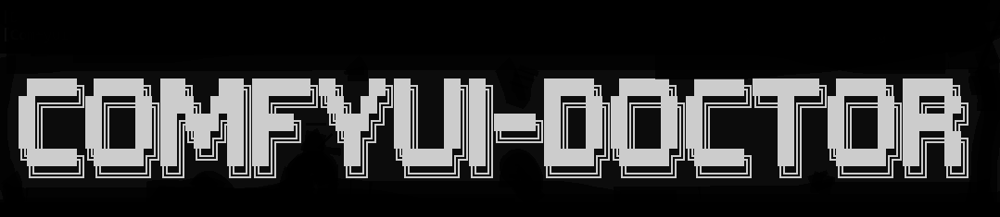

# ComfyUI-Doctor

[繁中](README.zh-TW.md) | [简中](README.zh-CN.md) | [日本語](README.ja.md) | [한국어](README.ko.md) | [Deutsch](README.de.md) | Français | [Italiano](README.it.md) | [Español](README.es.md) | [English](../../README.md) |

<div align="center">

</div>

ComfyUI-Doctor est un assistant de diagnostic et de débogage en temps réel pour ComfyUI. Il capture les erreurs d'exécution, identifie le contexte de node le plus probable, affiche des suggestions locales actionnables et peut utiliser en option un workflow de chat LLM pour un dépannage plus approfondi.

## Dernières mises à jour

Les dernières mises à jour sont maintenues dans le README anglais. Consultez [Latest Updates](../../README.md#latest-updates---click-to-expand).

## Fonctionnalités principales

- Capture en temps réel des sorties console/error de ComfyUI dès le démarrage.
- Suggestions intégrées à partir de 58 patterns d'erreur JSON, dont 22 core patterns et 36 community-extension patterns.
- Extraction validée du contexte de node pour les erreurs récentes d'exécution de workflow lorsque ComfyUI fournit suffisamment de données d'événement.
- Sidebar Doctor avec les onglets Chat, Statistics et Settings.
- Analyse LLM optionnelle via OpenAI-compatible services, Anthropic, Gemini, xAI, OpenRouter, Ollama et LMStudio, avec traitement unifié des provider request/response.
- Privacy controls pour les requêtes LLM sortantes, avec modes de sanitization des chemins, clés, e-mails et adresses IP.
- Credential store côté serveur optionnel avec admin guarding et support encryption-at-rest.
- Diagnostics locaux, statistiques, plugin trust report, telemetry controls et outils community feedback preview/submit.
- JSON error envelopes cohérentes pour les échecs de l'API Doctor.
- Prise en charge complète de l'interface et des suggestions en anglais, chinois traditionnel, chinois simplifié, japonais, coréen, allemand, français, italien et espagnol.

## Captures d'écran

<div align="center">

</div>

<div align="center">

</div>

## Installation

### ComfyUI-Manager

1. Ouvrez ComfyUI et cliquez sur **Manager**.
2. Sélectionnez **Install Custom Nodes**.
3. Recherchez `ComfyUI-Doctor`.
4. Installez-le puis redémarrez ComfyUI.

### Installation manuelle

```bash
cd ComfyUI/custom_nodes/
git clone https://github.com/rookiestar28/ComfyUI-Doctor.git
```

Redémarrez ComfyUI après le clone. Doctor devrait afficher ses diagnostics de démarrage et enregistrer l'entrée de sidebar `Doctor`.

## Utilisation de base

### Diagnostics automatiques

Après l'installation, Doctor enregistre passivement la sortie runtime de ComfyUI, détecte les tracebacks, fait correspondre les patterns d'erreur connus et affiche le dernier diagnostic dans la sidebar et le panneau de rapport droit optionnel.
Lorsque l'analyse LLM optionnelle est utilisée, Doctor construit le prompt context à partir de la même pipeline structurée qui gère la sanitization, le contexte de node, les execution logs, le workflow pruning et les informations système.

### Sidebar Doctor

Ouvrez **Doctor** dans la sidebar gauche de ComfyUI :

- **Chat** : consulter le dernier contexte d'erreur et poser des questions de débogage complémentaires.
- **Statistics** : inspecter les tendances d'erreur récentes, diagnostics, trust/health information, telemetry controls et feedback tools.
- **Settings** : choisir la langue, le LLM provider, la base URL, le model, le privacy mode, le comportement auto-open et le credential storage côté serveur optionnel.

### Smart Debug Node

Faites un clic droit sur le canvas, ajoutez **Smart Debug Node** et placez-le inline pour inspecter les données qui passent sans modifier la sortie du workflow.

## Configuration LLM optionnelle

Les cloud providers nécessitent un credential fourni via le session-only UI field, des variables d'environnement ou le server store optionnel protégé par admin. Les providers locaux comme Ollama et LMStudio peuvent fonctionner sans cloud credential.
Doctor normalise les formats provider-specific request/response pour OpenAI-compatible APIs, Anthropic et Ollama afin que chat, single-shot analysis, model listing et connectivity checks partagent le même comportement backend.

Valeurs recommandées :

- Utiliser **Privacy Mode: Basic** ou **Strict** pour les cloud providers.
- Utiliser des variables d'environnement pour les environnements partagés ou proches de la production.
- Définir `DOCTOR_ADMIN_TOKEN` et `DOCTOR_REQUIRE_ADMIN_TOKEN=1` sur les serveurs partagés.
- Réserver le local-only loopback convenience mode à un usage desktop mono-utilisateur.

## Documentation

- [User Guide](../USER_GUIDE.md) : UI walkthrough, diagnostics, privacy modes, LLM setup et feedback flow.
- [Configuration and Security](../CONFIGURATION_SECURITY.md) : environment variables, admin guard behavior, credential storage, outbound safety, telemetry et CSP notes.
- [API Reference](../API_REFERENCE.md) : endpoints publics Doctor et debugger.
- [Validation Guide](../VALIDATION.md) : commandes full-gate locales et lanes optionnelles compatibility/coverage.
- [Plugin Guide](../PLUGIN_GUIDE.md) : community plugin trust model et plugin authoring notes.
- [Plugin Migration](../PLUGIN_MIGRATION.md) : migration tooling pour plugin manifests et allowlists.
- [Outbound Safety](../OUTBOUND_SAFETY.md) : static checker et outbound request safety rules.

## Patterns d'erreur pris en charge

Les patterns sont stockés sous forme de fichiers JSON dans `patterns/` et peuvent être mis à jour sans changement de code.

| Pack | Count |
| --- | ---: |
| Core builtin patterns | 22 |
| Community extension patterns | 36 |
| **Total** | **58** |

Les community packs couvrent actuellement les modes d'échec courants de ControlNet, LoRA, VAE, AnimateDiff, IPAdapter, FaceRestore, checkpoint, sampler, scheduler et CLIP.

## Validation

Pour la validation locale CI-parity, utilisez le full-test script du projet :

```powershell
powershell -File scripts/run_full_tests_windows.ps1
```

```bash
bash scripts/run_full_tests_linux.sh
```

Le full gate couvre secrets detection, pre-commit hooks, host-like startup validation, backend unit tests et frontend Playwright E2E tests. Consultez le [Validation Guide](../VALIDATION.md) pour les commandes staged explicites et les lanes optionnelles.

## Prérequis

- Environnement ComfyUI custom-node.
- Python 3.10 ou plus récent.
- Node.js 18 ou plus récent uniquement pour la frontend E2E validation.
- Aucune runtime Python package dependency n'est requise au-delà de l'environnement bundled de ComfyUI et de la Python standard library.

## Licence

MIT License

## Contribution

Les contributions aux patterns et à la documentation sont bienvenues. Pour les changements de code, exécutez le full validation gate avant d'ouvrir une pull request et évitez de committer l'état local généré, les logs, credentials ou fichiers internes de planning.
